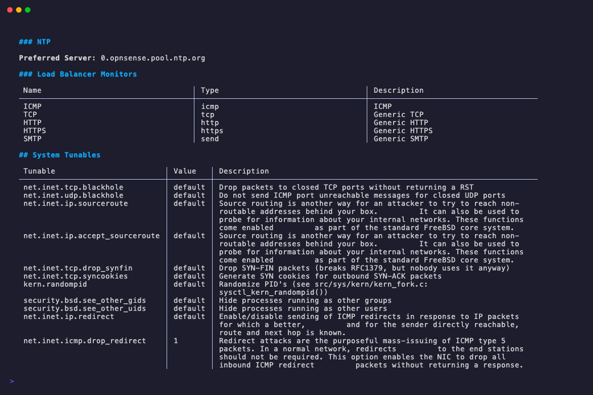
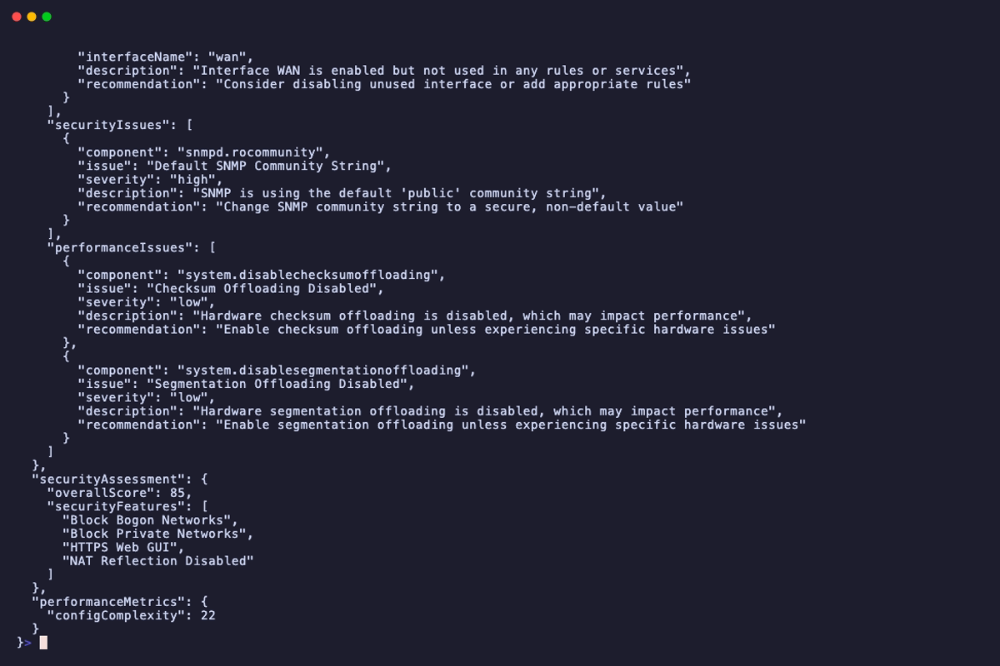
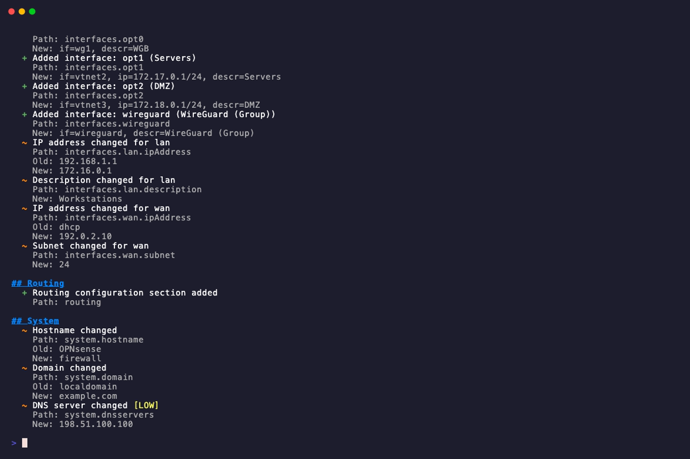
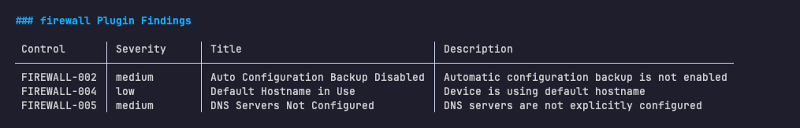
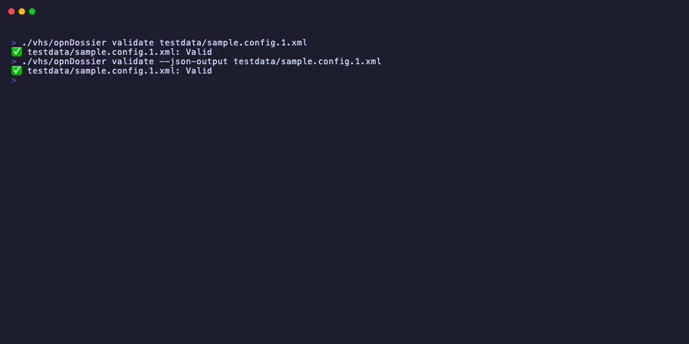

# opnDossier - OPNsense and pfSense Configuration Processor

[![OpenSSF Best Practices][ossf-badge]][ossf] [![Go Version][go-badge]][go] [![License][license-badge]][license] [![codecov][codecov-badge]][codecov] [![Documentation][docs-badge]][docs] [![wakatime][wakatime-badge]][wakatime] [![Go Report Card][goreportcard-badge]][goreportcard] [![Mergify Status][mergify-status]][mergify] [![All Contributors][all-contributors-badge]][all-contributors]

## Overview

opnDossier is a command-line tool for network operators and security professionals working with OPNsense and pfSense firewalls. Transform complex XML configuration files into clear, readable documentation and identify security issues, misconfigurations, and optimization opportunities.

Built for offline operation in secure environments - no external dependencies, no telemetry, complete airgapped support.

### What It Does

- **Security Analysis** - Automatically detect vulnerabilities, insecure protocols, weak configurations
- **Dead Rule Detection** - Find unreachable firewall rules and unused interfaces
- **Configuration Validation** - Comprehensive checks for misconfigurations and best-practice issues
- **Multi-Format Export** - Convert to markdown documentation, JSON, or YAML for integration
- **Offline Operation** - Works completely offline, perfect for airgapped networks

## Quick Start

### Installation

Download pre-built binaries for Linux, macOS, or Windows from [releases](https://github.com/EvilBit-Labs/opnDossier/releases), or install from source:

```bash
go install github.com/EvilBit-Labs/opnDossier@latest
```

### Basic Usage

```bash
# Generate configuration documentation
opnDossier convert config.xml -o report.md

# Run security audit (blue mode is default)
opnDossier audit config.xml

# Display config in terminal
opnDossier display config.xml
```

### Example Output

#### Markdown display output



#### Convert to JSON for automation/integration



#### Configuration diff



#### Audit findings example


## Analysis & Security Features

opnDossier automatically analyzes your OPNsense or pfSense configuration to identify security issues, misconfigurations, and optimization opportunities.

### Security Vulnerability Detection

Identifies common security issues in your firewall configuration:

- **Insecure Protocols** - Detects HTTP admin interfaces, Telnet, unencrypted SNMP
- **Weak Configurations** - Finds default community strings, overly permissive rules
- **Certificate Issues** - Identifies expired certificates, weak key sizes
- **Credential Exposure** - Detects plaintext passwords or weak authentication

Example output:



### Dead Rule Detection

Automatically identifies firewall rules that will never be reached:

- Rules positioned after "block all" rules on the same interface
- Duplicate rules with identical criteria (type, protocol, source, destination)

Example output:

```text
DEAD RULES DETECTED:
- Rule #15: Rules after position 12 on interface lan are unreachable due to preceding block-all rule
- Rule #31: Rule at position 31 is duplicate of rule at position 28 on interface wan
```

### Configuration Validation

Comprehensive checks for structural and logical issues:

- **Required Fields** - Validates hostname, domain, network interfaces
- **Data Types** - Ensures IP addresses, subnets, ports are valid
- **Cross-Field Validation** - Checks relationships between configuration elements
- **Network Topology** - Validates gateway assignments, routing tables, VLAN configurations

Example validation report:



### Unused Resource Detection

Finds enabled resources not actively used:

- Interfaces enabled but not referenced in rules or services
- Aliases defined but never used in firewall rules
- VPN tunnels configured but disabled
- Services running without corresponding firewall rules

### Compliance Checking

Built-in validation against security and operational best practices.

- Industry-standard security baselines
- SANS security guidelines

## Features

### Analysis & Reporting

- **Security vulnerability detection** - Identify insecure protocols, weak configurations, credential exposure
- **Dead rule detection** - Find unreachable firewall rules and duplicate rules
- **Unused resource analysis** - Detect unused interfaces, aliases, and services
- **Configuration validation** - Comprehensive structural and logical validation
- **Compliance checking** - Industry-standard security baselines and best practices

### Output & Export

- **Multi-format export** - Generate markdown documentation, JSON, or YAML output
- **Terminal display** - Rich terminal output with syntax highlighting and theme support
- **File export** - Save processed configurations with overwrite protection
- **International character support** - UTF-8, US-ASCII, ISO-8859-1, and Windows-1252 input encodings

### Performance & Architecture

- **Streaming processing** - Memory-efficient handling of large configuration files
- **Fast & lightweight** - Built with Go for performance and reliability
- **Offline operation** - Works completely offline, perfect for airgapped environments
- **Cross-platform** - Native binaries for Linux, macOS, and Windows

### Security & Privacy

- **No external dependencies** - Operates completely offline
- **No telemetry** - Zero data collection or external communication
- **Secure by design** - Input validation, sanitization, and SBOM generation throughout
- **Vulnerability scanning** - Automated dependency scanning and security checks in CI/CD

## Installation

### Pre-built Binaries (Recommended)

Download the latest release for your platform:

- [Linux (amd64, arm64)](https://github.com/EvilBit-Labs/opnDossier/releases)
- [macOS (Intel, Apple Silicon)](https://github.com/EvilBit-Labs/opnDossier/releases)
- [Windows (amd64)](https://github.com/EvilBit-Labs/opnDossier/releases)

Extract and run:

```bash
tar -xzf opnDossier-*.tar.gz
./opnDossier --help
```

### Install via Go

**Prerequisites:** Go 1.26 or later

```bash
go install github.com/EvilBit-Labs/opnDossier@latest
```

### Build from Source

```bash
git clone https://github.com/EvilBit-Labs/opnDossier.git
cd opnDossier
go build -o opnDossier main.go
```

For development builds with additional tooling, see [CONTRIBUTING.md](CONTRIBUTING.md).

If you plan to contribute, also install the pre-commit, commit-msg, and pre-push git hooks so local checks run automatically. The `pre-push` hook runs the full `just ci-check` (including the race detector, which CI cannot host reliably) before anything is pushed to GitHub:

```bash
just install   # runs mise install, installs all hook types, tidies modules
# or, manually:
pre-commit install --hook-type pre-commit --hook-type commit-msg --hook-type pre-push
```

See [CONTRIBUTING.md §Development Setup](CONTRIBUTING.md#development-setup) for details and the `--no-verify` escape hatch.

## Usage Examples

### Security Analysis

```bash
# Run blue team defensive audit (default mode)
opnDossier audit config.xml

# Blue team audit with specific compliance plugins
opnDossier audit config.xml --plugins stig,sans

# Red team attack surface analysis
opnDossier audit config.xml --mode red

# Export audit findings to JSON for automation/integration
opnDossier audit -f json config.xml -o findings.json
```

### Configuration Documentation

```bash
# Convert OPNsense or pfSense config to markdown documentation
opnDossier convert config.xml -o firewall-docs.md

# Generate YAML for configuration management tools
opnDossier convert -f yaml config.xml -o config.yaml

# Display in terminal with custom wrap width
opnDossier display --wrap 100 config.xml
```

### Validation

```bash
# Validate configuration file
opnDossier validate config.xml

# Validate before converting
opnDossier validate config.xml && opnDossier convert config.xml -o report.md
```

### Advanced Options

```bash
# Include system tunables in report
opnDossier convert config.xml -o comprehensive.md --include-tunables

# Verbose output for troubleshooting
opnDossier --verbose convert config.xml

# Quiet mode - only show errors
opnDossier --quiet convert config.xml -o output.md
```

## Configuration

opnDossier can be configured via command-line flags, environment variables, or a configuration file.

### Configuration Options

| Setting         | CLI Flag       | Environment Variable     | Config File         | Description                      |
| --------------- | -------------- | ------------------------ | ------------------- | -------------------------------- |
| Verbose logging | `--verbose`    | `OPNDOSSIER_VERBOSE`     | `verbose: true`     | Enable debug/verbose output      |
| Quiet mode      | `--quiet`      | `OPNDOSSIER_QUIET`       | `quiet: true`       | Suppress all non-error output    |
| Input file      | (positional)   | `OPNDOSSIER_INPUT_FILE`  | `input_file: path`  | Default input configuration file |
| Output file     | `-o, --output` | `OPNDOSSIER_OUTPUT_FILE` | `output_file: path` | Default output file path         |

For a complete list of all configuration options, see the [Configuration Reference](docs/user-guide/configuration-reference.md).

### Configuration File Example

Create `~/.opnDossier.yaml`:

```yaml
# Logging
verbose: false
quiet: false

# File paths
input_file: /path/to/default/config.xml
output_file: ./output.md
```

### Usage Examples

```bash
# Using CLI flags
opnDossier --verbose convert config.xml

# Using environment variables
export OPNDOSSIER_VERBOSE=true
opnDossier convert config.xml

# Using config file (automatically loaded from ~/.opnDossier.yaml)
opnDossier convert config.xml
```

## Output Formats

opnDossier supports multiple output formats for different use cases:

- **Markdown** - Human-readable documentation with formatted tables and sections
- **JSON** - Machine-readable format for automation and integration
- **YAML** - Configuration management and structured data export
- **Terminal Display** - Rich syntax-highlighted output with theme support

Specify format with `-f` or `--format` flag:

```bash
opnDossier convert -f json config.xml -o output.json
opnDossier convert -f yaml config.xml -o output.yaml
opnDossier convert -f markdown config.xml -o output.md  # default
```

## GitHub Actions

opnDossier is available as a GitHub Action backed by its Docker image. Use it to audit or document OPNsense and pfSense configurations automatically on every commit, PR, or scheduled run.

### Quick Start

```yaml
name: Audit firewall configuration

on:
  push:
    paths:
      - config.xml
  schedule:
    - cron: 0 6 * * 1   # every Monday at 06:00 UTC

jobs:
  audit:
    runs-on: ubuntu-latest
    steps:
      - uses: actions/checkout@v6

      - name: Audit OPNsense config
        uses: EvilBit-Labs/opnDossier@v1.4.0
        with:
          command: audit
          config-file: config.xml
```

See [Pinning](#pinning) for the recommended way to lock this reference in production CI.

### Inputs

| Input         | Required | Default  | Description                                                                                                                          |
| ------------- | -------- | -------- | ------------------------------------------------------------------------------------------------------------------------------------ |
| `command`     | No       | `audit`  | Sub-command: `audit`, `convert`, `diff`, `display`, `sanitize`, `validate`, or `version`                                             |
| `config-file` | **Yes**  | —        | Path to OPNsense or pfSense `config.xml` relative to the workspace root                                                              |
| `format`      | No       | —        | Output format for `convert`/`audit`: `markdown`, `json`, `yaml`, `text`, or `html`                                                   |
| `output`      | No       | —        | Path to write the output file, relative to the workspace root                                                                        |
| `args`        | No       | —        | Additional arguments split on whitespace (quoted strings with spaces are not preserved)                                              |
| `version`     | No       | `v1.4.0` | Image tag to pull (e.g. `v1.4.0`); defaults to the current release tag. `latest` is accepted but unpinned (see [Pinning](#pinning)). |

### Export findings to JSON

```yaml
  - name: Export audit findings
    uses: EvilBit-Labs/opnDossier@v1.4.0
    with:
      command: audit
      config-file: firewall/config.xml
      format: json
      output: findings.json

  - name: Upload findings
    uses: actions/upload-artifact@v4
    with:
      name: audit-findings
      path: findings.json
```

### Generate configuration documentation

```yaml
  - name: Generate firewall documentation
    uses: EvilBit-Labs/opnDossier@v1.4.0
    with:
      command: convert
      config-file: config.xml
      format: markdown
      output: docs/firewall.md
```

### Pinning

GitHub Action references should be pinned with intention. The three options, in order of preference for production CI:

**Recommended (production CI): pin to a full commit SHA.** A SHA is immutable — tags can, in theory, be force-pushed; commit SHAs cannot. Include the matching version tag as a trailing comment so humans can still tell what they are running.

```yaml
  - name: Audit OPNsense config
  # v1.4.0 — verify SHA against the release at https://github.com/EvilBit-Labs/opnDossier/releases/tag/v1.4.0
    uses: EvilBit-Labs/opnDossier@0ac538c64c8170f56dc9c1353ee5d71b532d303f
    with:
      command: audit
      config-file: config.xml
```

**Acceptable (most users): pin to a version tag.** This is what the Quick Start snippet above uses. You trust that the maintainers will not move published tags (we don't), and in exchange you get a readable reference and automatic patch-level fixes when you bump.

```yaml
  - uses: EvilBit-Labs/opnDossier@v1.4.0
```

**Not recommended for production: `@main` or `@latest`.** Both are moving targets: `@main` follows the default branch (may contain unreleased changes); `@latest` is only meaningful as an image tag on `ghcr.io/evilbit-labs/opndossier` and will pull whatever the registry currently points `latest` at. Use these only in throwaway sandboxes, never in CI that protects production configuration.

The `version:` input of the action follows the same three levels and defaults to the current release tag (`v1.4.0`). Override it only if you understand the tradeoff.

### Using the Docker image directly

The Docker image is published to the GitHub Container Registry alongside every release and can be used independently of the Action:

```bash
# Pull the latest release
docker pull ghcr.io/evilbit-labs/opndossier:latest

# Run an audit, mounting your config directory
# WORKDIR is /data, so use relative paths after the volume mount
docker run --rm \
  --volume "$(pwd):/data" \
  ghcr.io/evilbit-labs/opndossier:latest \
  audit config.xml
```

## Using as a Go Library

opnDossier's `pkg/` packages are importable by other Go modules. The typical consumer flow is: parse an OPNsense or pfSense `config.xml` into a vendor-specific document, convert it to the platform-agnostic `CommonDevice` model, and work with that.

Module path: `github.com/EvilBit-Labs/opnDossier`

Go version support: current and previous stable Go releases (N and N-1), matching Go's upstream policy. See [`.github/workflows/ci.yml`](.github/workflows/ci.yml) for the authoritative matrix.

See [docs/development/public-api.md](docs/development/public-api.md) for the full public API classification, stability policy, and semver rules.

### Quick Start

For consumers that already have a parsed schema document (for example, configuration generators that build one in-memory), call `ConvertDocument` directly. No blank imports, no factory wiring.

```go
package main

import (
    "encoding/xml"
    "fmt"
    "os"

    opnsenseparser "github.com/EvilBit-Labs/opnDossier/pkg/parser/opnsense"
    opnschema "github.com/EvilBit-Labs/opnDossier/pkg/schema/opnsense"
)

func main() {
    data, err := os.ReadFile("config.xml")
    if err != nil {
        panic(err)
    }

    var doc opnschema.OpnSenseDocument
    if err := xml.Unmarshal(data, &doc); err != nil {
        panic(err)
    }

    device, warnings, err := opnsenseparser.ConvertDocument(&doc)
    if err != nil {
        panic(err)
    }
    for _, w := range warnings {
        fmt.Printf("[%s] %s: %s (value=%q)\n", w.Severity, w.Field, w.Message, w.Value)
    }

    fmt.Printf("device type:  %s\n", device.DeviceType)
    fmt.Printf("hostname:     %s.%s\n", device.System.Hostname, device.System.Domain)
    fmt.Printf("rules:        %d\n", len(device.FirewallRules))
}
```

Use `pkg/parser/pfsense` and `pkg/schema/pfsense` for pfSense configurations.

### Auto-Detection via the Factory

When you have raw XML bytes of unknown provenance, use `pkg/parser.Factory`. The factory reads the root element and dispatches to the correct device parser. This path requires two blank imports — device parsers self-register from their `init()` functions, and Go only runs `init()` for imported packages:

```go
import (
    "github.com/EvilBit-Labs/opnDossier/pkg/model"
    "github.com/EvilBit-Labs/opnDossier/pkg/parser"

    _ "github.com/EvilBit-Labs/opnDossier/pkg/parser/opnsense" // registers "opnsense"
    _ "github.com/EvilBit-Labs/opnDossier/pkg/parser/pfsense"  // registers "pfsense"
)

factory := parser.NewFactory(myXMLDecoder)
device, warnings, err := factory.CreateDevice(ctx, reader, model.DeviceTypeUnknown, false)
```

`myXMLDecoder` must satisfy `parser.XMLDecoder`. Consumers typically wrap `encoding/xml` themselves using `parser.NewSecureXMLDecoder`, which applies opnDossier's XML-bomb and XXE hardening. If no parser packages are imported, `CreateDevice` returns an error containing the substring `"ensure parser packages are imported"` — that hint is covered by a regression test and safe for tooling to match on.

### Handling `ConversionWarning`

Every converter returns a `[]model.ConversionWarning` alongside the device. Warnings are non-fatal — they flag fields that did not round-trip perfectly (unrecognized enum values, truncated collections, orphan cross-references). Severity is a triage signal, not a compliance verdict:

| Severity   | Meaning                                                  |
| ---------- | -------------------------------------------------------- |
| `critical` | Data loss or corruption in the converted output.         |
| `high`     | Material gap or silently altered behavior.               |
| `medium`   | Partial data preservation (e.g., truncated collections). |
| `low`      | Cosmetic or best-effort conversion gap.                  |
| `info`     | Normal observation about the conversion.                 |

Log all warnings; treat `high` and above as signals to investigate the source config before trusting the output.

### Handling Secrets When Exporting `CommonDevice`

`CommonDevice` carries plaintext secrets sourced from the firewall configuration. If you serialize a `CommonDevice` to JSON, YAML, or any other format, **these secrets will appear in cleartext unless you redact them yourself.** opnDossier's CLI has redaction logic for its own `convert` and `sanitize` commands, but that code lives in `internal/` and is not exposed as a public API.

The secret-bearing fields are:

| Struct                       | Field                            |
| ---------------------------- | -------------------------------- |
| `model.Certificate`          | `PrivateKey`                     |
| `model.CertificateAuthority` | `PrivateKey`                     |
| `model.WireGuardClient`      | `PSK`                            |
| `model.APIKey`               | `Secret`                         |
| `model.HighAvailability`     | `Password`                       |
| `model.SNMPConfig`           | `ROCommunity`                    |
| `model.DHCPAdvancedV6`       | `AdvDHCP6KeyInfoStatementSecret` |

Recommended approaches, in order of preference:

1. **Invoke the opnDossier CLI as a subprocess.** `opnDossier convert --format json` and `opnDossier sanitize` apply the full redaction pipeline, including the field-pattern-based sanitizer. Safest for operators who need a hardened output.
2. **Redact in-place before serializing.** Walk the `CommonDevice` and set each secret field to `""` (or a marker like `"[REDACTED]"`) before passing it to `json.Marshal` or `yaml.Marshal`. Straightforward for known consumers that own the export path.
3. **Implement a custom `json.Marshaler`.** Define a wrapper type that shallow-copies `CommonDevice`, zeros the secret fields on the copy, then delegates to `json.Marshal`. Useful when the export is deep inside a library you control.

Do not rely on struct tags for redaction — `json:"privateKey,omitempty"` controls field names and omit-empty behavior, not whether the field is serialized at all.

If you add a new field to `CommonDevice` that carries a secret, update this table and update the CLI's redaction logic in the same change. See [GOTCHAS § 13.1](GOTCHAS.md) for the testing pitfall with multiline secrets (JSON escapes newlines, so raw-string `NotContains` assertions pass vacuously — always unmarshal and assert on field values).

## Documentation

- **[User Guide](docs/user-guide/)** - Installation, usage, and configuration
- **[Security Documentation](docs/security/)** - Vulnerability scanning and security features
- **[API Reference](docs/api.md)** - Detailed API documentation
- **[Public Go API](docs/development/public-api.md)** - Stability policy and semver rules for library consumers
- **[Examples](docs/examples/)** - Real-world usage examples

For developers:

- **[Contributing Guide](CONTRIBUTING.md)** - How to contribute to the project
- **[Architecture Documentation](docs/development/architecture.md)** - System design and architecture

## Support

- **Issues** - [GitHub Issues](https://github.com/EvilBit-Labs/opnDossier/issues)
- **Discussions** - [GitHub Discussions](https://github.com/EvilBit-Labs/opnDossier/discussions)
- **Documentation** - [Full Documentation](docs/index.md)
- **Contributing** - [Contributing Guide](CONTRIBUTING.md)

## Troubleshooting

- If you see garbled characters, confirm the XML declaration encoding matches the file's actual encoding.
- Supported input encodings include UTF-8, US-ASCII, ISO-8859-1, and Windows-1252; convert legacy files to UTF-8 if needed.

## Security

opnDossier is designed with security as a first-class concern:

- **No external dependencies** - Operates completely offline
- **No telemetry** - No data collection or external communication
- **Secure by design** - Input validation, sanitization, and SBOM generation
- **Automated scanning** - Daily vulnerability scans and dependency audits in CI/CD

For security vulnerabilities, please see our [security policy](SECURITY.md).

## License

Apache License 2.0 - see [LICENSE](LICENSE) file for details.

## Contributors

See [CONTRIBUTORS.md](CONTRIBUTORS.md) for the full list of contributors.

## Acknowledgements

- Inspired by [TKCERT/pfFocus](https://github.com/TKCERT/pfFocus) for pfSense configurations
- Terminal UI powered by [Charm](https://charm.sh/) - [glamour](https://github.com/charmbracelet/glamour), [lipgloss](https://github.com/charmbracelet/lipgloss), [log](https://github.com/charmbracelet/log), [bubbles](https://github.com/charmbracelet/bubbles)
- CLI framework by [spf13/cobra](https://github.com/spf13/cobra) and [spf13/viper](https://github.com/spf13/viper)
- Markdown generation by [nao1215/markdown](https://github.com/nao1215/markdown)
- Documentation built with [MkDocs](https://www.mkdocs.org/) and [Material for MkDocs](https://squidfunk.github.io/mkdocs-material/)

---

Built for network operators and security professionals.

<!-- Reference Links -->

[all-contributors]: #contributors
[all-contributors-badge]: https://img.shields.io/github/all-contributors/EvilBit-Labs/opnDossier?color=ee8449&style=flat-square
[codecov]: https://codecov.io/gh/EvilBit-Labs/opnDossier
[codecov-badge]: https://codecov.io/gh/EvilBit-Labs/opnDossier/graph/badge.svg?token=WD1QD9ITZF
[docs]: https://github.com/EvilBit-Labs/opnDossier/blob/main/docs/index.md
[docs-badge]: https://img.shields.io/badge/docs-mkdocs-blue.svg
[go]: https://golang.org
[go-badge]: https://img.shields.io/github/go-mod/go-version/EvilBit-Labs/opnDossier?label=go&color=blue
[goreportcard]: https://goreportcard.com/report/github.com/EvilBit-Labs/opnDossier
[goreportcard-badge]: https://goreportcard.com/badge/github.com/EvilBit-Labs/opnDossier
[license]: LICENSE
[license-badge]: https://img.shields.io/badge/license-Apache-green.svg
[mergify]: https://mergify.com
[mergify-status]: https://img.shields.io/endpoint.svg?url=https://api.mergify.com/v1/badges/EvilBit-Labs/opnDossier&style=flat
[ossf]: https://www.bestpractices.dev/projects/11920
[ossf-badge]: https://www.bestpractices.dev/projects/11920/badge
[wakatime]: https://wakatime.com/badge/user/2d2fbc27-e3f7-4ec1-b2a7-935e48bad498/project/018dae18-42c0-4e3e-8330-14d39f574bd5
[wakatime-badge]: https://wakatime.com/badge/user/2d2fbc27-e3f7-4ec1-b2a7-935e48bad498/project/018dae18-42c0-4e3e-8330-14d39f574bd5.svg
