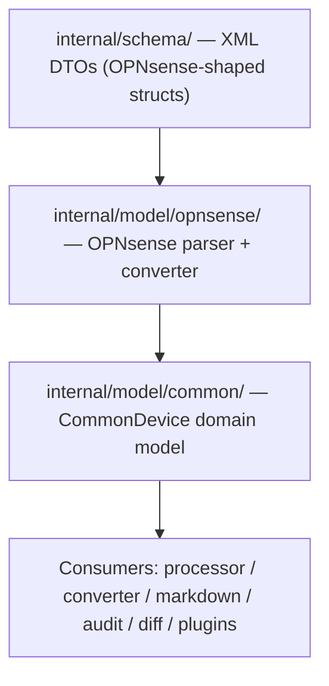
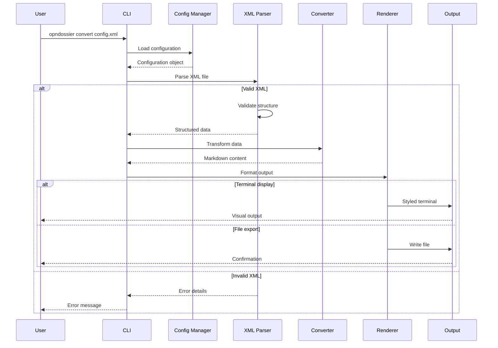
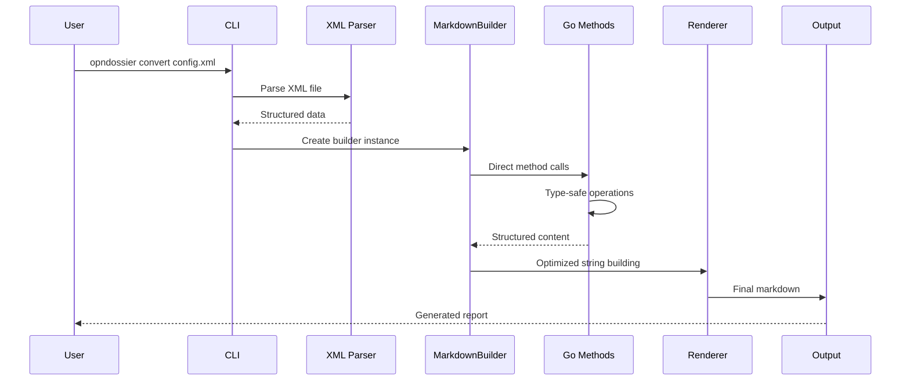
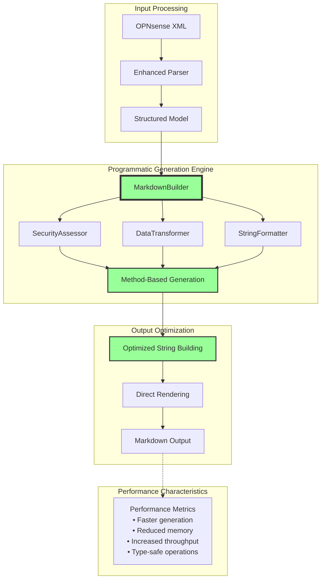
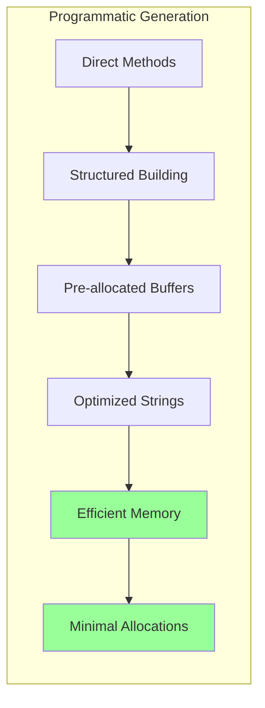
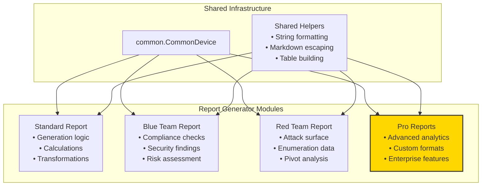
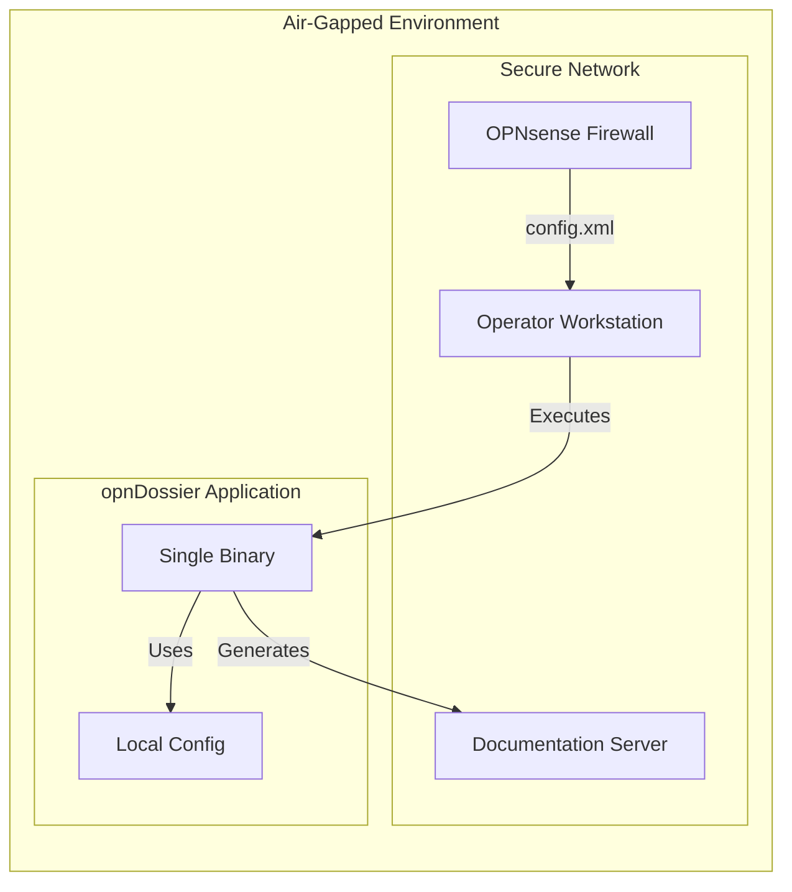
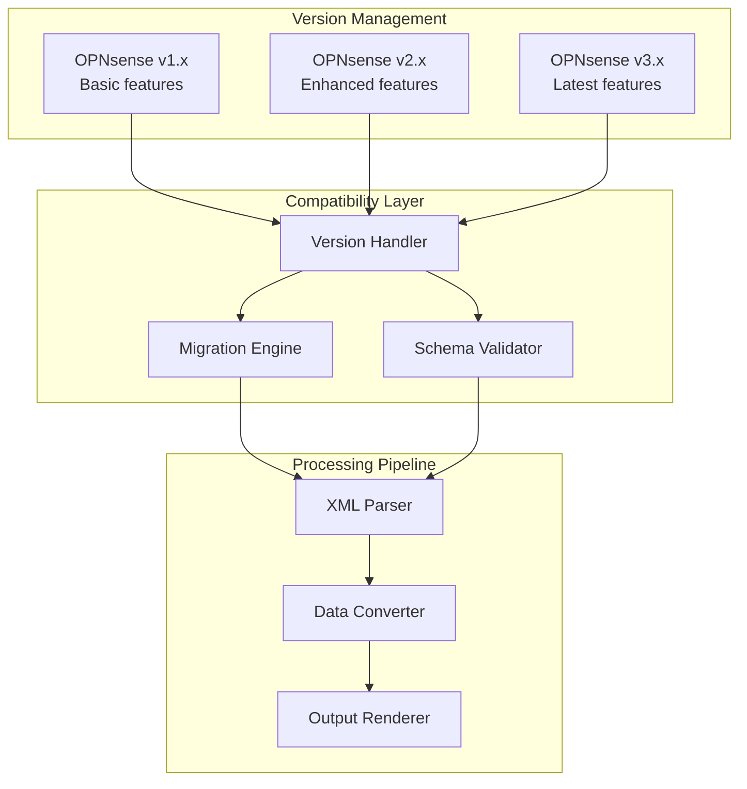

# opnDossier System Architecture

## Overview

opnDossier is a **CLI-based multi-device firewall configuration processor** designed with an **offline-first, operator-focused architecture**. Currently supports OPNsense with an extensible architecture for additional device types. The system transforms complex XML configuration files into human-readable markdown documentation, following security-first principles and air-gap compatibility.


## High-Level Architecture

### Core Design Principles

1. **Offline-First**: Zero external dependencies, complete air-gap compatibility
2. **Operator-Focused**: Built for network administrators and operators
3. **Framework-First**: Leverages established Go libraries (Cobra, Charm ecosystem)
4. **Structured Data**: Maintains configuration hierarchy and relationships
5. **Security-First**: No telemetry, input validation, secure processing

### Architecture Pattern

- **Monolithic CLI Application** with clear separation of concerns
- **Single Binary Distribution** for easy deployment
- **Local Processing Only** - no external network calls
- **Streaming Data Pipeline** from XML input to various output formats

### Technology Stack

Built with modern Go practices and established libraries:

| Component          | Technology                                                  |
| ------------------ | ----------------------------------------------------------- |
| CLI Framework      | [Cobra](https://github.com/spf13/cobra)                     |
| Configuration      | [Viper](https://github.com/spf13/viper)                     |
| CLI Enhancement    | [Charm Fang](https://github.com/charmbracelet/fang)         |
| Terminal Styling   | [Charm Lipgloss](https://github.com/charmbracelet/lipgloss) |
| Markdown Rendering | [Charm Glamour](https://github.com/charmbracelet/glamour)   |
| XML Processing     | Go's built-in `encoding/xml`                                |
| Structured Logging | [Charm Log](https://github.com/charmbracelet/log)           |

The CLI uses a layered architecture: **Cobra** provides command structure and argument parsing, **Viper** handles layered configuration management (files, env, flags), and **Fang** adds enhanced UX features like styled help, automatic version flags, and shell completion.

## Services and Components

### 1. CLI Interface Layer

- **Framework**: Cobra CLI
- **Responsibility**: Command parsing, user interaction, error handling
- **Key Files**: `cmd/root.go`, `cmd/convert.go`, `cmd/display.go`, `cmd/validate.go`

### 2. Configuration Management

- **Framework**: spf13/viper
- **Sources**: CLI flags > Environment variables > Config file > Defaults
- **Format**: YAML configuration files
- **Precedence**: Standard order where environment variables override config files for deployment flexibility

### 3. Data Processing Engine

#### XML Parser Component

- **Technology**: Go's built-in `encoding/xml`
- **Input**: OPNsense config.xml files
- **Output**: Structured Go data types
- **Features**: Schema validation, error reporting, automatic charset conversion (UTF-8, US-ASCII, ISO-8859-1, Windows-1252)

#### Data Converter Component

- **Input**: Parsed XML structures
- **Output**: Markdown content
- **Features**: Hierarchy preservation, metadata injection

#### Output Renderer Component

- **Formats**: Markdown, JSON, YAML, plain text, HTML
- **Technologies**: Charm Lipgloss (styling) + Charm Glamour (rendering)

### 4. Output Systems

- **Terminal Display**: Syntax-highlighted, styled terminal output via `display` command
- **File Export**: Multi-format file generation (markdown, JSON, YAML, text, HTML)

## Data Model Architecture

opnDossier uses a hierarchical model structure that mirrors the OPNsense XML configuration while organizing functionality into logical domains:

```mermaid
graph TB
    subgraph "Root Configuration"
        ROOT[Opnsense Root]
        META[Metadata & Global Settings]
    end

    subgraph "System Domain"
        SYS[System Configuration]
        USERS[User Management]
        GROUPS[Group Management]
        SYSCFG[System Services Config]
    end

    subgraph "Network Domain"
        NET[Network Configuration]
        IFACES[Interface Management]
        ROUTING[Routing & Gateways]
        VLAN[VLAN Configuration]
    end

    subgraph "Security Domain"
        SEC[Security Configuration]
        FIREWALL[Firewall Rules]
        NAT[NAT Configuration]
        VPN[VPN Services]
        CERTS[Certificate Management]
    end

    subgraph "Services Domain"
        SVC[Services Configuration]
        DNS[DNS Services]
        DHCP[DHCP Services]
        MONITOR[Monitoring Services]
        WEB[Web Services]
    end

    ROOT --> META
    ROOT --> SYS
    ROOT --> NET
    ROOT --> SEC
    ROOT --> SVC

    SYS --> USERS
    SYS --> GROUPS
    SYS --> SYSCFG

    NET --> IFACES
    NET --> ROUTING
    NET --> VLAN

    SEC --> FIREWALL
    SEC --> NAT
    SEC --> VPN
    SEC --> CERTS

    SVC --> DNS
    SVC --> DHCP
    SVC --> MONITOR
    SVC --> WEB
```



This hierarchical structure provides:

- **Logical Organization**: Related configuration grouped by functional domain
- **Maintainability**: Easier to locate and modify specific configuration types
- **Extensibility**: New features can be added to appropriate domains
- **Validation**: Domain-specific validation rules improve data integrity
- **API Evolution**: JSON tags enable better REST API integration

## Multi-Device Model Layer Architecture

opnDossier separates XML-specific DTOs from the domain model consumed by all downstream components. This enables support for multiple device types (OPNsense today, pfSense/Cisco ASA in the future) behind a single `CommonDevice` abstraction.



### Layer Responsibilities

- **`internal/schema/`** — XML DTO layer. Carries `xml:""` tags and mirrors the OPNsense config.xml structure. This layer is untouched by downstream consumers.
- **`internal/model/opnsense/`** — Contains `parser.go` and `converter.go`. Reads schema DTOs and emits `*common.CommonDevice`. This is the only package that imports `internal/schema/`.
- **`internal/model/common/`** — Device-agnostic domain model. No XML tags. All consumer code (processor, converter, markdown, audit, diff, compliance plugins) operates on `CommonDevice`.
- **`internal/model/factory.go`** — `ParserFactory` and `DeviceParser` interface. Auto-detects the device type from the XML root element. The `--device-type opnsense` flag bypasses auto-detection.

### Device Type Detection

The `--device-type` flag is exposed on all config-reading commands (`convert`, `display`, `audit`, `diff`, `validate`). When specified, it bypasses auto-detection and fails only if parsing or validation fails. When omitted, `ParserFactory` inspects the root XML element to select the correct parser.

## Data Flow Architecture



## Programmatic Generation Architecture

### Core Architecture

opnDossier uses programmatic markdown generation via the `MarkdownBuilder` component, delivering high performance, type safety, and enhanced developer experience.



### Key Architectural Features

#### 1. Performance Optimizations

The programmatic approach delivers significant performance improvements:

- **Memory Usage**: Reduced allocations through direct string building
- **Generation Speed**: Fast generation via method-based approach
- **Throughput**: High reports per second
- **Scalability**: Consistent performance across all dataset sizes

Performance can be measured using benchmarks in `internal/converter/markdown_bench_test.go`.

#### 2. Type Safety


#### 3. Security Enhancements (Red Team Focus)

- **Output Obfuscation**: Built-in capabilities for sensitive data handling
- **Complete Offline Support**: No external dependencies
- **Memory Safety**: Improved handling of large configurations
- **Error Isolation**: Structured error handling prevents information leakage

### MarkdownBuilder Component Architecture

```mermaid
classDiagram
    class ReportBuilder {
        <<interface>>
        +BuildStandardReport(data) string
        +BuildCustomReport(data, options) string
        +BuildSystemSection(data) string
        +BuildNetworkSection(data) string
        +BuildSecuritySection(data) string
        +BuildServicesSection(data) string
    }

    class MarkdownBuilder {
        -device *common.CommonDevice
        -options BuildOptions
        -logger *Logger
        +CalculateSecurityScore(data) int
        +AssessRiskLevel(severity) string
        +FilterSystemTunables(tunables, filter) []SysctlItem
        +GroupServicesByStatus(services) map[string][]Service
        +FormatInterfaceLinks(interfaces) string
        +EscapeMarkdownSpecialChars(input) string
    }

    class SecurityAssessor {
        +CalculateSecurityScore(data) int
        +AssessRiskLevel(severity) string
        +AssessServiceRisk(service) string
        +DetermineSecurityZone(interface) string
    }

    class DataTransformer {
        +FilterSystemTunables(tunables, filter) []SysctlItem
        +GroupServicesByStatus(services) map[string][]Service
        +FormatSystemStats(data) map[string]interface{}
    }

    class StringFormatter {
        +EscapeMarkdownSpecialChars(input) string
        +FormatTimestamp(timestamp) string
        +TruncateDescription(text, length) string
        +FormatBoolean(value) string
    }

    ReportBuilder <|.. MarkdownBuilder
    MarkdownBuilder o-- SecurityAssessor
    MarkdownBuilder o-- DataTransformer
    MarkdownBuilder o-- StringFormatter
```

### Data Flow Pipeline (Programmatic Mode)



### Method Categories and Performance

#### Security Assessment Methods

- **CalculateSecurityScore**: 1.59M operations/sec
- **AssessRiskLevel**: 92M operations/sec
- **AssessServiceRisk**: High-frequency assessment capability

#### Data Transformation Methods

- **FilterSystemTunables**: 797K operations/sec
- **GroupServicesByStatus**: 1.01M operations/sec
- **FormatSystemStats**: Optimized for large datasets

#### String Utility Methods

- **EscapeMarkdownSpecialChars**: Ultra-fast character processing
- **FormatTimestamp**: Efficient time formatting
- **TruncateDescription**: Word-boundary aware truncation

#### Section Builders

- **BuildSystemSection**: 1.7K operations/sec (comprehensive sections)
- **BuildNetworkSection**: 6.7K operations/sec
- **BuildSecuritySection**: 5.1K operations/sec
- **BuildServicesSection**: 13K operations/sec

### Memory Management Architecture



### Error Handling Architecture

```go
// Structured error types
type ValidationError struct {
    Field   string
    Value   any
    Message string
}

type GenerationError struct {
    Component string
    Operation string
    Cause     error
}

// Context-aware error handling
func (b *MarkdownBuilder) BuildSection(device *common.CommonDevice) (string, error) {
    if err := b.validateInput(data); err != nil {
        return "", &ValidationError{
            Field:   "input_data",
            Value:   data,
            Message: fmt.Sprintf("invalid input: %v", err),
        }
    }

    result, err := b.generateContent(data)
    if err != nil {
        return "", &GenerationError{
            Component: "section_builder",
            Operation: "content_generation",
            Cause:     err,
        }
    }

    return result, nil
}
```

## Modular Report Generator Architecture

### Design Principles

Report generators in opnDossier follow a **modular, self-contained architecture** designed to support:

1. **Build-time feature selection** via Go build flags
2. **Pro-level features** through optional modules
3. **Independent development** of report types
4. **Clean separation** between shared infrastructure and report-specific logic

### Module Structure

Each report generator should be a self-contained module with its own:

- **Generation logic** - All markdown/output construction
- **Calculation logic** - Security scoring, risk assessment, statistics
- **Data transformations** - Report-specific data processing
- **Constants and mappings** - Report-specific configuration



### Build Flag Integration

Report generators can be conditionally included using Go build tags:

```go
//go:build pro

package reports

// Pro-level report generators included only with -tags=pro
```

This enables:

- **Standard builds** with core report types
- **Pro builds** with additional enterprise features
- **Custom builds** with specific report combinations

### Implementation Guidelines

#### What Each Report Module Should Contain

Report modules are self-contained packages. Currently, report generation lives in `internal/converter/builder/` and `internal/converter/formatters/`. As the system evolves to support Pro-level features, each report type may be extracted to its own package following this structure:

```
internal/converter/<report-type>/
├── generator.go       # Main generation logic
├── calculations.go    # Report-specific calculations
├── transformers.go    # Data transformation functions
├── constants.go       # Report-specific constants
└── <report-type>_test.go
```

#### What Should Remain Shared

- **`common.CommonDevice`** - The parsed device-agnostic configuration model
- **String helpers** - Markdown escaping, formatting utilities
- **Table builders** - Generic markdown table construction
- **Common interfaces** - `ReportBuilder`, `Generator` interfaces

#### Example Module Structure

```go
// internal/reports/blueteam/generator.go
package blueteam

import (
    "github.com/EvilBit-Labs/opnDossier/internal/model/common"
    "github.com/EvilBit-Labs/opnDossier/internal/converter/formatters"
)

type BlueTeamGenerator struct {
    // All state and configuration for blue team reports
}

func (g *BlueTeamGenerator) Generate(device *common.CommonDevice) (string, error) {
    // Self-contained generation using only model and helpers
    score := g.calculateSecurityScore(device)
    findings := g.analyzeCompliance(device)
    return g.buildReport(device, score, findings)
}

// All calculation logic is internal to this module
func (g *BlueTeamGenerator) calculateSecurityScore(device *common.CommonDevice) int {
    // Blue team specific scoring algorithm
}
```

### Benefits

1. **Independent Testing** - Each report module can be tested in isolation
2. **Feature Gating** - Pro features excluded from standard builds
3. **Reduced Coupling** - Changes to one report type don't affect others
4. **Clear Ownership** - Each module has defined boundaries
5. **Extensibility** - New report types added without modifying core

## Data Storage Strategy

### Local File System

- **Configuration**: `~/.opnDossier.yaml` (user preferences)
- **Input**: OPNsense XML files (any location)
- **Output**: Markdown files (user-specified or current directory)

### Memory Management

- **Structured Data**: Go structs with XML/JSON tags
- **Large Files**: Streaming processing for memory efficiency
- **Type Safety**: Strong typing throughout the pipeline

### No Persistent Storage

- **Stateless Operation**: Each run is independent
- **No Database**: All data flows through memory
- **Temporary Files**: Cleaned up automatically

## External Integrations

### Documentation System

- **Technology**: MkDocs with Material theme
- **Purpose**: Static documentation generation
- **Deployment**: Local development server, no runtime dependencies

### Package Distribution

- **Build System**: GoReleaser for multi-platform builds
- **Platforms**: Linux, macOS, Windows (amd64, arm64)
- **Distribution**: GitHub Releases, package managers, direct download
- **Formats**: Binary archives, system packages (deb, rpm, apk)

### Development Integration

- **CI/CD**: GitHub Actions
- **Quality**: golangci-lint, pre-commit hooks
- **Testing**: Go's built-in testing framework
- **Task Runner**: Just for development workflows

## Air-Gap/Offline Considerations

### Design for Isolation



### Offline Capabilities

1. **Zero External Dependencies**: All libraries embedded in binary
2. **No Network Calls**: Completely self-contained operation
3. **Portable Deployment**: Single binary, no installation required
4. **Data Exchange**: File-based import/export only

### Data Exchange Patterns

- **Import**: Local files, USB drives, network shares
- **Export**: Markdown, JSON, plain text
- **Transfer**: Standard file transfer protocols (SCP, SFTP, etc.)

## Versioned Data Strategy

### Configuration Versioning

- **Backward Compatibility**: Support for older OPNsense versions
- **Forward Compatibility**: Graceful handling of newer configurations
- **Version Detection**: Automatic OPNsense version identification
- **Migration Support**: Utilities for format changes

### Non-Destructive Processing

- **Original Preservation**: Input files never modified
- **Timestamped Outputs**: Version metadata in all outputs
- **Audit Trail**: Change tracking and diff generation
- **Rollback Support**: Easy reversion to previous states

### Schema Evolution



## Security Architecture

### Threat Model

- **Primary Threats**: Malicious XML files, path traversal, resource exhaustion
- **Not Addressed**: Network attacks (offline operation), privilege escalation (user-level tool)

### Security Controls

- **Input Validation**: XML schema validation, path sanitization, size limits
- **Processing Security**: Memory safety (Go runtime), type safety, error handling
- **Output Security**: Path validation, permission checks, content sanitization

### Air-Gap Security Benefits

- **No Network Attack Surface**: Offline operation eliminates network-based threats
- **No Data Exfiltration**: Local processing only
- **No Unauthorized Updates**: Manual deployment only
- **Audit-Friendly**: All operations are local and traceable

## Deployment Patterns

### Single Binary Distribution

- **Build**: Cross-compiled Go binary
- **Size**: Minimal footprint (~10-20MB)
- **Dependencies**: None (all embedded)
- **Installation**: Drop-in replacement, no setup required

### Multi-Platform Support

- **Operating Systems**: Linux, macOS, Windows
- **Architectures**: amd64, arm64
- **Special**: macOS universal binaries
- **Packages**: Native package formats for each platform

### Enterprise Deployment

- **Package Management**: APT, RPM, Homebrew integration
- **Code Signing**: Verified binaries for security
- **Bulk Deployment**: Network share or USB distribution
- **Configuration Management**: YAML-based configuration

---

## Quick Start Architecture Summary

1. **User provides** OPNsense config.xml file
2. **CLI parses** command-line arguments and loads configuration
3. **ParserFactory** auto-detects device type and converts to `CommonDevice`
4. **Data Converter** transforms XML to markdown with metadata
5. **Output Renderer** formats for terminal display or file export
6. **User receives** human-readable documentation

**Key Benefits**: Offline operation, security-first design, operator-focused workflows, cross-platform compatibility, and comprehensive documentation generation from complex network configurations.
