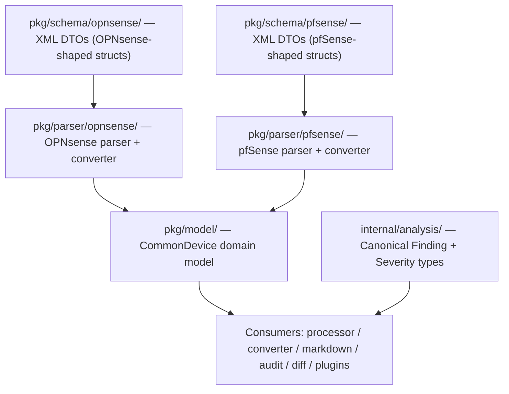
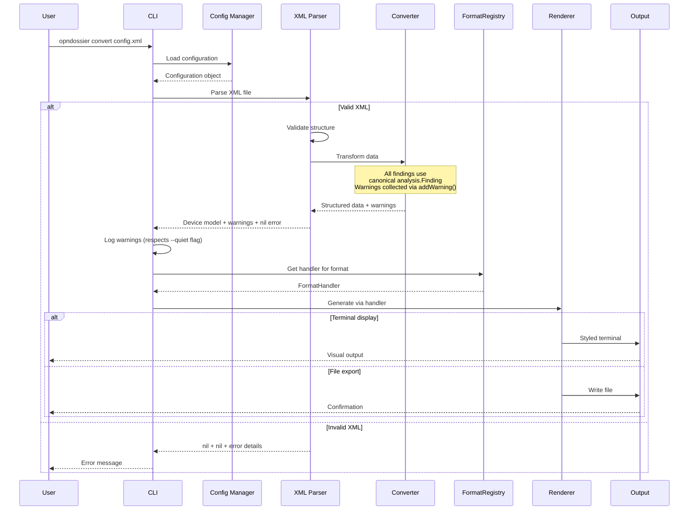
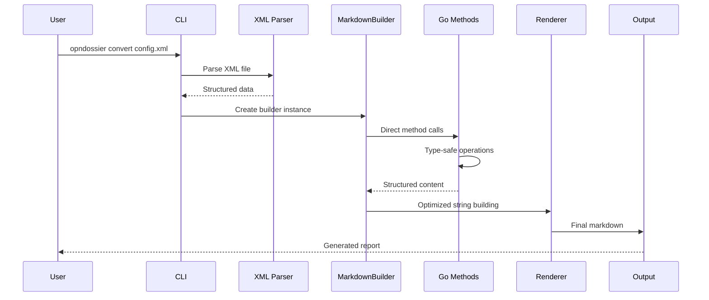
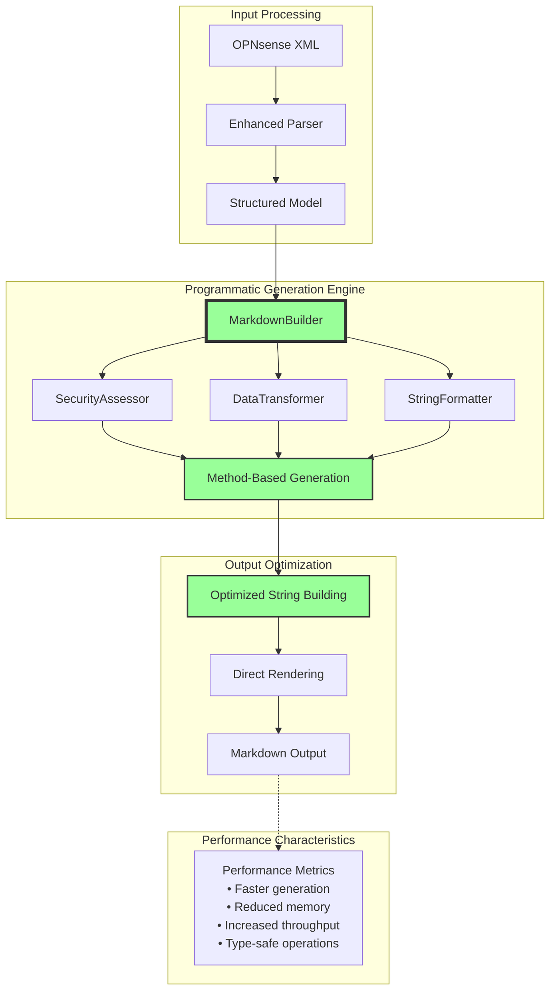
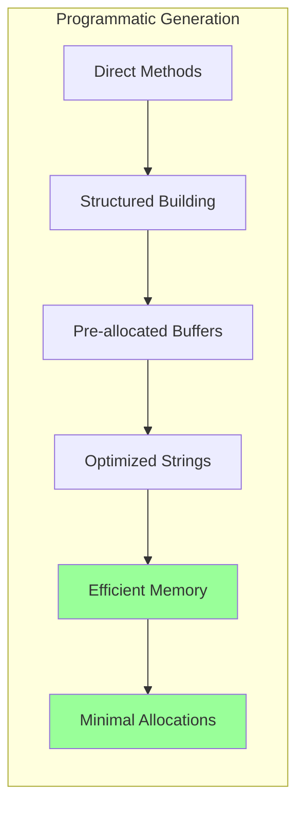
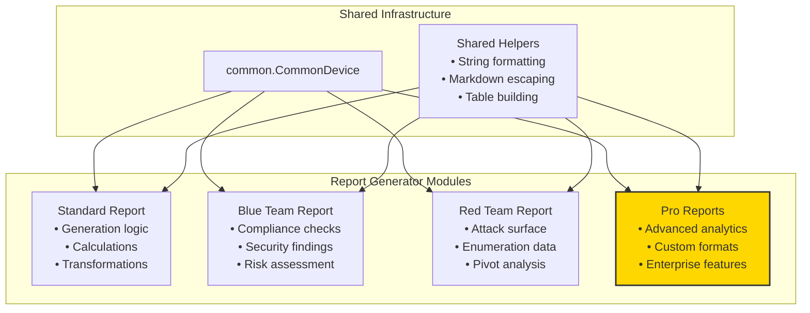
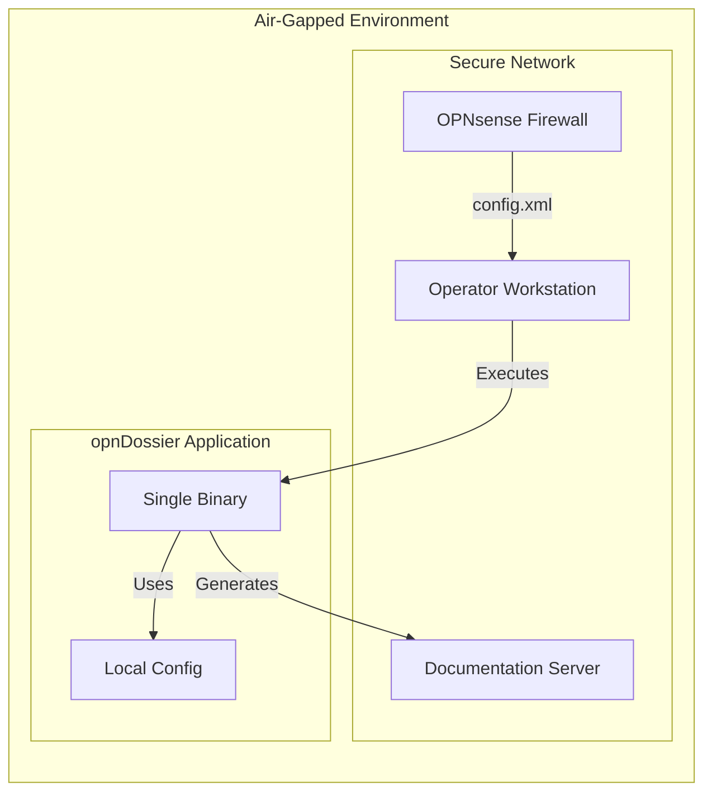

# opnDossier System Architecture

## Overview

opnDossier is a **CLI-based multi-device firewall configuration processor** designed with an **offline-first, operator-focused architecture**. Currently supports OPNsense and pfSense with an extensible architecture for additional device types. The system transforms complex XML configuration files into human-readable markdown documentation, following security-first principles and air-gap compatibility.


## High-Level Architecture

### Core Design Principles

1. **Offline-First**: Zero external dependencies, complete air-gap compatibility, no runtime network calls
2. **Operator-Focused**: Built for network administrators and operators, preserves operator control and visibility
3. **Framework-First**: Leverages established Go libraries (Cobra, Charm ecosystem) before custom plumbing
4. **Structured Data**: Maintains configuration hierarchy and relationships, prefers typed models over ad-hoc strings
5. **Security-First**: No telemetry, input validation, secure processing, restrictive file permissions
6. **Polish Over Scale**: Smaller, well-documented feature set with sane defaults over large inconsistent surface area

For the complete philosophical foundation and ethical constraints, see **[CONTRIBUTING.md](../../CONTRIBUTING.md) Core Philosophy** section.

### Architecture Pattern

- **Monolithic CLI Application** with clear separation of concerns
- **Single Binary Distribution** for easy deployment
- **Local Processing Only** - no external network calls
- **Streaming Data Pipeline** from XML input to various output formats

### Technology Stack

Built with modern Go practices and established libraries:

| Component           | Technology                                                  |
| ------------------- | ----------------------------------------------------------- |
| CLI Framework       | [Cobra](https://github.com/spf13/cobra)                     |
| Configuration       | [Viper](https://github.com/spf13/viper)                     |
| CLI Enhancement     | [Charm Fang](https://github.com/charmbracelet/fang)         |
| Terminal Styling    | [Charm Lipgloss](https://github.com/charmbracelet/lipgloss) |
| Markdown Rendering  | [Charm Glamour](https://github.com/charmbracelet/glamour)   |
| Markdown Generation | [nao1215/markdown](https://github.com/nao1215/markdown)     |
| XML Processing      | Go's built-in `encoding/xml`                                |
| Structured Logging  | [Charm Log](https://github.com/charmbracelet/log)           |
| Minimum Go Version  | Go 1.26+                                                    |

The CLI uses a layered architecture: **Cobra** provides command structure and argument parsing, **Viper** handles layered configuration management (files, env, flags) for opnDossier's own settings (CLI preferences, display options), and **Fang** adds enhanced UX features like styled help, automatic version flags, and shell completion. Note that **Viper** manages opnDossier configuration, while OPNsense `config.xml` parsing is handled separately by `internal/cfgparser/`.

## Public Package Boundaries and Interface Injection

### The pkg/internal/ Import Boundary

`pkg/` packages must **NEVER** import `internal/` packages. Any type exposed through a `pkg/` struct field must itself live in `pkg/` or stdlib. This enforces a strict architectural boundary that ensures external consumers can use the public API without encountering Go's `internal/` access restrictions.

**Key Principle**: When moving types from `internal/` to `pkg/`, audit all struct fields for leaked internal types and define public equivalents in `pkg/` (e.g., `pkg/model.Severity` replaces `internal/analysis.Severity` in `ConversionWarning`).

### Boundary Verification

Before committing changes to `pkg/` packages, run this command to catch boundary violations:

```bash
grep -rn 'internal/' --include='*.go' pkg/ | grep -v _test.go
```

This checks for any production code in `pkg/` that imports `internal/` packages. Test files (`*_test.go`) are allowed to import `internal/` packages since Go's access restrictions only apply to external consumers.

### Interface Injection Pattern

When `pkg/` packages need functionality from `internal/` packages, use **interface injection** instead of moving entire dependency chains:

1. **Define an interface in `pkg/`** with the required methods
2. **Inject the concrete implementation at the `cmd/` layer** where both `pkg/` and `internal/` packages are accessible
3. **Use the interface type** in `pkg/` package constructors and fields

#### Canonical Example: XMLDecoder

The `pkg/parser.XMLDecoder` interface demonstrates this pattern:

```go
// pkg/parser/factory.go
type XMLDecoder interface {
    Parse(ctx context.Context, r io.Reader) (*schema.OpnSenseDocument, error)
    ParseAndValidate(ctx context.Context, r io.Reader) (*schema.OpnSenseDocument, error)
}

func NewFactory(decoder XMLDecoder) *Factory {
    return &Factory{xmlDecoder: decoder, registry: DefaultRegistry()}
}

// NewFactoryWithRegistry allows test isolation with a custom registry.
func NewFactoryWithRegistry(decoder XMLDecoder, reg *DeviceParserRegistry) *Factory {
    return &Factory{xmlDecoder: decoder, registry: reg}
}
```

Application code in `cmd/` wires the concrete implementation:

```go
// cmd/convert.go
factory := parser.NewFactory(cfgparser.NewXMLParser())
```

This allows `pkg/parser` to use XML parsing functionality from `internal/cfgparser` without importing it directly.

### Structural Typing for Sub-Packages

Go's structural typing allows `pkg/` sub-packages to define their own interface that `internal/` types satisfy without importing them. In **PR #437**, the OPNsense parser was refactored to use the exported `parser.XMLDecoder` interface directly instead of a local `xmlDecoder` interface. This change was made because:

1. The `parser.XMLDecoder` interface is already exported in the public API
2. The local interface was redundant and added unnecessary indirection
3. Using the exported interface enables better type safety and documentation
4. It clarifies the dependency contract for external consumers

```go
// pkg/parser/opnsense/parser.go
func NewParser(decoder parser.XMLDecoder) *Parser {
    return &Parser{decoder: decoder}
}
```

The `internal/cfgparser.XMLParser` type satisfies the `parser.XMLDecoder` interface through structural compatibility, without requiring an explicit import of `internal/cfgparser`.

### Unexporting Types Pattern

When making a type unexported (e.g., `Converter` → `converter`) to reduce API surface area, provide a **convenience function** for external test packages that cannot access unexported constructors:

```go
// pkg/parser/opnsense/converter.go
type converter struct {
    // unexported fields
}

// ConvertDocument provides public access for testing and external consumers
func ConvertDocument(doc *schema.OpnSenseDocument) (*common.CommonDevice, []common.ConversionWarning, error) {
    c := &converter{}
    return c.ToCommonDevice(doc)
}
```

This allows external test packages to use the conversion functionality without accessing the unexported `converter` type directly.

### Related Documentation

For detailed examples and the historical context of fixing `pkg/internal/` boundary violations, see:

- **[docs/solutions/architecture-issues/pkg-internal-import-boundary.md](../solutions/architecture-issues/pkg-internal-import-boundary.md)**

For practical developer guidance on public package purity and the boundary verification command, see **[CONTRIBUTING.md](../../CONTRIBUTING.md) Go Development Standards** section.

## Services and Components

### 1. CLI Interface Layer

- **Framework**: Cobra CLI
- **Responsibility**: Command parsing, user interaction, error handling, warning propagation
- **Key Files**: `cmd/root.go`, `cmd/convert.go`, `cmd/display.go`, `cmd/validate.go`, `cmd/audit.go`, `cmd/audit_output.go`
- **Warning Handling**: All commands log conversion warnings via structured logging; warnings suppressed when `--quiet` flag is used
- **File Organization**: Audit command split into two files following file-size guidelines:
  - `audit.go` — Command definition, flags, `PreRunE` validation, `runAudit`, and `generateAuditOutput`
  - `audit_output.go` — Output emission logic (`emitAuditResult`), path derivation (`deriveAuditOutputPath`), and segment escaping (`escapePathSegment`)

### 2. Configuration Management

- **Framework**: spf13/viper
- **Sources**: CLI flags > Environment variables > Config file > Defaults
- **Format**: YAML configuration files
- **Precedence**: Standard order where environment variables override config files for deployment flexibility

### 3. Analysis Infrastructure

- **Package**: `internal/analysis/`
- **Responsibility**: Shared analysis logic and canonical finding types for converter, processor, audit, and compliance packages
- **Key Types**: `Finding` struct, `Severity` type with validation helpers
- **Shared Functions**:
  - `ComputeStatistics()` - Statistics computation for configuration items, services, and security features
  - `ComputeAnalysis()` - Detection logic for dead rules, unused interfaces, security, performance, and consistency issues
  - `DetectDeadRules()` - Dead rule detection with structured `Kind` field (`"unreachable"` or `"duplicate"`). **Uses typed constants for rule type comparisons** (e.g., `rule.Type == common.RuleTypeBlock`)
  - `DetectUnusedInterfaces()` - Unused interface detection across rules, DHCP, DNS, VPN, and load balancer
  - `RulesEquivalent()` - Rule comparison including `Disabled` field and normalized interface order
- **Defensive API**: All exported `Compute*` functions include nil guards for safe use with nil arguments
- **Export Model**: `ComplianceResults`, `ComplianceFinding`, `PluginComplianceResult`, `ComplianceControl`, `ComplianceResultSummary`, `CompliancePluginInfo`, `ComplianceAttackSurface` in `pkg/model/enrichment.go`
- **Purpose**: Eliminates duplicated detection and statistics logic, ensures consistency across all analysis-related packages. **Analysis code uses typed enum constants instead of string literals**, providing compile-time safety for rule type checks and security severity levels
- **Usage**: Also used in `ConversionWarning` type for severity classification of non-fatal conversion issues

### 4. Data Processing Engine

#### Device Parser Registry

- **Package**: `pkg/parser/`
- **Pattern**: Self-registration via `init()` + blank imports (mirrors `database/sql` driver pattern)
- **Key Types**: `DeviceParserRegistry`, `ConstructorFunc`, `DeviceParser` interface
- **Singleton**: `parser.DefaultRegistry()` returns the global registry; `parser.NewDeviceParserRegistry()` for test isolation
- **Registration**: Each parser package calls `parser.Register("rootElement", factory)` from `init()`
- **Dispatch**: `Factory.CreateDevice()` auto-detects device type from the XML root element via registry lookup, or accepts an explicit `--device-type` override
- **Built-in**: OPNsense parser self-registers in `pkg/parser/opnsense/parser.go`
- **Extensibility**: External parsers register via blank import in the consumer binary (see [Plugin Development Guide](plugin-development.md#device-parser-development))
- **Blank Import Requirement**: `cmd/root.go` (and test files using `parser.NewFactory()`) must import both device parsers to trigger registration:
  ```go
  _ "github.com/EvilBit-Labs/opnDossier/pkg/parser/opnsense"
  _ "github.com/EvilBit-Labs/opnDossier/pkg/parser/pfsense"
  ```

#### XML Parser Component

- **Technology**: Go's built-in `encoding/xml`
- **Input**: OPNsense and pfSense config.xml files
- **Output**: Structured Go data types
- **Features**: Schema validation, error reporting, automatic charset conversion (UTF-8, US-ASCII, ISO-8859-1, Windows-1252)
- **Shared Security Hardening**: `pkg/parser/xmlutil.go` provides `NewSecureXMLDecoder()` and `CharsetReader()` for XXE protection, input size limits, and charset handling used by both OPNsense and pfSense parsers

#### Data Converter Component

- **Input**: Parsed XML structures
- **Output**: Markdown content, conversion warnings
- **Features**: Hierarchy preservation, metadata injection, non-fatal issue tracking
- **Warning Generation**: Accumulates conversion warnings for incomplete or problematic configuration elements (empty firewall rule fields, missing NAT rule data, gateway issues, user/certificate problems, HA configuration warnings)
- **Analysis Integration**: Delegates to `internal/analysis/` for `ComputeStatistics()` and `ComputeAnalysis()` (shared, not mirrored)
- **Audit Report Rendering**: Delegates compliance audit report rendering to `internal/converter/builder/` via `BuildAuditSection()` and `WriteAuditSection()` methods
- **Audit Mode Integration**: In audit mode, `cmd/audit_handler.go` maps `audit.Report` to `common.ComplianceResults` and populates the `ComplianceChecks` field on a shallow copy of `CommonDevice`, enabling multi-format output (markdown, JSON, YAML, text, HTML) through the standard generation pipeline

#### Output Renderer Component

- **Formats**: Markdown, JSON, YAML, plain text, HTML (registered as handlers in `DefaultRegistry`)
- **Format Dispatch**: `FormatRegistry` pattern provides centralized format metadata and handler dispatch
- **Technologies**: Charm Lipgloss (styling) + Charm Glamour (rendering)
- **Format Registration**: `DefaultRegistry` manages format names, aliases (txt, htm, md, yml), file extensions, and validation

### 5. Output Systems

- **Terminal Display**: Syntax-highlighted, styled terminal output via `display` command and `audit` command (glamour rendering for markdown to stdout)
- **File Export**: Multi-format file generation (markdown, JSON, YAML, text, HTML)
- **Multi-File Audit Output**: Auto-naming with lossless tilde-based path escaping prevents filename collisions (e.g., `prod/site-a/config.xml` → `prod_site-a_config-audit.md`)

## Data Model Architecture

opnDossier uses a hierarchical model structure that mirrors the OPNsense XML configuration while organizing functionality into logical domains:


```mermaid
graph TB
    subgraph "Root Configuration"
        ROOT[Opnsense Root]
        META[Metadata & Global Settings]
    end

    subgraph "System Domain"
        SYS[System Configuration]
        USERS[User Management]
        GROUPS[Group Management]
        SYSCFG[System Services Config]
    end

    subgraph "Network Domain"
        NET[Network Configuration]
        IFACES[Interface Management]
        ROUTING[Routing & Gateways]
        VLAN[VLAN Configuration]
    end

    subgraph "Security Domain"
        SEC[Security Configuration]
        FIREWALL[Firewall Rules]
        NAT[NAT Configuration]
        VPN[VPN Services]
        CERTS[Certificate Management]
    end

    subgraph "Services Domain"
        SVC[Services Configuration]
        DNS[DNS Services]
        DHCP[DHCP Services]
        MONITOR[Monitoring Services]
        WEB[Web Services]
    end

    ROOT --> META
    ROOT --> SYS
    ROOT --> NET
    ROOT --> SEC
    ROOT --> SVC

    SYS --> USERS
    SYS --> GROUPS
    SYS --> SYSCFG

    NET --> IFACES
    NET --> ROUTING
    NET --> VLAN

    SEC --> FIREWALL
    SEC --> NAT
    SEC --> VPN
    SEC --> CERTS

    SVC --> DNS
    SVC --> DHCP
    SVC --> MONITOR
    SVC --> WEB
```

This hierarchical structure provides:

- **Logical Organization**: Related configuration grouped by functional domain
- **Maintainability**: Easier to locate and modify specific configuration types
- **Extensibility**: New features can be added to appropriate domains
- **Validation**: Domain-specific validation rules improve data integrity
- **API Evolution**: JSON tags enable better REST API integration
- **Compliance Data**: `ComplianceResults` field (formerly `ComplianceChecks`) is a rich nested structure containing `Mode`, `Findings`, `PluginResults` map with per-plugin `PluginComplianceResult` instances, `Summary`, and `Metadata`

### Type Safety with Enums

The model package enforces type safety through **typed string enums** for configuration domains where arbitrary string values historically led to validation and refactoring challenges:

#### Firewall Rule Types

```go
type FirewallRuleType string

const (
    RuleTypePass   FirewallRuleType = "pass"    // Allow traffic
    RuleTypeBlock  FirewallRuleType = "block"   // Silently drop traffic
    RuleTypeReject FirewallRuleType = "reject"  // Drop and send rejection
)
```

#### NAT Configuration

```go
type NATOutboundMode string

const (
    OutboundAutomatic NATOutboundMode = "automatic"  // Automatic rules
    OutboundHybrid    NATOutboundMode = "hybrid"     // Mixed auto/manual
    OutboundAdvanced  NATOutboundMode = "advanced"   // Manual only
    OutboundDisabled  NATOutboundMode = "disabled"   // NAT disabled
)
```

#### Network Configuration

```go
type IPProtocol string

const (
    IPProtocolInet  IPProtocol = "inet"   // IPv4
    IPProtocolInet6 IPProtocol = "inet6"  // IPv6
)

type FirewallDirection string

const (
    DirectionIn  FirewallDirection = "in"   // Inbound traffic
    DirectionOut FirewallDirection = "out"  // Outbound traffic
    DirectionAny FirewallDirection = "any"  // Bidirectional
)

type LAGGProtocol string

const (
    LAGGProtocolLACP        LAGGProtocol = "lacp"        // IEEE 802.3ad
    LAGGProtocolFailover    LAGGProtocol = "failover"    // Active/standby
    LAGGProtocolLoadBalance LAGGProtocol = "loadbalance" // Hash-based
    LAGGProtocolRoundRobin  LAGGProtocol = "roundrobin"  // Round-robin
)

type VIPMode string

const (
    VIPModeCarp     VIPMode = "carp"     // CARP failover
    VIPModeIPAlias  VIPMode = "ipalias"  // IP alias
    VIPModeProxyARP VIPMode = "proxyarp" // ARP proxy
)
```

#### Benefits of Typed Enums

1. **Compile-Time Safety**: Type system prevents invalid assignments like `rule.Type = "invalid"` — compiler enforces valid constants
2. **Refactoring Support**: IDE rename operations update all references across 70 files without grep-based search/replace
3. **Documentation**: Enum constants provide inline documentation at usage sites (`RuleTypePass` is self-documenting vs `"pass"`)
4. **Autocomplete**: IDEs offer completion suggestions for valid enum values
5. **Magic String Elimination**: No bare string literals like `"pass"`, `"block"`, `"reject"` scattered across analysis, diff, converter, and plugin packages

## Multi-Device Model Layer Architecture

opnDossier separates XML-specific DTOs from the domain model consumed by all downstream components. This enables support for multiple device types (OPNsense and pfSense today, Cisco ASA in the future) behind a single `CommonDevice` abstraction.


```mermaid
graph TD
    A["pkg/schema/opnsense/ — XML DTOs (OPNsense-shaped structs)"]
    B["pkg/parser/opnsense/ — OPNsense parser + converter"]
    C["pkg/schema/pfsense/ — XML DTOs (pfSense-shaped structs)"]
    D["pkg/parser/pfsense/ — pfSense parser + converter"]
    E["pkg/model/ — CommonDevice domain model"]
    F["internal/analysis/ — Canonical Finding + Severity types"]
    G["Consumers: processor / converter / markdown / audit / diff / plugins"]

    A --> B
    C --> D
    B --> E
    D --> E
    E --> G
    F --> G
```

### Layer Responsibilities

- **`pkg/schema/opnsense/`** — XML DTO layer. Carries `xml:""` tags and mirrors the OPNsense config.xml structure. This layer is untouched by downstream consumers.
- **`pkg/parser/opnsense/`** — Contains `parser.go` and `converter.go`. Reads schema DTOs and emits `*common.CommonDevice` with conversion warnings. **Converts OPNsense XML string values to typed enum constants** (e.g., `"pass"` → `common.RuleTypePass`, `"automatic"` → `common.OutboundAutomatic`). This is the only package that imports `pkg/schema/opnsense/`.
- **`pkg/schema/pfsense/`** — XML DTO layer for pfSense. Follows **copy-on-write pattern**: reuses OPNsense types where XML structures are identical (e.g., `Interface`, `Destination`, `Source`), forks locally at divergence points (e.g., `InboundRule` uses `<target>` instead of `<internalip>`, `FilterRule` adds pfSense-specific fields like `ID`, `Tag`, `OS`, `AssociatedRuleID`). Documented in `pkg/schema/pfsense/README.md`.
- **`pkg/parser/pfsense/`** — Contains `parser.go`, `converter.go`, and subsystem converters. Manages its own XML decoding via `parser.NewSecureXMLDecoder()` (pfSense parser doesn't use `internal/cfgparser.NewXMLParser()` because the shared `XMLDecoder` interface returns `*schema.OpnSenseDocument`). Emits `*common.CommonDevice` with conversion warnings.
- **`pkg/model/`** — Device-agnostic domain model. No XML tags. Defines typed string enums for firewall rules (`RuleType`, `Direction`, `IPProtocol`), NAT configurations (`OutboundMode`), and network elements (`LAGGProtocol`, `VIPMode`). All consumer code (processor, converter, markdown, audit, diff, compliance plugins) operates on `CommonDevice`. Includes `ConversionWarning` type for non-fatal issues and `ComplianceResults` type (with nested `ComplianceFinding`, `PluginComplianceResult`, `ComplianceControl`, `ComplianceResultSummary`, `CompliancePluginInfo`, `ComplianceAttackSurface`) for compliance audit data representation. Adds `DeviceType.DisplayName()` method for dynamic report headers (e.g., "OPNsense" vs "pfSense").
- **`internal/analysis/`** — Shared analysis logic and canonical finding types. Provides detection functions (`DetectDeadRules`, `DetectUnusedInterfaces`, `DetectSecurityIssues`, `DetectPerformanceIssues`, `DetectConsistency`), statistics computation (`ComputeStatistics`), analysis aggregation (`ComputeAnalysis`), and rule comparison (`RulesEquivalent`). **Uses typed constants for rule type comparisons** (e.g., `rule.Type == common.RuleTypeBlock`) instead of string literals. Used by both `internal/converter` and `internal/processor` to eliminate duplicated logic.
- **`pkg/parser/factory.go`** — `Factory` and `DeviceParser` interface. Uses the `DeviceParserRegistry` for device type dispatch. Auto-detects the device type from the XML root element or uses the `--device-type` flag to bypass auto-detection. Returns 3 values: device model, warnings slice, and error.

### Schema Reuse Pattern

pfSense schema follows a **copy-on-write** approach to minimize duplication:

- **Reuse OPNsense types** when XML structure is identical (e.g., `opnsense.Interface`, `opnsense.Source`, `opnsense.Destination`, `opnsense.Outbound`, `opnsense.SSHConfig`)
- **Fork locally** when pfSense diverges (e.g., `InboundRule` for `<target>` vs `<internalip>`, `Group` for `[]string Priv` vs single privilege, `System` for `[]string DNSServers` vs single server, `FilterRule` for pfSense-specific fields)
- **Document differences** in `pkg/schema/pfsense/README.md` with complete structural reference covering 50+ top-level sections

### pfSense-Specific Types

Key pfSense types that differ from OPNsense:

- **`InboundRule`** — NAT port forward rule using `<target>` field instead of OPNsense's `<internalip>`
- **`FilterRule`** — Firewall rule with pfSense-specific fields: `ID`, `Tag`, `Tagged`, `OS`, `AssociatedRuleID`, `MaxSrcStates`, plus additional rate-limiting and state fields
- **`Group`** — Group with `[]string Priv` array (per-group privileges) instead of OPNsense's single privilege model
- **`System`** — System config with `[]string DNSServers` (repeating `<dnsserver>` elements) instead of single DNS server string
- **`User`** — User account with `BcryptHash` field instead of OPNsense's `Password` field (SHA-based)

### Parser Independence

The pfSense parser operates independently from the OPNsense parser:

- **Self-contained XML decoding**: Uses `parser.NewSecureXMLDecoder()` directly instead of `internal/cfgparser.NewXMLParser()` because the shared `XMLDecoder` interface is typed to return `*schema.OpnSenseDocument`
- **Shared security hardening**: Both parsers use the same `NewSecureXMLDecoder()` and `CharsetReader()` from `pkg/parser/xmlutil.go` for XXE protection, input size limits, and charset handling (UTF-8, US-ASCII, ISO-8859-1, Windows-1252)
- **Registry-based registration**: Self-registers via `init()` in `pkg/parser/pfsense/parser.go` to handle `<pfsense>` root elements

### Device Type Detection

The `--device-type` flag is exposed on all config-reading commands (`convert`, `display`, `audit`, `diff`, `validate`). When specified, it bypasses auto-detection and validates against the parser registry; error messages dynamically list supported devices from `registry.List()`. When omitted, `parser.Factory` inspects the root XML element to select the correct parser from the registry.

## Audit Command Architecture

### Overview

The `opndossier audit` command provides a dedicated, first-class entry point for security audit and compliance checks. It is an alternative to the `convert --audit-mode` workflow, using the same underlying audit/compliance engine but offering a streamlined CLI interface optimized for audit-specific workflows.

### Command Structure and Execution Flow

1. **Command Definition** (`cmd/audit.go`):

   - Declares audit-specific flags: `--mode` (standard/blue/red), `--plugins` (compliance checks), `--plugin-dir` (dynamic plugin loading)
   - Reuses shared output flags: `--format`, `--output`, `--wrap`, `--section`, `--comprehensive`, `--redact`
   - `PreRunE` validation enforces:
     - Valid audit mode (standard, blue, red)
     - Valid plugin names (stig, sans, firewall)
     - `--plugins` flag only accepted with `--mode blue` (compliance checks only run in blue mode)
     - `--output` flag rejected when auditing multiple files (prevents output clobbering)

2. **Execution Flow** (`runAudit`):

   - Validates device type flag before any file processing
   - Processes multiple input files concurrently with configurable semaphore (defaults to `runtime.NumCPU()`)
   - Buffers all results before emission to prevent interleaved stdout writes or file overwrites
   - Each file processed via `generateAuditOutput` (parsing + audit generation, no I/O)
   - Results emitted serially via `emitAuditResult` after all processing completes

3. **Output Emission** (`cmd/audit_output.go`):

   - `emitAuditResult` handles file vs stdout emission with format-specific rendering
   - Markdown output to stdout uses glamour for styled terminal rendering
   - Non-markdown formats (JSON, YAML, text, HTML) written raw
   - File output uses standard file export without terminal styling

### Architectural Patterns

#### Shared Validation Extraction

The `validateOutputFlags()` helper (in `cmd/shared_flags.go`) was extracted from `validateConvertFlags()` to share format, wrap, and section validation logic between audit and convert commands:

- **Validates**: Format against `converter.DefaultRegistry`, wrap width range, mutual exclusivity of `--wrap` and `--no-wrap`
- **Warns**: When section filtering used with JSON/YAML (sections ignored in structured formats)
- **Reused by**: Both `convert` and `audit` commands call `validateOutputFlags()` in their `PreRunE` hooks
- **Command-specific validation**: Each command performs its own audit-mode/plugin validation on command-specific flag variables

#### Multi-File Output Naming

When auditing multiple files, each report is auto-named to prevent filename collisions:

- **Pattern**: `<escaped-path>_<basename>-audit.<ext>`
- **Escaping**: Lossless tilde-based escaping via `escapePathSegment()`:
  - Tildes become `~~` (escape character doubling)
  - Underscores become `~u` (freeing underscore as segment separator)
  - Prevents boundary ambiguity: `"a_/b"` → `"a~u_b"`, `"a/_b"` → `"a_~ub"` (unambiguous)
- **Absolute paths**: Marked with `~a` prefix segment
- **Examples**:
  - `config.xml` → `config-audit.md`
  - `prod/site-a/config.xml` → `prod_site-a_config-audit.md`
  - `~/configs/edge.xml` → `~a_home_user_configs_edge-audit.md`

#### Plugin Mode Coupling

- `--plugins` flag only accepted with `--mode blue` (enforced in `PreRunE`)
- Standard and red modes do not execute compliance checks
- When no plugins specified in blue mode, all available plugins run (resolved in `internal/audit/mode_controller.go`)

### Relationship to convert --audit-mode

Both entry points use the same underlying `internal/audit` package and `cmd/audit_handler.go` mapping logic:

| Aspect              | `opndossier audit`                                   | `convert --audit-mode`                             |
| ------------------- | ---------------------------------------------------- | -------------------------------------------------- |
| **Purpose**         | Dedicated audit workflow                             | General conversion with optional audit             |
| **Flag Names**      | Shorter audit-specific flags (`--mode`, `--plugins`) | Prefixed flags (`--audit-mode`, `--audit-plugins`) |
| **Multi-File**      | Concurrent processing with auto-naming               | Sequential processing with explicit output paths   |
| **Output**          | Glamour-styled markdown to terminal                  | Raw markdown or file export                        |
| **Backward Compat** | New in PR #454                                       | Existing since initial audit support               |

The `convert --audit-mode` workflow remains unchanged for backward compatibility.

## DeviceParser Registry Pattern

opnDossier uses a **pluggable DeviceParser registry** that enables external Go projects to register custom device parsers at compile time. This pattern follows the `database/sql` driver registration model, replacing hardcoded switch statements with a thread-safe registry.

### Registry Architecture

```go
// ConstructorFunc is the factory function signature for creating DeviceParser instances
type ConstructorFunc = func(XMLDecoder) DeviceParser

// DeviceParserRegistry manages registered DeviceParser constructors
type DeviceParserRegistry struct {
    mu      sync.RWMutex
    parsers map[string]ConstructorFunc
}
```

### Key Components

#### 1. Thread-Safe Operations

The registry uses `sync.RWMutex` for concurrent access:

- **`Register(deviceType, fn)`** — Registers a parser constructor (panics on duplicates, nil functions, or empty device types)
- **`Get(deviceType)`** — Returns `(ConstructorFunc, bool)` for thread-safe lookups with nil guards
- **`List()`** — Returns sorted slice of registered device type names

#### 2. Self-Registration via init()

Parser packages register themselves using `init()` functions:

```go
// pkg/parser/opnsense/parser.go
func NewParserFactory(decoder parser.XMLDecoder) parser.DeviceParser {
    return NewParser(decoder)
}

func init() {
    parser.Register("opnsense", NewParserFactory)
}
```

#### 3. CRITICAL: Blank Import Requirement

**All code using `parser.NewFactory()` MUST include blank imports for parser packages** to ensure `init()` functions execute:

```go
import (
    _ "github.com/EvilBit-Labs/opnDossier/pkg/parser/opnsense"  // Register OPNsense parser
    _ "github.com/EvilBit-Labs/opnDossier/pkg/parser/pfsense"   // Register pfSense parser
)
```

Without these blank imports, the parsers never register and the factory has no parsers available. This gotcha is documented in **GOTCHAS.md §7.1** and affects:

- `cmd/root.go` — CLI entry point
- All test files using `parser.NewFactory()` or `parser.DefaultRegistry()`

#### 4. Factory Integration

`factory.go` uses registry-based dispatch instead of hardcoded switch statements:

```go
func (f *Factory) createWithOverride(ctx context.Context, r io.Reader, override string, validateMode bool) (*common.CommonDevice, []common.ConversionWarning, error) {
    fn, ok := f.registry.Get(override)
    if !ok {
        return nil, nil, fmt.Errorf(
            "unsupported device type override: %s; supported: %s",
            override, strings.Join(f.registry.List(), ", "),
        )
    }
    
    return parseDevice(ctx, fn(f.xmlDecoder), r, validateMode)
}
```

Error messages dynamically list supported devices from `registry.List()`, eliminating hardcoded device type strings.

#### 5. Test Isolation with NewFactoryWithRegistry()

Tests requiring isolated registry state use `NewFactoryWithRegistry()`:

```go
func TestCustomParser(t *testing.T) {
    reg := parser.NewDeviceParserRegistry()
    reg.Register("testdevice", testParserFactory)
    factory := parser.NewFactoryWithRegistry(mockDecoder, reg)
    // Test without polluting global registry
}
```

### CLI Integration

`cmd/shared_flags.go` functions derive device type lists dynamically from `parser.DefaultRegistry()`:

- **`ValidDeviceTypes()`** — Shell completion using `registry.List()`
- **`validateDeviceType()`** — Validation using `registry.Get()` with dynamic error messages
- **`resolveDeviceType()`** — Type-safe device type resolution that converts the raw `--device-type` flag value into a `common.DeviceType` enum constant for built-in types (opnsense, pfsense) or falls back to casting the normalized registry key for third-party parsers

The `resolveDeviceType()` function replaces the previous `sharedDeviceType` string pattern, providing compile-time safety for built-in device types while maintaining extensibility for externally registered parsers. This approach eliminates hardcoded "opnsense" strings with registry queries, enabling automatic CLI support for new parsers via self-registration.

### Benefits

1. **Compile-Time Extensibility**: External projects register parsers via blank imports
2. **Zero Hardcoded Strings**: Device types discovered from registry at runtime
3. **Thread-Safe**: Concurrent access protected by RWMutex
4. **Test Isolation**: Custom registries prevent global state pollution
5. **Dynamic Error Messages**: Supported device lists always accurate

### Related Documentation

For complete implementation details, error-handling patterns, and gotchas, see:

- **[docs/solutions/architecture-issues/pluggable-deviceparser-registry-pattern.md](../solutions/architecture-issues/pluggable-deviceparser-registry-pattern.md)**
- **[GOTCHAS.md §7.1](../../GOTCHAS.md)** — Blank import requirement

For practical developer guidance on the DeviceParser registry pattern and blank import footgun, see **[CONTRIBUTING.md](../../CONTRIBUTING.md) Go Development Standards** section.

## Data Flow Architecture

The data processing pipeline follows a clear multi-stage architecture documented in **[CONTRIBUTING.md](../../CONTRIBUTING.md) Data Processing Pipeline** section:

1. **Ingestion**: Device-specific parsers parse configuration files → schema documents
   - OPNsense: `internal/cfgparser/` parses `config.xml` → `pkg/schema/opnsense.OpnSenseDocument`
   - pfSense: `pkg/parser/pfsense/parser.go` parses `config.xml` → `pkg/schema/pfsense.Document`
2. **Conversion**: Device-specific converters transform schema documents → `pkg/model.CommonDevice` with conversion warnings
   - OPNsense: `pkg/parser/opnsense/` transforms `OpnSenseDocument` → `CommonDevice`
   - pfSense: `pkg/parser/pfsense/` transforms `Document` → `CommonDevice`
   - **XML string values are converted to typed enum constants** (e.g., `rule.Type` XML string `"pass"` becomes `common.RuleTypePass`)
3. **Export Enrichment**: `internal/converter/enrichment.go` populates statistics, analysis, security assessment via `prepareForExport()`
4. **Export**: Registry-driven multi-format output (markdown, json, yaml, text, html) via `FormatRegistry`. **Typed enums serialize back to string values** during JSON/YAML marshaling (e.g., `common.RuleTypePass` → `"pass"`)
5. **Report Generation**: Audience-aware reports built through `builder.MarkdownBuilder` with dynamic headers using `DeviceType.DisplayName()` (e.g., "OPNsense Configuration Summary" vs "pfSense Configuration Summary")


```mermaid
sequenceDiagram
    participant User
    participant CLI
    participant ConfigMgr as Config Manager
    participant Parser as XML Parser
    participant Converter
    participant Registry as FormatRegistry
    participant Renderer
    participant Output

    User->>CLI: opndossier convert config.xml
    CLI->>ConfigMgr: Load configuration
    ConfigMgr-->>CLI: Configuration object
    CLI->>Parser: Parse XML file

    alt Valid XML
        Parser->>Parser: Validate structure
        Parser->>Converter: Transform data
        Note over Converter: All findings use<br/>canonical analysis.Finding<br/>Warnings collected via addWarning()
        Converter-->>Parser: Structured data + warnings
        Parser-->>CLI: Device model + warnings + nil error
        CLI->>CLI: Log warnings (respects --quiet flag)
        CLI->>Registry: Get handler for format
        Registry-->>CLI: FormatHandler
        CLI->>Renderer: Generate via handler

        alt Terminal display
            Renderer->>Output: Styled terminal
            Output-->>User: Visual output
        else File export
            Renderer->>Output: Write file
            Output-->>User: Confirmation
        end
    else Invalid XML
        Parser-->>CLI: nil + nil + error details
        CLI-->>User: Error message
    end
```

**Note on Format Dispatch**: The `Renderer` component uses the `FormatRegistry` for format dispatch rather than switch statements. `DefaultRegistry` manages all format metadata (names, aliases, extensions) and provides `FormatHandler` implementations for centralized format handling.

## Programmatic Generation Architecture

### Core Architecture

opnDossier uses programmatic markdown generation via the `MarkdownBuilder` component, delivering high performance, type safety, and enhanced developer experience.


```mermaid
sequenceDiagram
    participant User
    participant CLI
    participant Parser as XML Parser
    participant Builder as MarkdownBuilder
    participant Methods as Go Methods
    participant Renderer
    participant Output

    User->>CLI: opndossier convert config.xml
    CLI->>Parser: Parse XML file
    Parser-->>CLI: Structured data
    CLI->>Builder: Create builder instance
    Builder->>Methods: Direct method calls
    Methods->>Methods: Type-safe operations
    Methods-->>Builder: Structured content
    Builder->>Renderer: Optimized string building
    Renderer->>Output: Final markdown
    Output-->>User: Generated report
```

### Key Architectural Features

#### 1. Performance Optimizations

The programmatic approach delivers significant performance improvements:

- **Memory Usage**: Reduced allocations through direct string building
- **Generation Speed**: Fast generation via method-based approach
- **Throughput**: High reports per second
- **Scalability**: Consistent performance across all dataset sizes

Performance can be measured using benchmarks in `internal/converter/markdown_bench_test.go`.

#### 2. Type Safety


```mermaid
graph TB
    subgraph "Programmatic Generation"
        P1[Go Methods] --> P2[Compile-time Validation]
        P2 --> P3[Type-safe Operations]
        P3 --> P4[Explicit Error Handling]
        P4 --> P5[Structured Results]
    end

    style P2 fill:#99ff99
    style P3 fill:#99ff99
    style P4 fill:#99ff99
```

#### 3. Security Enhancements (Red Team Focus)

- **Output Obfuscation**: Built-in capabilities for sensitive data handling
- **Complete Offline Support**: No external dependencies
- **Memory Safety**: Improved handling of large configurations
- **Error Isolation**: Structured error handling prevents information leakage

### MarkdownBuilder Component Architecture

The `ReportBuilder` interface follows the Interface Segregation Principle (SOLID), composing three focused sub-interfaces that were split from the original monolithic interface in PR #431 (issue #323):

- **`SectionBuilder`** (9 methods): Build\*Section methods for rendering individual configuration domains
- **`TableWriter`** (11 methods): Write\*Table methods for formatting data tables
- **`ReportComposer`** (3 methods): SetIncludeTunables, BuildStandardReport, and BuildComprehensiveReport

This composition provides full backward compatibility—existing code using `ReportBuilder` continues to work unchanged—while enabling consumers to depend only on the methods they actually use.

```mermaid
classDiagram
    class SectionBuilder {
        <<interface>>
        +BuildSystemSection(data) string
        +BuildNetworkSection(data) string
        +BuildSecuritySection(data) string
        +BuildServicesSection(data) string
        +BuildIPsecSection(data) string
        +BuildOpenVPNSection(data) string
        +BuildHASection(data) string
        +BuildIDSSection(data) string
        +BuildAuditSection(data) string
    }

    class TableWriter {
        <<interface>>
        +WriteFirewallRulesTable(md, rules) *Markdown
        +WriteInterfaceTable(md, interfaces) *Markdown
        +WriteUserTable(md, users) *Markdown
        +WriteGroupTable(md, groups) *Markdown
        +WriteSysctlTable(md, sysctl) *Markdown
        +WriteOutboundNATTable(md, rules) *Markdown
        +WriteInboundNATTable(md, rules) *Markdown
        +WriteVLANTable(md, vlans) *Markdown
        +WriteStaticRoutesTable(md, routes) *Markdown
        +WriteDHCPSummaryTable(md, scopes) *Markdown
        +WriteDHCPStaticLeasesTable(md, leases) *Markdown
    }

    class ReportComposer {
        <<interface>>
        +SetIncludeTunables(v bool)
        +BuildStandardReport(data) (string, error)
        +BuildComprehensiveReport(data) (string, error)
    }

    class ReportBuilder {
        <<interface>>
    }

    class MarkdownBuilder {
        -device *common.CommonDevice
        -options BuildOptions
        -logger *Logger
        +CalculateSecurityScore(data) int
        +AssessRiskLevel(severity) string
        +FilterSystemTunables(tunables, filter) []SysctlItem
        +GroupServicesByStatus(services) map[string][]Service
        +FormatInterfaceLinks(interfaces) string
        +EscapeMarkdownSpecialChars(input) string
    }

    class SecurityAssessor {
        +CalculateSecurityScore(data) int
        +AssessRiskLevel(severity) string
        +AssessServiceRisk(service) string
        +DetermineSecurityZone(interface) string
    }

    class DataTransformer {
        +FilterSystemTunables(tunables, filter) []SysctlItem
        +GroupServicesByStatus(services) map[string][]Service
        +FormatSystemStats(data) map[string]interface{}
    }

    class StringFormatter {
        +EscapeMarkdownSpecialChars(input) string
        +FormatTimestamp(timestamp) string
        +TruncateDescription(text, length) string
        +FormatBoolean(value) string
    }

    ReportBuilder *-- SectionBuilder : composes
    ReportBuilder *-- TableWriter : composes
    ReportBuilder *-- ReportComposer : composes
    ReportBuilder <|.. MarkdownBuilder : implements
    MarkdownBuilder o-- SecurityAssessor
    MarkdownBuilder o-- DataTransformer
    MarkdownBuilder o-- StringFormatter
```

#### Consumer-Local Interface Narrowing

`HybridGenerator` demonstrates the consumer-local interface narrowing pattern (documented in AGENTS.md §5.9a). It defines a private `reportGenerator` interface that exposes only the four methods it directly calls:

- `SetIncludeTunables`, `BuildAuditSection`, `BuildStandardReport`, and `BuildComprehensiveReport` -- all listed directly, not via embedded sub-interfaces

The `HybridGenerator.builder` field is typed as this narrower `reportGenerator` interface internally. Public methods (`SetBuilder`, `GetBuilder`) continue to accept and return the full `ReportBuilder` interface, maintaining backward compatibility. The `GetBuilder` method uses a two-value type assertion to recover the full interface when needed.

#### FormatRegistry Integration

`HybridGenerator` delegates format-specific generation to `FormatHandler` implementations retrieved from `DefaultRegistry` (documented in AGENTS.md §5.9b). The `handlerForFormat()` helper function resolves the format string to a handler via the registry; format defaulting (to markdown) is handled earlier via `DefaultOptions` / CLI configuration, so `handlerForFormat()` expects a non-empty, registered format string. Each handler implements:

- **`FileExtension()`** - Returns the file extension for the format (e.g., ".md", ".json")
- **`Aliases()`** - Returns alternative format names (e.g., "md" for markdown, "yml" for yaml)
- **`Generate()`** - Creates documentation as a string via the generator
- **`GenerateToWriter()`** - Streams documentation directly to an io.Writer

Handler dispatch replaces the previous switch statement approach, enabling centralized format metadata management and simplified addition of new formats through `DefaultRegistry` registration.

### Data Flow Pipeline (Programmatic Mode)


```mermaid
graph TD
    subgraph "Input Processing"
        XML[OPNsense XML] --> Parser[Enhanced Parser]
        Parser --> Model[Structured Model]
    end

    subgraph "Programmatic Generation Engine"
        Model --> Builder[MarkdownBuilder]
        Builder --> Security[SecurityAssessor]
        Builder --> Transform[DataTransformer]
        Builder --> Format[StringFormatter]

        Security --> Methods[Method-Based Generation]
        Transform --> Methods
        Format --> Methods
    end

    subgraph "Output Optimization"
        Methods --> StringBuild[Optimized String Building]
        StringBuild --> Render[Direct Rendering]
        Render --> Output[Markdown Output]
    end

    subgraph "Performance Characteristics"
        Metrics[Performance Metrics<br/>• Faster generation<br/>• Reduced memory<br/>• Increased throughput<br/>• Type-safe operations]
    end

    Output -.-> Metrics

    style Builder fill:#99ff99,stroke:#333,stroke-width:4px
    style Methods fill:#99ff99,stroke:#333,stroke-width:2px
    style StringBuild fill:#99ff99,stroke:#333,stroke-width:2px
```

### Method Categories and Performance

#### Security Assessment Methods

- **CalculateSecurityScore**: 1.59M operations/sec
- **AssessRiskLevel**: 92M operations/sec
- **AssessServiceRisk**: High-frequency assessment capability

#### Data Transformation Methods

- **FilterSystemTunables**: 797K operations/sec
- **GroupServicesByStatus**: 1.01M operations/sec
- **FormatSystemStats**: Optimized for large datasets

#### String Utility Methods

- **EscapeMarkdownSpecialChars**: Ultra-fast character processing
- **FormatTimestamp**: Efficient time formatting
- **TruncateDescription**: Word-boundary aware truncation

#### Section Builders

- **BuildSystemSection**: 1.7K operations/sec (comprehensive sections)
- **BuildNetworkSection**: 6.7K operations/sec
- **BuildSecuritySection**: 5.1K operations/sec
- **BuildServicesSection**: 13K operations/sec
- **BuildAuditSection**: Renders compliance audit sections including summary, plugin results, findings tables, and metadata

### Memory Management Architecture


```mermaid
graph LR
    subgraph "Programmatic Generation"
        P1[Direct Methods] --> P2[Structured Building]
        P2 --> P3[Pre-allocated Buffers]
        P3 --> P4[Optimized Strings]
        P4 --> P5[Efficient Memory]
        P5 --> P6[Minimal Allocations]
    end

    style P5 fill:#99ff99
    style P6 fill:#99ff99
```

### Error Handling Architecture

```go
// Structured error types
type ValidationError struct {
    Field   string
    Value   any
    Message string
}

type GenerationError struct {
    Component string
    Operation string
    Cause     error
}

// Context-aware error handling
func (b *MarkdownBuilder) BuildSection(device *common.CommonDevice) (string, error) {
    if err := b.validateInput(data); err != nil {
        return "", &ValidationError{
            Field:   "input_data",
            Value:   data,
            Message: fmt.Sprintf("invalid input: %v", err),
        }
    }

    result, err := b.generateContent(data)
    if err != nil {
        return "", &GenerationError{
            Component: "section_builder",
            Operation: "content_generation",
            Cause:     err,
        }
    }

    return result, nil
}
```

## Modular Report Generator Architecture

### Design Principles

Report generators in opnDossier follow a **modular, self-contained architecture** designed to support:

1. **Build-time feature selection** via Go build flags
2. **Pro-level features** through optional modules
3. **Independent development** of report types
4. **Clean separation** between shared infrastructure and report-specific logic

### Module Structure

Each report generator should be a self-contained module with its own:

- **Generation logic** - All markdown/output construction
- **Calculation logic** - Security scoring, risk assessment, statistics
- **Data transformations** - Report-specific data processing
- **Constants and mappings** - Report-specific configuration


```mermaid
graph TB
    subgraph "Shared Infrastructure"
        Model[common.CommonDevice]
        Helpers[Shared Helpers<br/>• String formatting<br/>• Markdown escaping<br/>• Table building]
    end

    subgraph "Report Generator Modules"
        Standard[Standard Report<br/>• Generation logic<br/>• Calculations<br/>• Transformations]
        Blue[Blue Team Report<br/>• Compliance checks<br/>• Security findings<br/>• Risk assessment]
        Red[Red Team Report<br/>• Attack surface<br/>• Enumeration data<br/>• Pivot analysis]
        Pro[Pro Reports<br/>• Advanced analytics<br/>• Custom formats<br/>• Enterprise features]
    end

    Model --> Standard
    Model --> Blue
    Model --> Red
    Model --> Pro

    Helpers --> Standard
    Helpers --> Blue
    Helpers --> Red
    Helpers --> Pro

    style Pro fill:#ffd700,stroke:#333,stroke-width:2px
```

### Build Flag Integration

Report generators can be conditionally included using Go build tags:

```go
//go:build pro

package reports

// Pro-level report generators included only with -tags=pro
```

This enables:

- **Standard builds** with core report types
- **Pro builds** with additional enterprise features
- **Custom builds** with specific report combinations

### Implementation Guidelines

#### What Each Report Module Should Contain

Report modules are self-contained packages. Currently, report generation lives in `internal/converter/builder/` and `internal/converter/formatters/`. As the system evolves to support Pro-level features, each report type may be extracted to its own package following this structure:

```
internal/converter/<report-type>/
├── generator.go       # Main generation logic
├── calculations.go    # Report-specific calculations
├── transformers.go    # Data transformation functions
├── constants.go       # Report-specific constants
└── <report-type>_test.go
```

#### What Should Remain Shared

- **`common.CommonDevice`** - The parsed device-agnostic configuration model
- **`analysis.Finding`** - Canonical finding type for all analysis results
- **String helpers** - Markdown escaping, formatting utilities
- **Table builders** - Generic markdown table construction
- **Common interfaces** - `ReportBuilder`, `Generator` interfaces

#### Example Module Structure

```go
// internal/reports/blueteam/generator.go
package blueteam

import (
    "github.com/EvilBit-Labs/opnDossier/internal/analysis"
    common "github.com/EvilBit-Labs/opnDossier/pkg/model"
    "github.com/EvilBit-Labs/opnDossier/internal/converter/formatters"
)

type BlueTeamGenerator struct {
    // All state and configuration for blue team reports
}

func (g *BlueTeamGenerator) Generate(device *common.CommonDevice) (string, error) {
    // Self-contained generation using only model and helpers
    score := g.calculateSecurityScore(device)
    findings := g.analyzeCompliance(device)
    return g.buildReport(device, score, findings)
}

// All calculation logic is internal to this module
func (g *BlueTeamGenerator) calculateSecurityScore(device *common.CommonDevice) int {
    // Blue team specific scoring algorithm
}

// All findings returned use the canonical analysis.Finding type
func (g *BlueTeamGenerator) analyzeCompliance(device *common.CommonDevice) []analysis.Finding {
    // Compliance analysis returning standardized findings
}
```

### Benefits

1. **Independent Testing** - Each report module can be tested in isolation
2. **Feature Gating** - Pro features excluded from standard builds
3. **Reduced Coupling** - Changes to one report type don't affect others
4. **Clear Ownership** - Each module has defined boundaries
5. **Extensibility** - New report types added without modifying core

## Audit-to-Export Mapping

The `cmd/audit_handler.go` module contains `mapAuditReportToComplianceResults()`, which converts the internal `audit.Report` structure into the export model `common.ComplianceResults`. This mapping enables multi-format output (markdown, JSON, YAML, text, HTML) for compliance audit data through the standard generation pipeline.

### Mapping Process

1. **Top-level findings**: Converts `audit.Finding` instances (which embed `analysis.Finding`) to `common.ComplianceFinding` instances, preserving `AttackSurface`, `ExploitNotes`, and `Control` fields
2. **Per-plugin results**: Maps each `audit.ComplianceResult` in the `report.Compliance` map to `common.PluginComplianceResult`, including:
   - Plugin metadata (`PluginInfo`)
   - Plugin-specific findings
   - Summary statistics (`ComplianceResultSummary`)
   - Control definitions (`ComplianceControl`)
   - Per-control compliance status (boolean map)
3. **Aggregate summary**: Computes summary statistics across all plugins and direct findings, including total/critical/high/medium/low counts and compliant/non-compliant control counts
4. **Metadata preservation**: Clones the audit metadata map

### Integration with Builder Layer

Once the mapping is complete, `handleAuditMode()` creates a shallow copy of the `CommonDevice` and populates its `ComplianceChecks` field with the mapped `ComplianceResults`. This enriched device is then passed to `generateWithProgrammaticGenerator()`, which delegates to the appropriate format handler via `FormatRegistry`. For markdown, `BuildAuditSection()` renders compliance sections; for JSON/YAML/text/HTML, the `ComplianceChecks` field is serialized directly or formatted according to the target format.

## Data Storage Strategy

### Local File System

- **Configuration**: `~/.opnDossier.yaml` (user preferences)
- **Input**: OPNsense XML files (any location)
- **Output**: Markdown files (user-specified or current directory)

### Memory Management

- **Structured Data**: Go structs with XML/JSON tags
- **Large Files**: Streaming processing for memory efficiency
- **Type Safety**: Strong typing throughout the pipeline

### No Persistent Storage

- **Stateless Operation**: Each run is independent
- **No Database**: All data flows through memory
- **Temporary Files**: Cleaned up automatically

## External Integrations

### Documentation System

- **Technology**: MkDocs with Material theme
- **Purpose**: Static documentation generation
- **Deployment**: Local development server, no runtime dependencies

### Package Distribution

- **Build System**: GoReleaser for multi-platform builds
- **Platforms**: Linux, macOS, Windows (amd64, arm64)
- **Distribution**: GitHub Releases, package managers, direct download
- **Formats**: Binary archives, system packages (deb, rpm, apk)

### Development Integration

- **CI/CD**: GitHub Actions
- **Quality**: golangci-lint, pre-commit hooks
- **Testing**: Go's built-in testing framework
- **Task Runner**: Just for development workflows

## Air-Gap/Offline Considerations

### Design for Isolation


```mermaid
graph LR
    subgraph "Air-Gapped Environment"
        subgraph "Secure Network"
            FW[OPNsense Firewall]
            OPS[Operator Workstation]
            DOCS[Documentation Server]
        end

        subgraph "opnDossier Application"
            BIN[Single Binary]
            CFG[Local Config]
        end
    end

    FW -->|config.xml| OPS
    OPS -->|Executes| BIN
    BIN -->|Uses| CFG
    BIN -->|Generates| DOCS
```

### Offline Capabilities

1. **Zero External Dependencies**: All libraries embedded in binary
2. **No Network Calls**: Completely self-contained operation
3. **Portable Deployment**: Single binary, no installation required
4. **Data Exchange**: File-based import/export only

### Data Exchange Patterns

- **Import**: Local files, USB drives, network shares
- **Export**: Markdown, JSON, YAML, plain text, HTML
- **Transfer**: Standard file transfer protocols (SCP, SFTP, etc.)

## FormatRegistry Pattern

### Overview

The `FormatRegistry` pattern provides a **centralized format dispatch mechanism** that replaced scattered switch statements across 8+ locations. `DefaultRegistry` is the single source of truth for supported output formats, managing format names, aliases, file extensions, validation, and generation dispatch.

### Key Components

#### FormatHandler Interface

Each format implements the `FormatHandler` interface:

```go
type FormatHandler interface {
    FileExtension() string
    Aliases() []string
    Generate(g *HybridGenerator, data *common.CommonDevice, opts Options) (string, error)
    GenerateToWriter(g *HybridGenerator, w io.Writer, data *common.CommonDevice, opts Options) error
}
```

#### Registered Formats

`DefaultRegistry` manages five built-in format handlers:

| Format   | Extension | Aliases | Handler Implementation |
| -------- | --------- | ------- | ---------------------- |
| markdown | `.md`     | md      | `markdownHandler`      |
| json     | `.json`   | -       | `jsonHandler`          |
| yaml     | `.yaml`   | yml     | `yamlHandler`          |
| text     | `.txt`    | txt     | `textHandler`          |
| html     | `.html`   | htm     | `htmlHandler`          |

### Adding a New Format

Adding a new format requires only registering a `FormatHandler` in `newDefaultRegistry()`:

```go
func newDefaultRegistry() *FormatRegistry {
    r := NewFormatRegistry()
    r.Register("markdown", &markdownHandler{})
    r.Register("json", &jsonHandler{})
    r.Register("yaml", &yamlHandler{})
    r.Register("text", &textHandler{})
    r.Register("html", &htmlHandler{})
    // Add new formats here
    return r
}
```

All validation, shell completion, and dispatch logic automatically picks up the new format.

### Format Resolution and Validation

- **`DefaultRegistry.Canonical(format)`** - Resolves aliases to canonical names (e.g., "md" → "markdown", "yml" → "yaml")
- **`DefaultRegistry.Get(format)`** - Returns the `FormatHandler` for a format or alias, returning `ErrUnsupportedFormat` for unknown formats
- **`DefaultRegistry.ValidFormats()`** - Returns sorted slice of canonical format names for validation
- **`DefaultRegistry.Extensions()`** - Returns map of format name to file extension for file output

### Integration Points

#### CLI Layer (`cmd/`)

- Format validation and shell completions use `DefaultRegistry.ValidFormats()`
- File extension lookup replaced switch statements with `handler.FileExtension()`
- Format descriptions maintained separately in `formatDescriptions` map in `cmd/shared_flags.go`

#### Config Layer (`internal/config/`)

- `ValidFormats` derived from registry with `slices.Clone()` for immutability

#### Generator Layer (`internal/converter/`)

- `HybridGenerator.Generate()` uses `handlerForFormat()` to retrieve handlers
- Handler dispatch via `handler.Generate()` and `handler.GenerateToWriter()`
- Each handler delegates to generator's private format-specific methods

#### Processor Layer (`internal/processor/`)

- `processor.Transform()` resolves aliases via `DefaultRegistry.Canonical()`
- Supports all five formats (markdown, json, yaml, text, html)
- Text and HTML formats delegate to exported `converter.StripMarkdownFormatting()` and `converter.RenderMarkdownToHTML()`

### Design Rationale

- **Single Source of Truth**: Eliminates duplicated format lists across CLI, config, and generator layers
- **Centralized Validation**: Format validation occurs in one place via the registry
- **Extensibility**: New formats require only handler registration, no changes to dispatch logic
- **Alias Support**: Consistent alias resolution (txt, htm, md, yml) across all code paths
- **Type Safety**: Handler interface ensures consistent format implementation

### Related Documentation

For detailed guidance on the FormatRegistry pattern and consumer-local interface narrowing, see AGENTS.md §5.9b.

For practical developer guidance on the FormatRegistry pattern, format addition workflow, and avoiding hardcoded switch statements, see **[CONTRIBUTING.md](../../CONTRIBUTING.md) Go Development Standards** section.

## Versioned Data Strategy

### Configuration Versioning

- **Backward Compatibility**: Support for older OPNsense versions
- **Forward Compatibility**: Graceful handling of newer configurations
- **Version Detection**: Automatic OPNsense version identification
- **Migration Support**: Utilities for format changes

### Non-Destructive Processing

- **Original Preservation**: Input files never modified
- **Timestamped Outputs**: Version metadata in all outputs
- **Audit Trail**: Change tracking and diff generation
- **Rollback Support**: Easy reversion to previous states

### Schema Evolution

```mermaid
graph TB
    subgraph "Version Management"
        V1[OPNsense v1.x<br/>Basic features]
        V2[OPNsense v2.x<br/>Enhanced features]
        V3[OPNsense v3.x<br/>Latest features]
    end

    subgraph "Compatibility Layer"
        COMPAT[Version Handler]
        MIGRATE[Migration Engine]
        VALIDATE[Schema Validator]
    end

    subgraph "Processing Pipeline"
        PARSER[XML Parser]
        CONVERTER[Data Converter]
        RENDERER[Output Renderer]
    end

    V1 --> COMPAT
    V2 --> COMPAT
    V3 --> COMPAT

    COMPAT --> VALIDATE
    COMPAT --> MIGRATE
    MIGRATE --> PARSER
    VALIDATE --> PARSER

    PARSER --> CONVERTER
    Note over CONVERTER: Accumulates warnings<br/>for incomplete data
    CONVERTER --> RENDERER
```

## Warning System

### ConversionWarning Type

The `ConversionWarning` type captures non-fatal issues encountered during schema-to-CommonDevice conversion:

```go
// ConversionWarning represents a non-fatal issue encountered during conversion
type ConversionWarning struct {
    Field    string            // Dot-path of problematic field (e.g., "FirewallRules[0].Type")
    Value    string            // Problematic value encountered
    Message  string            // Human-readable description
    Severity analysis.Severity // Importance of the warning
}
```

### Warning Generation

The OPNsense converter (`pkg/parser/opnsense/converter.go`) accumulates warnings during conversion via the `addWarning()` method:

```go
func (c *Converter) addWarning(field, value, message string, severity analysis.Severity) {
    c.warnings = append(c.warnings, common.ConversionWarning{
        Field:    field,
        Value:    value,
        Message:  message,
        Severity: severity,
    })
}
```

### Common Warning Scenarios

Warnings are generated for configuration elements with missing or incomplete data:

#### Firewall Rules

- **Empty rule type**: High severity warning when firewall rule has no type specified
- **Missing source address**: Medium severity warning for rules without source address
- **Missing destination address**: Medium severity warning for rules without destination address
- **No interface assigned**: Medium severity warning when interface field is empty

#### NAT Rules

- **Outbound NAT without interface**: Medium severity warning for unassigned outbound rules
- **Inbound NAT missing internal IP**: High severity warning for port forwards without target IP
- **Inbound NAT without interface**: Medium severity warning for unassigned inbound rules

#### Network Configuration

- **Gateway missing address**: Warnings for incomplete gateway definitions
- **Gateway missing name**: Warnings for unnamed gateways

#### System Configuration

- **User missing name**: Warnings for incomplete user accounts
- **User missing UID**: Warnings for users without unique identifiers
- **Certificate problems**: Warnings for invalid or incomplete certificates
- **HA configuration issues**: Warnings for high-availability misconfigurations

### Warning Propagation

Warnings flow through the system alongside the device model:

1. **Converter generates warnings** during `ToCommonDevice()` conversion
2. **DeviceParser returns warnings** from `Parse()` and `ParseAndValidate()` methods
3. **The Factory propagates warnings** through `CreateDevice()`
4. **CLI commands log warnings** via structured logging using `ctxLogger.Warn()`

### DeviceParser Interface

The `DeviceParser` interface signature returns 3 values to support warnings:

```go
type DeviceParser interface {
    // Parse reads and converts the configuration, returning non-fatal conversion warnings.
    Parse(ctx context.Context, r io.Reader) (*common.CommonDevice, []common.ConversionWarning, error)
    
    // ParseAndValidate reads, converts, and validates the configuration, returning non-fatal conversion warnings.
    ParseAndValidate(ctx context.Context, r io.Reader) (*common.CommonDevice, []common.ConversionWarning, error)
}
```

### Factory

The `Factory.CreateDevice()` method returns 3 values:

```go
func (f *Factory) CreateDevice(
    ctx context.Context,
    r io.Reader,
    deviceTypeOverride string,
    validateMode bool,
) (*common.CommonDevice, []common.ConversionWarning, error)
```

### CLI Integration

All configuration-reading commands (`convert`, `display`, `validate`, `diff`) handle warnings consistently:

```go
device, warnings, err := parser.NewFactory(cfgparser.NewXMLParser()).CreateDevice(ctx, file, deviceType, validateMode)
if err != nil {
    // Handle fatal error
}

// Log warnings unless --quiet flag is set
if cmdConfig == nil || !cmdConfig.IsQuiet() {
    for _, w := range warnings {
        ctxLogger.Warn("conversion warning",
            "field", w.Field,
            "message", w.Message,
            "severity", w.Severity,
        )
    }
}
```

### Quiet Mode Behavior

When the `--quiet` flag is used:

- Warnings are collected but not logged
- Only errors are reported
- Processing continues normally with warning suppression
- Useful for automated processing pipelines

## Security Architecture

### Threat Model

- **Primary Threats**: Malicious XML files, path traversal, resource exhaustion
- **Not Addressed**: Network attacks (offline operation), privilege escalation (user-level tool)

### Security Controls

- **Input Validation**: XML schema validation, path sanitization, size limits at system boundaries
- **Processing Security**: Memory safety (Go runtime), type safety, error handling that prevents credential leakage
- **Output Security**: Path validation, restrictive file permissions (0600 for sensitive data), content sanitization

For secure coding principles, SNMP redaction patterns, and the canonical approach to safe error messages, see **[CONTRIBUTING.md](../../CONTRIBUTING.md) Secure Coding Principles** section and `internal/processor/report.go`.

### Air-Gap Security Benefits

- **No Network Attack Surface**: Offline operation eliminates network-based threats
- **No Data Exfiltration**: Local processing only
- **No Unauthorized Updates**: Manual deployment only
- **Audit-Friendly**: All operations are local and traceable

## Deployment Patterns

### Single Binary Distribution

- **Build**: Cross-compiled Go binary
- **Size**: Minimal footprint (~10-20MB)
- **Dependencies**: None (all embedded)
- **Installation**: Drop-in replacement, no setup required

### Multi-Platform Support

- **Operating Systems**: Linux, macOS, Windows
- **Architectures**: amd64, arm64
- **Special**: macOS universal binaries
- **Packages**: Native package formats for each platform

### Enterprise Deployment

- **Package Management**: APT, RPM, Homebrew integration
- **Code Signing**: Verified binaries for security
- **Bulk Deployment**: Network share or USB distribution
- **Configuration Management**: YAML-based configuration

---

## Quick Start Architecture Summary

1. **User provides** OPNsense or pfSense config.xml file
2. **CLI parses** command-line arguments and loads configuration (via `convert`, `display`, `audit`, `validate`, or `diff` commands)
3. **Factory** auto-detects device type from XML root element (`<opnsense>` or `<pfsense>`) and dispatches to appropriate parser
4. **Converter** transforms XML to `CommonDevice`, accumulating conversion warnings for non-fatal issues
5. **Parser returns** 3 values: device model, warnings slice, error
6. **CLI logs** warnings via structured logging (suppressed with `--quiet` flag)
7. **FormatRegistry** provides handler for requested format (markdown, JSON, YAML, text, HTML)
8. **Output Renderer** generates documentation via format-specific handler with dynamic headers using `DeviceType.DisplayName()`
9. **User receives** human-readable documentation in the requested format

**Key Benefits**: Offline operation, security-first design, operator-focused workflows, cross-platform compatibility, and comprehensive documentation generation from complex network configurations.

**Audit Command**: The `opndossier audit` command provides a dedicated entry point for security audit and compliance checks, using the same underlying engine as `convert --audit-mode` but with a streamlined CLI interface, concurrent multi-file processing, glamour-styled terminal output, and auto-named report files to prevent collisions.
