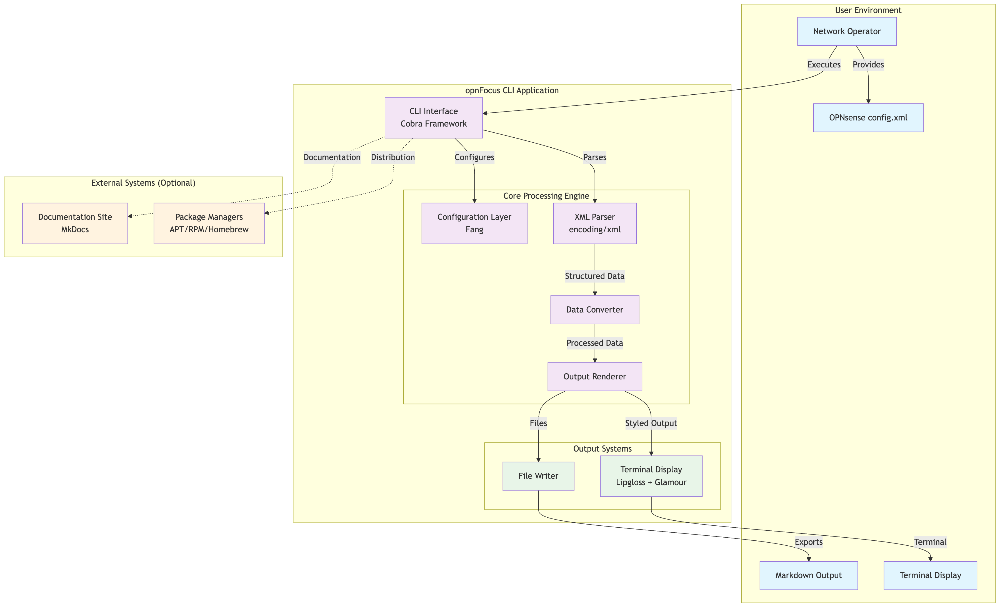
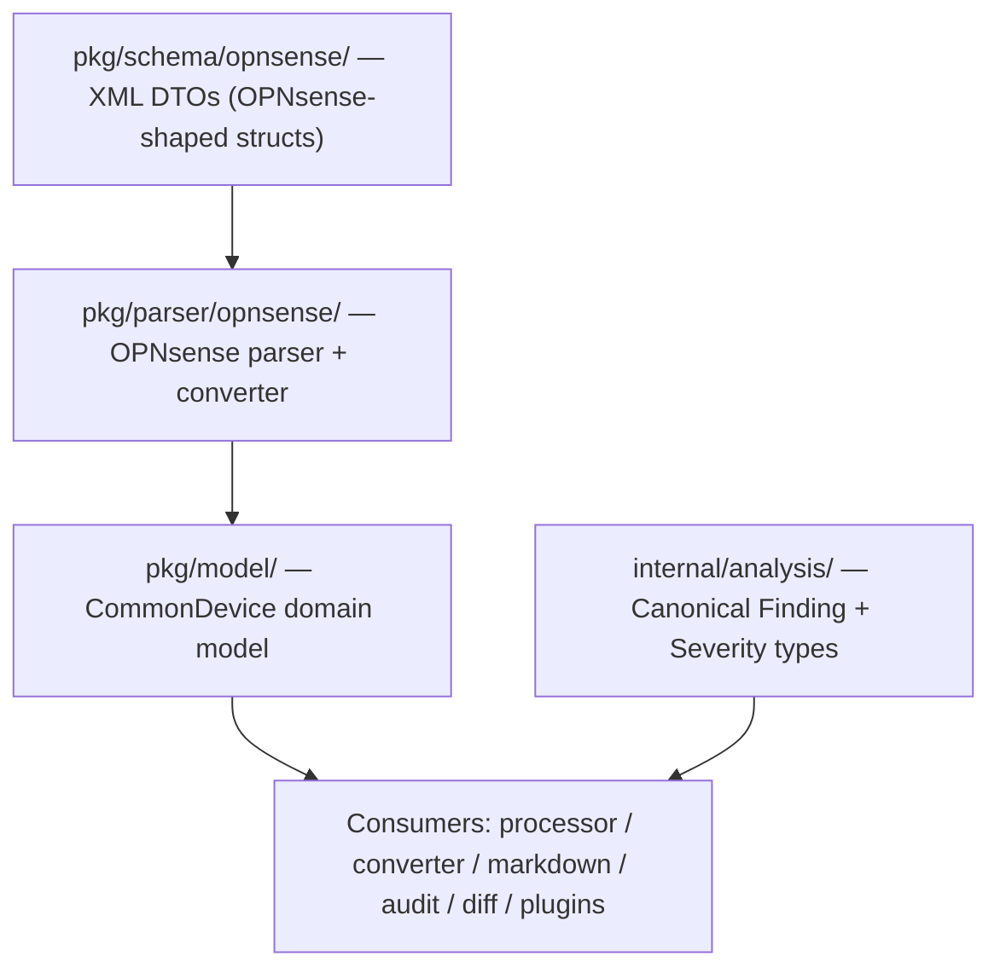
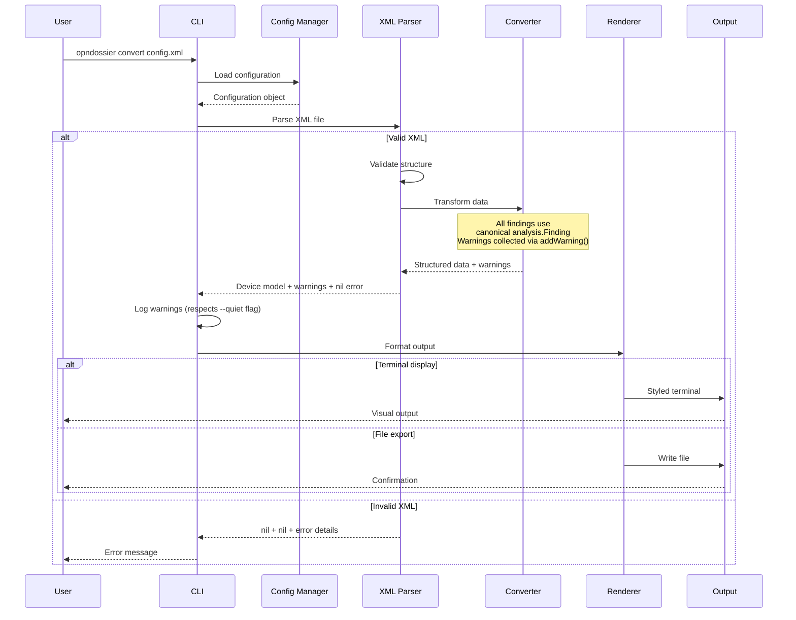
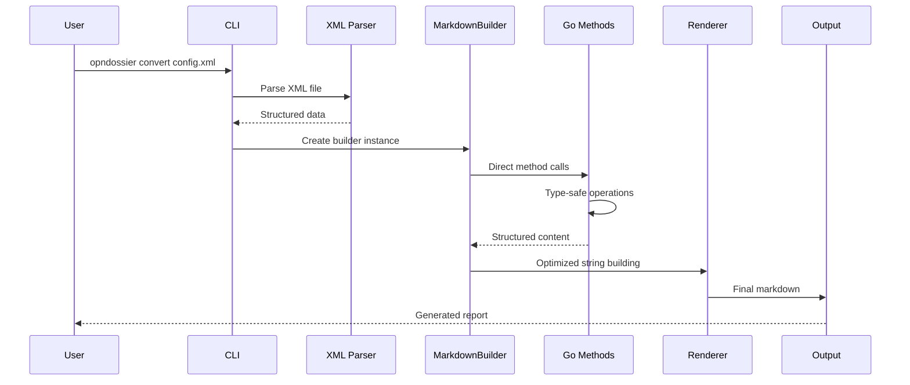
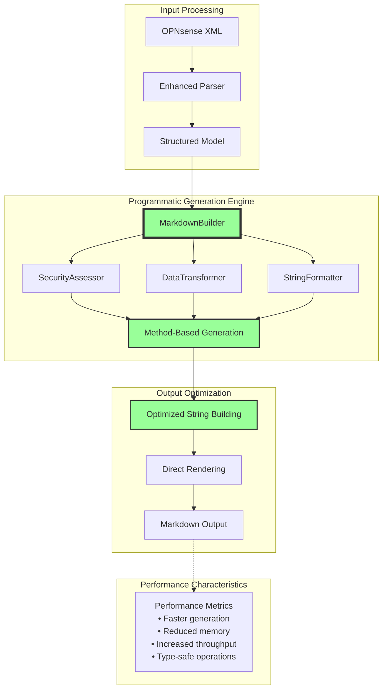
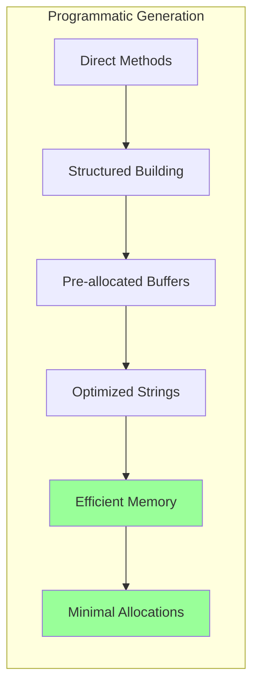
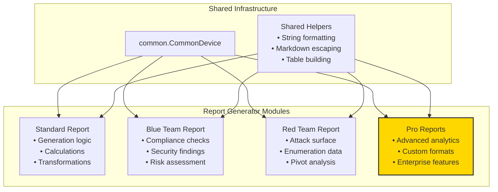
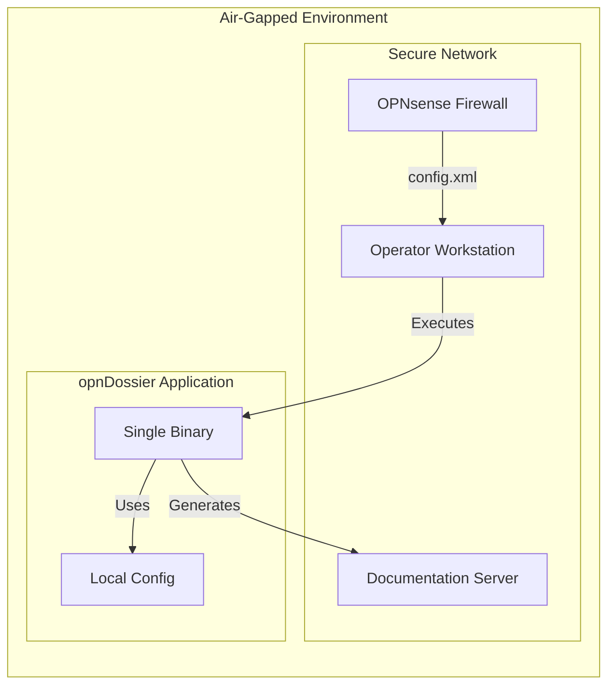

# opnDossier System Architecture

## Overview

opnDossier is a **CLI-based multi-device firewall configuration processor** designed with an **offline-first, operator-focused architecture**. Currently supports OPNsense with an extensible architecture for additional device types. The system transforms complex XML configuration files into human-readable markdown documentation, following security-first principles and air-gap compatibility.



## High-Level Architecture

### Core Design Principles

1. **Offline-First**: Zero external dependencies, complete air-gap compatibility
2. **Operator-Focused**: Built for network administrators and operators
3. **Framework-First**: Leverages established Go libraries (Cobra, Charm ecosystem)
4. **Structured Data**: Maintains configuration hierarchy and relationships
5. **Security-First**: No telemetry, input validation, secure processing

### Architecture Pattern

- **Monolithic CLI Application** with clear separation of concerns
- **Single Binary Distribution** for easy deployment
- **Local Processing Only** - no external network calls
- **Streaming Data Pipeline** from XML input to various output formats

### Technology Stack

Built with modern Go practices and established libraries:

| Component          | Technology                                                  |
| ------------------ | ----------------------------------------------------------- |
| CLI Framework      | [Cobra](https://github.com/spf13/cobra)                     |
| Configuration      | [Viper](https://github.com/spf13/viper)                     |
| CLI Enhancement    | [Charm Fang](https://github.com/charmbracelet/fang)         |
| Terminal Styling   | [Charm Lipgloss](https://github.com/charmbracelet/lipgloss) |
| Markdown Rendering | [Charm Glamour](https://github.com/charmbracelet/glamour)   |
| XML Processing     | Go's built-in `encoding/xml`                                |
| Structured Logging | [Charm Log](https://github.com/charmbracelet/log)           |

The CLI uses a layered architecture: **Cobra** provides command structure and argument parsing, **Viper** handles layered configuration management (files, env, flags), and **Fang** adds enhanced UX features like styled help, automatic version flags, and shell completion.

## Public Package Boundaries and Interface Injection

### The pkg/internal/ Import Boundary

`pkg/` packages must **NEVER** import `internal/` packages. Any type exposed through a `pkg/` struct field must itself live in `pkg/` or stdlib. This enforces a strict architectural boundary that ensures external consumers can use the public API without encountering Go's `internal/` access restrictions.

**Key Principle**: When moving types from `internal/` to `pkg/`, audit all struct fields for leaked internal types and define public equivalents in `pkg/` (e.g., `pkg/model.Severity` replaces `internal/analysis.Severity` in `ConversionWarning`).

### Boundary Verification

Before committing changes to `pkg/` packages, run this command to catch boundary violations:

```bash
grep -rn 'internal/' --include='*.go' pkg/ | grep -v _test.go
```

This checks for any production code in `pkg/` that imports `internal/` packages. Test files (`*_test.go`) are allowed to import `internal/` packages since Go's access restrictions only apply to external consumers.

### Interface Injection Pattern

When `pkg/` packages need functionality from `internal/` packages, use **interface injection** instead of moving entire dependency chains:

1. **Define an interface in `pkg/`** with the required methods
2. **Inject the concrete implementation at the `cmd/` layer** where both `pkg/` and `internal/` packages are accessible
3. **Use the interface type** in `pkg/` package constructors and fields

#### Canonical Example: XMLDecoder

The `pkg/parser.XMLDecoder` interface demonstrates this pattern:

```go
// pkg/parser/factory.go
type XMLDecoder interface {
    Parse(ctx context.Context, r io.Reader) (*schema.OpnSenseDocument, error)
    ParseAndValidate(ctx context.Context, r io.Reader) (*schema.OpnSenseDocument, error)
}

func NewFactory(decoder XMLDecoder) *Factory {
    return &Factory{xmlDecoder: decoder}
}
```

Application code in `cmd/` wires the concrete implementation:

```go
// cmd/convert.go
factory := parser.NewFactory(cfgparser.NewXMLParser())
```

This allows `pkg/parser` to use XML parsing functionality from `internal/cfgparser` without importing it directly.

### Structural Typing for Sub-Packages

Go's structural typing allows `pkg/` sub-packages to define their own **unexported interface** that `internal/` types satisfy without importing them:

```go
// pkg/parser/opnsense/parser.go
type xmlDecoder interface {
    Parse(ctx context.Context, r io.Reader) (*schema.OpnSenseDocument, error)
    ParseAndValidate(ctx context.Context, r io.Reader) (*schema.OpnSenseDocument, error)
}

func NewParser(decoder xmlDecoder) *Parser {
    return &Parser{decoder: decoder}
}
```

The `internal/cfgparser.XMLParser` type satisfies this interface through structural compatibility, without requiring an explicit import.

### Unexporting Types Pattern

When making a type unexported (e.g., `Converter` → `converter`) to reduce API surface area, provide a **convenience function** for external test packages that cannot access unexported constructors:

```go
// pkg/parser/opnsense/converter.go
type converter struct {
    // unexported fields
}

// ConvertDocument provides public access for testing and external consumers
func ConvertDocument(doc *schema.OpnSenseDocument) (*common.CommonDevice, []common.ConversionWarning, error) {
    c := &converter{}
    return c.ToCommonDevice(doc)
}
```

This allows external test packages to use the conversion functionality without accessing the unexported `converter` type directly.

### Related Documentation

For detailed examples and the historical context of fixing `pkg/internal/` boundary violations, see:
- **[docs/solutions/architecture-issues/pkg-internal-import-boundary.md](../solutions/architecture-issues/pkg-internal-import-boundary.md)**

## Services and Components

### 1. CLI Interface Layer

- **Framework**: Cobra CLI
- **Responsibility**: Command parsing, user interaction, error handling, warning propagation
- **Key Files**: `cmd/root.go`, `cmd/convert.go`, `cmd/display.go`, `cmd/validate.go`
- **Warning Handling**: All commands log conversion warnings via structured logging; warnings suppressed when `--quiet` flag is used

### 2. Configuration Management

- **Framework**: spf13/viper
- **Sources**: CLI flags > Environment variables > Config file > Defaults
- **Format**: YAML configuration files
- **Precedence**: Standard order where environment variables override config files for deployment flexibility

### 3. Analysis Infrastructure

- **Package**: `internal/analysis/`
- **Responsibility**: Canonical finding and severity types shared across audit, compliance, and processor packages
- **Key Types**: `Finding` struct, `Severity` type with validation helpers
- **Export Model**: `ComplianceResults`, `ComplianceFinding`, `PluginComplianceResult`, `ComplianceControl`, `ComplianceResultSummary`, `CompliancePluginInfo`, `ComplianceAttackSurface` in `pkg/model/enrichment.go`
- **Purpose**: Eliminates type duplication, ensures consistency across all analysis-related packages
- **Usage**: Also used in `ConversionWarning` type for severity classification of non-fatal conversion issues

### 4. Data Processing Engine

#### XML Parser Component

- **Technology**: Go's built-in `encoding/xml`
- **Input**: OPNsense config.xml files
- **Output**: Structured Go data types
- **Features**: Schema validation, error reporting, automatic charset conversion (UTF-8, US-ASCII, ISO-8859-1, Windows-1252)

#### Data Converter Component

- **Input**: Parsed XML structures
- **Output**: Markdown content, conversion warnings
- **Features**: Hierarchy preservation, metadata injection, non-fatal issue tracking
- **Warning Generation**: Accumulates conversion warnings for incomplete or problematic configuration elements (empty firewall rule fields, missing NAT rule data, gateway issues, user/certificate problems, HA configuration warnings)
- **Audit Report Rendering**: Delegates compliance audit report rendering to `internal/converter/builder/` via `BuildAuditSection()` and `WriteAuditSection()` methods
- **Audit Mode Integration**: In audit mode, `cmd/audit_handler.go` maps `audit.Report` to `common.ComplianceResults` and populates the `ComplianceChecks` field on a shallow copy of `CommonDevice`, enabling multi-format output (markdown, JSON, YAML) through the standard generation pipeline

#### Output Renderer Component

- **Formats**: Markdown, JSON, YAML, plain text, HTML
- **Technologies**: Charm Lipgloss (styling) + Charm Glamour (rendering)

### 5. Output Systems

- **Terminal Display**: Syntax-highlighted, styled terminal output via `display` command
- **File Export**: Multi-format file generation (markdown, JSON, YAML, text, HTML)

## Data Model Architecture

opnDossier uses a hierarchical model structure that mirrors the OPNsense XML configuration while organizing functionality into logical domains:


```mermaid
graph TB
    subgraph "Root Configuration"
        ROOT[Opnsense Root]
        META[Metadata & Global Settings]
    end

    subgraph "System Domain"
        SYS[System Configuration]
        USERS[User Management]
        GROUPS[Group Management]
        SYSCFG[System Services Config]
    end

    subgraph "Network Domain"
        NET[Network Configuration]
        IFACES[Interface Management]
        ROUTING[Routing & Gateways]
        VLAN[VLAN Configuration]
    end

    subgraph "Security Domain"
        SEC[Security Configuration]
        FIREWALL[Firewall Rules]
        NAT[NAT Configuration]
        VPN[VPN Services]
        CERTS[Certificate Management]
    end

    subgraph "Services Domain"
        SVC[Services Configuration]
        DNS[DNS Services]
        DHCP[DHCP Services]
        MONITOR[Monitoring Services]
        WEB[Web Services]
    end

    ROOT --> META
    ROOT --> SYS
    ROOT --> NET
    ROOT --> SEC
    ROOT --> SVC

    SYS --> USERS
    SYS --> GROUPS
    SYS --> SYSCFG

    NET --> IFACES
    NET --> ROUTING
    NET --> VLAN

    SEC --> FIREWALL
    SEC --> NAT
    SEC --> VPN
    SEC --> CERTS

    SVC --> DNS
    SVC --> DHCP
    SVC --> MONITOR
    SVC --> WEB
```

This hierarchical structure provides:

- **Logical Organization**: Related configuration grouped by functional domain
- **Maintainability**: Easier to locate and modify specific configuration types
- **Extensibility**: New features can be added to appropriate domains
- **Validation**: Domain-specific validation rules improve data integrity
- **API Evolution**: JSON tags enable better REST API integration
- **Compliance Data**: `ComplianceResults` field (formerly `ComplianceChecks`) is a rich nested structure containing `Mode`, `Findings`, `PluginResults` map with per-plugin `PluginComplianceResult` instances, `Summary`, and `Metadata`

## Multi-Device Model Layer Architecture

opnDossier separates XML-specific DTOs from the domain model consumed by all downstream components. This enables support for multiple device types (OPNsense today, pfSense/Cisco ASA in the future) behind a single `CommonDevice` abstraction.


```mermaid
graph TD
    A["pkg/schema/opnsense/ — XML DTOs (OPNsense-shaped structs)"]
    B["pkg/parser/opnsense/ — OPNsense parser + converter"]
    C["pkg/model/ — CommonDevice domain model"]
    D["internal/analysis/ — Canonical Finding + Severity types"]
    E["Consumers: processor / converter / markdown / audit / diff / plugins"]

    A --> B
    B --> C
    C --> E
    D --> E
```

### Layer Responsibilities

- **`pkg/schema/opnsense/`** — XML DTO layer. Carries `xml:""` tags and mirrors the OPNsense config.xml structure. This layer is untouched by downstream consumers.
- **`pkg/parser/opnsense/`** — Contains `parser.go` and `converter.go`. Reads schema DTOs and emits `*common.CommonDevice` with conversion warnings. This is the only package that imports `pkg/schema/opnsense/`.
- **`pkg/model/`** — Device-agnostic domain model. No XML tags. All consumer code (processor, converter, markdown, audit, diff, compliance plugins) operates on `CommonDevice`. Includes `ConversionWarning` type for non-fatal issues and `ComplianceResults` type (with nested `ComplianceFinding`, `PluginComplianceResult`, `ComplianceControl`, `ComplianceResultSummary`, `CompliancePluginInfo`, `ComplianceAttackSurface`) for compliance audit data representation.
- **`internal/analysis/`** — Canonical finding and severity types. Provides the shared `Finding` struct and `Severity` type used across audit, compliance, and processor packages to ensure consistency.
- **`pkg/parser/factory.go`** — `Factory` and `DeviceParser` interface. Auto-detects the device type from the XML root element. The `--device-type opnsense` flag bypasses auto-detection. Returns 3 values: device model, warnings slice, and error.

### Device Type Detection

The `--device-type` flag is exposed on all config-reading commands (`convert`, `display`, `audit`, `diff`, `validate`). When specified, it bypasses auto-detection and fails only if parsing or validation fails. When omitted, `parser.Factory` inspects the root XML element to select the correct parser.

## Data Flow Architecture


```mermaid
sequenceDiagram
    participant User
    participant CLI
    participant ConfigMgr as Config Manager
    participant Parser as XML Parser
    participant Converter
    participant Renderer
    participant Output

    User->>CLI: opndossier convert config.xml
    CLI->>ConfigMgr: Load configuration
    ConfigMgr-->>CLI: Configuration object
    CLI->>Parser: Parse XML file

    alt Valid XML
        Parser->>Parser: Validate structure
        Parser->>Converter: Transform data
        Note over Converter: All findings use<br/>canonical analysis.Finding<br/>Warnings collected via addWarning()
        Converter-->>Parser: Structured data + warnings
        Parser-->>CLI: Device model + warnings + nil error
        CLI->>CLI: Log warnings (respects --quiet flag)
        CLI->>Renderer: Format output

        alt Terminal display
            Renderer->>Output: Styled terminal
            Output-->>User: Visual output
        else File export
            Renderer->>Output: Write file
            Output-->>User: Confirmation
        end
    else Invalid XML
        Parser-->>CLI: nil + nil + error details
        CLI-->>User: Error message
    end
```

## Programmatic Generation Architecture

### Core Architecture

opnDossier uses programmatic markdown generation via the `MarkdownBuilder` component, delivering high performance, type safety, and enhanced developer experience.


```mermaid
sequenceDiagram
    participant User
    participant CLI
    participant Parser as XML Parser
    participant Builder as MarkdownBuilder
    participant Methods as Go Methods
    participant Renderer
    participant Output

    User->>CLI: opndossier convert config.xml
    CLI->>Parser: Parse XML file
    Parser-->>CLI: Structured data
    CLI->>Builder: Create builder instance
    Builder->>Methods: Direct method calls
    Methods->>Methods: Type-safe operations
    Methods-->>Builder: Structured content
    Builder->>Renderer: Optimized string building
    Renderer->>Output: Final markdown
    Output-->>User: Generated report
```

### Key Architectural Features

#### 1. Performance Optimizations

The programmatic approach delivers significant performance improvements:

- **Memory Usage**: Reduced allocations through direct string building
- **Generation Speed**: Fast generation via method-based approach
- **Throughput**: High reports per second
- **Scalability**: Consistent performance across all dataset sizes

Performance can be measured using benchmarks in `internal/converter/markdown_bench_test.go`.

#### 2. Type Safety


```mermaid
graph TB
    subgraph "Programmatic Generation"
        P1[Go Methods] --> P2[Compile-time Validation]
        P2 --> P3[Type-safe Operations]
        P3 --> P4[Explicit Error Handling]
        P4 --> P5[Structured Results]
    end

    style P2 fill:#99ff99
    style P3 fill:#99ff99
    style P4 fill:#99ff99
```

#### 3. Security Enhancements (Red Team Focus)

- **Output Obfuscation**: Built-in capabilities for sensitive data handling
- **Complete Offline Support**: No external dependencies
- **Memory Safety**: Improved handling of large configurations
- **Error Isolation**: Structured error handling prevents information leakage

### MarkdownBuilder Component Architecture

```mermaid
classDiagram
    class ReportBuilder {
        <<interface>>
        +BuildStandardReport(data) string
        +BuildCustomReport(data, options) string
        +BuildSystemSection(data) string
        +BuildNetworkSection(data) string
        +BuildSecuritySection(data) string
        +BuildServicesSection(data) string
        +BuildAuditSection(data) string
    }

    class MarkdownBuilder {
        -device *common.CommonDevice
        -options BuildOptions
        -logger *Logger
        +CalculateSecurityScore(data) int
        +AssessRiskLevel(severity) string
        +FilterSystemTunables(tunables, filter) []SysctlItem
        +GroupServicesByStatus(services) map[string][]Service
        +FormatInterfaceLinks(interfaces) string
        +EscapeMarkdownSpecialChars(input) string
        +BuildAuditSection(data) string
    }

    class SecurityAssessor {
        +CalculateSecurityScore(data) int
        +AssessRiskLevel(severity) string
        +AssessServiceRisk(service) string
        +DetermineSecurityZone(interface) string
    }

    class DataTransformer {
        +FilterSystemTunables(tunables, filter) []SysctlItem
        +GroupServicesByStatus(services) map[string][]Service
        +FormatSystemStats(data) map[string]interface{}
    }

    class StringFormatter {
        +EscapeMarkdownSpecialChars(input) string
        +FormatTimestamp(timestamp) string
        +TruncateDescription(text, length) string
        +FormatBoolean(value) string
    }

    ReportBuilder <|.. MarkdownBuilder
    MarkdownBuilder o-- SecurityAssessor
    MarkdownBuilder o-- DataTransformer
    MarkdownBuilder o-- StringFormatter
```

### Data Flow Pipeline (Programmatic Mode)


```mermaid
graph TD
    subgraph "Input Processing"
        XML[OPNsense XML] --> Parser[Enhanced Parser]
        Parser --> Model[Structured Model]
    end

    subgraph "Programmatic Generation Engine"
        Model --> Builder[MarkdownBuilder]
        Builder --> Security[SecurityAssessor]
        Builder --> Transform[DataTransformer]
        Builder --> Format[StringFormatter]

        Security --> Methods[Method-Based Generation]
        Transform --> Methods
        Format --> Methods
    end

    subgraph "Output Optimization"
        Methods --> StringBuild[Optimized String Building]
        StringBuild --> Render[Direct Rendering]
        Render --> Output[Markdown Output]
    end

    subgraph "Performance Characteristics"
        Metrics[Performance Metrics<br/>• Faster generation<br/>• Reduced memory<br/>• Increased throughput<br/>• Type-safe operations]
    end

    Output -.-> Metrics

    style Builder fill:#99ff99,stroke:#333,stroke-width:4px
    style Methods fill:#99ff99,stroke:#333,stroke-width:2px
    style StringBuild fill:#99ff99,stroke:#333,stroke-width:2px
```

### Method Categories and Performance

#### Security Assessment Methods

- **CalculateSecurityScore**: 1.59M operations/sec
- **AssessRiskLevel**: 92M operations/sec
- **AssessServiceRisk**: High-frequency assessment capability

#### Data Transformation Methods

- **FilterSystemTunables**: 797K operations/sec
- **GroupServicesByStatus**: 1.01M operations/sec
- **FormatSystemStats**: Optimized for large datasets

#### String Utility Methods

- **EscapeMarkdownSpecialChars**: Ultra-fast character processing
- **FormatTimestamp**: Efficient time formatting
- **TruncateDescription**: Word-boundary aware truncation

#### Section Builders

- **BuildSystemSection**: 1.7K operations/sec (comprehensive sections)
- **BuildNetworkSection**: 6.7K operations/sec
- **BuildSecuritySection**: 5.1K operations/sec
- **BuildServicesSection**: 13K operations/sec
- **BuildAuditSection**: Renders compliance audit sections including summary, plugin results, findings tables, and metadata

### Memory Management Architecture


```mermaid
graph LR
    subgraph "Programmatic Generation"
        P1[Direct Methods] --> P2[Structured Building]
        P2 --> P3[Pre-allocated Buffers]
        P3 --> P4[Optimized Strings]
        P4 --> P5[Efficient Memory]
        P5 --> P6[Minimal Allocations]
    end

    style P5 fill:#99ff99
    style P6 fill:#99ff99
```

### Error Handling Architecture

```go
// Structured error types
type ValidationError struct {
    Field   string
    Value   any
    Message string
}

type GenerationError struct {
    Component string
    Operation string
    Cause     error
}

// Context-aware error handling
func (b *MarkdownBuilder) BuildSection(device *common.CommonDevice) (string, error) {
    if err := b.validateInput(data); err != nil {
        return "", &ValidationError{
            Field:   "input_data",
            Value:   data,
            Message: fmt.Sprintf("invalid input: %v", err),
        }
    }

    result, err := b.generateContent(data)
    if err != nil {
        return "", &GenerationError{
            Component: "section_builder",
            Operation: "content_generation",
            Cause:     err,
        }
    }

    return result, nil
}
```

## Modular Report Generator Architecture

### Design Principles

Report generators in opnDossier follow a **modular, self-contained architecture** designed to support:

1. **Build-time feature selection** via Go build flags
2. **Pro-level features** through optional modules
3. **Independent development** of report types
4. **Clean separation** between shared infrastructure and report-specific logic

### Module Structure

Each report generator should be a self-contained module with its own:

- **Generation logic** - All markdown/output construction
- **Calculation logic** - Security scoring, risk assessment, statistics
- **Data transformations** - Report-specific data processing
- **Constants and mappings** - Report-specific configuration


```mermaid
graph TB
    subgraph "Shared Infrastructure"
        Model[common.CommonDevice]
        Helpers[Shared Helpers<br/>• String formatting<br/>• Markdown escaping<br/>• Table building]
    end

    subgraph "Report Generator Modules"
        Standard[Standard Report<br/>• Generation logic<br/>• Calculations<br/>• Transformations]
        Blue[Blue Team Report<br/>• Compliance checks<br/>• Security findings<br/>• Risk assessment]
        Red[Red Team Report<br/>• Attack surface<br/>• Enumeration data<br/>• Pivot analysis]
        Pro[Pro Reports<br/>• Advanced analytics<br/>• Custom formats<br/>• Enterprise features]
    end

    Model --> Standard
    Model --> Blue
    Model --> Red
    Model --> Pro

    Helpers --> Standard
    Helpers --> Blue
    Helpers --> Red
    Helpers --> Pro

    style Pro fill:#ffd700,stroke:#333,stroke-width:2px
```

### Build Flag Integration

Report generators can be conditionally included using Go build tags:

```go
//go:build pro

package reports

// Pro-level report generators included only with -tags=pro
```

This enables:

- **Standard builds** with core report types
- **Pro builds** with additional enterprise features
- **Custom builds** with specific report combinations

### Implementation Guidelines

#### What Each Report Module Should Contain

Report modules are self-contained packages. Currently, report generation lives in `internal/converter/builder/` and `internal/converter/formatters/`. As the system evolves to support Pro-level features, each report type may be extracted to its own package following this structure:

```
internal/converter/<report-type>/
├── generator.go       # Main generation logic
├── calculations.go    # Report-specific calculations
├── transformers.go    # Data transformation functions
├── constants.go       # Report-specific constants
└── <report-type>_test.go
```

#### What Should Remain Shared

- **`common.CommonDevice`** - The parsed device-agnostic configuration model
- **`analysis.Finding`** - Canonical finding type for all analysis results
- **String helpers** - Markdown escaping, formatting utilities
- **Table builders** - Generic markdown table construction
- **Common interfaces** - `ReportBuilder`, `Generator` interfaces

#### Example Module Structure

```go
// internal/reports/blueteam/generator.go
package blueteam

import (
    "github.com/EvilBit-Labs/opnDossier/internal/analysis"
    common "github.com/EvilBit-Labs/opnDossier/pkg/model"
    "github.com/EvilBit-Labs/opnDossier/internal/converter/formatters"
)

type BlueTeamGenerator struct {
    // All state and configuration for blue team reports
}

func (g *BlueTeamGenerator) Generate(device *common.CommonDevice) (string, error) {
    // Self-contained generation using only model and helpers
    score := g.calculateSecurityScore(device)
    findings := g.analyzeCompliance(device)
    return g.buildReport(device, score, findings)
}

// All calculation logic is internal to this module
func (g *BlueTeamGenerator) calculateSecurityScore(device *common.CommonDevice) int {
    // Blue team specific scoring algorithm
}

// All findings returned use the canonical analysis.Finding type
func (g *BlueTeamGenerator) analyzeCompliance(device *common.CommonDevice) []analysis.Finding {
    // Compliance analysis returning standardized findings
}
```

### Benefits

1. **Independent Testing** - Each report module can be tested in isolation
2. **Feature Gating** - Pro features excluded from standard builds
3. **Reduced Coupling** - Changes to one report type don't affect others
4. **Clear Ownership** - Each module has defined boundaries
5. **Extensibility** - New report types added without modifying core

## Audit-to-Export Mapping

The `cmd/audit_handler.go` module contains `mapAuditReportToComplianceResults()`, which converts the internal `audit.Report` structure into the export model `common.ComplianceResults`. This mapping enables multi-format output (markdown, JSON, YAML) for compliance audit data through the standard generation pipeline.

### Mapping Process

1. **Top-level findings**: Converts `audit.Finding` instances (which embed `analysis.Finding`) to `common.ComplianceFinding` instances, preserving `AttackSurface`, `ExploitNotes`, and `Control` fields
2. **Per-plugin results**: Maps each `audit.ComplianceResult` in the `report.Compliance` map to `common.PluginComplianceResult`, including:
   - Plugin metadata (`PluginInfo`)
   - Plugin-specific findings
   - Summary statistics (`ComplianceResultSummary`)
   - Control definitions (`ComplianceControl`)
   - Per-control compliance status (boolean map)
3. **Aggregate summary**: Computes summary statistics across all plugins and direct findings, including total/critical/high/medium/low counts and compliant/non-compliant control counts
4. **Metadata preservation**: Clones the audit metadata map

### Integration with Builder Layer

Once the mapping is complete, `handleAuditMode()` creates a shallow copy of the `CommonDevice` and populates its `ComplianceChecks` field with the mapped `ComplianceResults`. This enriched device is then passed to `generateWithProgrammaticGenerator()`, which delegates to `BuildAuditSection()` (for markdown) or serializes the `ComplianceChecks` field directly (for JSON/YAML).

## Data Storage Strategy

### Local File System

- **Configuration**: `~/.opnDossier.yaml` (user preferences)
- **Input**: OPNsense XML files (any location)
- **Output**: Markdown files (user-specified or current directory)

### Memory Management

- **Structured Data**: Go structs with XML/JSON tags
- **Large Files**: Streaming processing for memory efficiency
- **Type Safety**: Strong typing throughout the pipeline

### No Persistent Storage

- **Stateless Operation**: Each run is independent
- **No Database**: All data flows through memory
- **Temporary Files**: Cleaned up automatically

## External Integrations

### Documentation System

- **Technology**: MkDocs with Material theme
- **Purpose**: Static documentation generation
- **Deployment**: Local development server, no runtime dependencies

### Package Distribution

- **Build System**: GoReleaser for multi-platform builds
- **Platforms**: Linux, macOS, Windows (amd64, arm64)
- **Distribution**: GitHub Releases, package managers, direct download
- **Formats**: Binary archives, system packages (deb, rpm, apk)

### Development Integration

- **CI/CD**: GitHub Actions
- **Quality**: golangci-lint, pre-commit hooks
- **Testing**: Go's built-in testing framework
- **Task Runner**: Just for development workflows

## Air-Gap/Offline Considerations

### Design for Isolation


```mermaid
graph LR
    subgraph "Air-Gapped Environment"
        subgraph "Secure Network"
            FW[OPNsense Firewall]
            OPS[Operator Workstation]
            DOCS[Documentation Server]
        end

        subgraph "opnDossier Application"
            BIN[Single Binary]
            CFG[Local Config]
        end
    end

    FW -->|config.xml| OPS
    OPS -->|Executes| BIN
    BIN -->|Uses| CFG
    BIN -->|Generates| DOCS
```

### Offline Capabilities

1. **Zero External Dependencies**: All libraries embedded in binary
2. **No Network Calls**: Completely self-contained operation
3. **Portable Deployment**: Single binary, no installation required
4. **Data Exchange**: File-based import/export only

### Data Exchange Patterns

- **Import**: Local files, USB drives, network shares
- **Export**: Markdown, JSON, plain text
- **Transfer**: Standard file transfer protocols (SCP, SFTP, etc.)

## Versioned Data Strategy

### Configuration Versioning

- **Backward Compatibility**: Support for older OPNsense versions
- **Forward Compatibility**: Graceful handling of newer configurations
- **Version Detection**: Automatic OPNsense version identification
- **Migration Support**: Utilities for format changes

### Non-Destructive Processing

- **Original Preservation**: Input files never modified
- **Timestamped Outputs**: Version metadata in all outputs
- **Audit Trail**: Change tracking and diff generation
- **Rollback Support**: Easy reversion to previous states

### Schema Evolution

```mermaid
graph TB
    subgraph "Version Management"
        V1[OPNsense v1.x<br/>Basic features]
        V2[OPNsense v2.x<br/>Enhanced features]
        V3[OPNsense v3.x<br/>Latest features]
    end

    subgraph "Compatibility Layer"
        COMPAT[Version Handler]
        MIGRATE[Migration Engine]
        VALIDATE[Schema Validator]
    end

    subgraph "Processing Pipeline"
        PARSER[XML Parser]
        CONVERTER[Data Converter]
        RENDERER[Output Renderer]
    end

    V1 --> COMPAT
    V2 --> COMPAT
    V3 --> COMPAT

    COMPAT --> VALIDATE
    COMPAT --> MIGRATE
    MIGRATE --> PARSER
    VALIDATE --> PARSER

    PARSER --> CONVERTER
    Note over CONVERTER: Accumulates warnings<br/>for incomplete data
    CONVERTER --> RENDERER
```

## Warning System

### ConversionWarning Type

The `ConversionWarning` type captures non-fatal issues encountered during schema-to-CommonDevice conversion:

```go
// ConversionWarning represents a non-fatal issue encountered during conversion
type ConversionWarning struct {
    Field    string            // Dot-path of problematic field (e.g., "FirewallRules[0].Type")
    Value    string            // Problematic value encountered
    Message  string            // Human-readable description
    Severity analysis.Severity // Importance of the warning
}
```

### Warning Generation

The OPNsense converter (`pkg/parser/opnsense/converter.go`) accumulates warnings during conversion via the `addWarning()` method:

```go
func (c *Converter) addWarning(field, value, message string, severity analysis.Severity) {
    c.warnings = append(c.warnings, common.ConversionWarning{
        Field:    field,
        Value:    value,
        Message:  message,
        Severity: severity,
    })
}
```

### Common Warning Scenarios

Warnings are generated for configuration elements with missing or incomplete data:

#### Firewall Rules

- **Empty rule type**: High severity warning when firewall rule has no type specified
- **Missing source address**: Medium severity warning for rules without source address
- **Missing destination address**: Medium severity warning for rules without destination address
- **No interface assigned**: Medium severity warning when interface field is empty

#### NAT Rules

- **Outbound NAT without interface**: Medium severity warning for unassigned outbound rules
- **Inbound NAT missing internal IP**: High severity warning for port forwards without target IP
- **Inbound NAT without interface**: Medium severity warning for unassigned inbound rules

#### Network Configuration

- **Gateway missing address**: Warnings for incomplete gateway definitions
- **Gateway missing name**: Warnings for unnamed gateways

#### System Configuration

- **User missing name**: Warnings for incomplete user accounts
- **User missing UID**: Warnings for users without unique identifiers
- **Certificate problems**: Warnings for invalid or incomplete certificates
- **HA configuration issues**: Warnings for high-availability misconfigurations

### Warning Propagation

Warnings flow through the system alongside the device model:

1. **Converter generates warnings** during `ToCommonDevice()` conversion
2. **DeviceParser returns warnings** from `Parse()` and `ParseAndValidate()` methods
3. **The Factory propagates warnings** through `CreateDevice()`
4. **CLI commands log warnings** via structured logging using `ctxLogger.Warn()`

### DeviceParser Interface

The `DeviceParser` interface signature returns 3 values to support warnings:

```go
type DeviceParser interface {
    // Parse reads and converts the configuration, returning non-fatal conversion warnings.
    Parse(ctx context.Context, r io.Reader) (*common.CommonDevice, []common.ConversionWarning, error)
    
    // ParseAndValidate reads, converts, and validates the configuration, returning non-fatal conversion warnings.
    ParseAndValidate(ctx context.Context, r io.Reader) (*common.CommonDevice, []common.ConversionWarning, error)
}
```

### Factory

The `Factory.CreateDevice()` method returns 3 values:

```go
func (f *Factory) CreateDevice(
    ctx context.Context,
    r io.Reader,
    deviceTypeOverride string,
    validateMode bool,
) (*common.CommonDevice, []common.ConversionWarning, error)
```

### CLI Integration

All configuration-reading commands (`convert`, `display`, `validate`, `diff`) handle warnings consistently:

```go
device, warnings, err := parser.NewFactory(cfgparser.NewXMLParser()).CreateDevice(ctx, file, deviceType, validateMode)
if err != nil {
    // Handle fatal error
}

// Log warnings unless --quiet flag is set
if cmdConfig == nil || !cmdConfig.IsQuiet() {
    for _, w := range warnings {
        ctxLogger.Warn("conversion warning",
            "field", w.Field,
            "message", w.Message,
            "severity", w.Severity,
        )
    }
}
```

### Quiet Mode Behavior

When the `--quiet` flag is used:

- Warnings are collected but not logged
- Only errors are reported
- Processing continues normally with warning suppression
- Useful for automated processing pipelines

## Security Architecture

### Threat Model

- **Primary Threats**: Malicious XML files, path traversal, resource exhaustion
- **Not Addressed**: Network attacks (offline operation), privilege escalation (user-level tool)

### Security Controls

- **Input Validation**: XML schema validation, path sanitization, size limits
- **Processing Security**: Memory safety (Go runtime), type safety, error handling
- **Output Security**: Path validation, permission checks, content sanitization

### Air-Gap Security Benefits

- **No Network Attack Surface**: Offline operation eliminates network-based threats
- **No Data Exfiltration**: Local processing only
- **No Unauthorized Updates**: Manual deployment only
- **Audit-Friendly**: All operations are local and traceable

## Deployment Patterns

### Single Binary Distribution

- **Build**: Cross-compiled Go binary
- **Size**: Minimal footprint (~10-20MB)
- **Dependencies**: None (all embedded)
- **Installation**: Drop-in replacement, no setup required

### Multi-Platform Support

- **Operating Systems**: Linux, macOS, Windows
- **Architectures**: amd64, arm64
- **Special**: macOS universal binaries
- **Packages**: Native package formats for each platform

### Enterprise Deployment

- **Package Management**: APT, RPM, Homebrew integration
- **Code Signing**: Verified binaries for security
- **Bulk Deployment**: Network share or USB distribution
- **Configuration Management**: YAML-based configuration

---

## Quick Start Architecture Summary

1. **User provides** OPNsense config.xml file
2. **CLI parses** command-line arguments and loads configuration
3. **Factory** auto-detects device type and converts to `CommonDevice`
4. **Converter** transforms XML to `CommonDevice`, accumulating conversion warnings for non-fatal issues
5. **Parser returns** 3 values: device model, warnings slice, error
6. **CLI logs** warnings via structured logging (suppressed with `--quiet` flag)
7. **Output Renderer** formats for terminal display or file export
8. **User receives** human-readable documentation

**Key Benefits**: Offline operation, security-first design, operator-focused workflows, cross-platform compatibility, and comprehensive documentation generation from complex network configurations.
