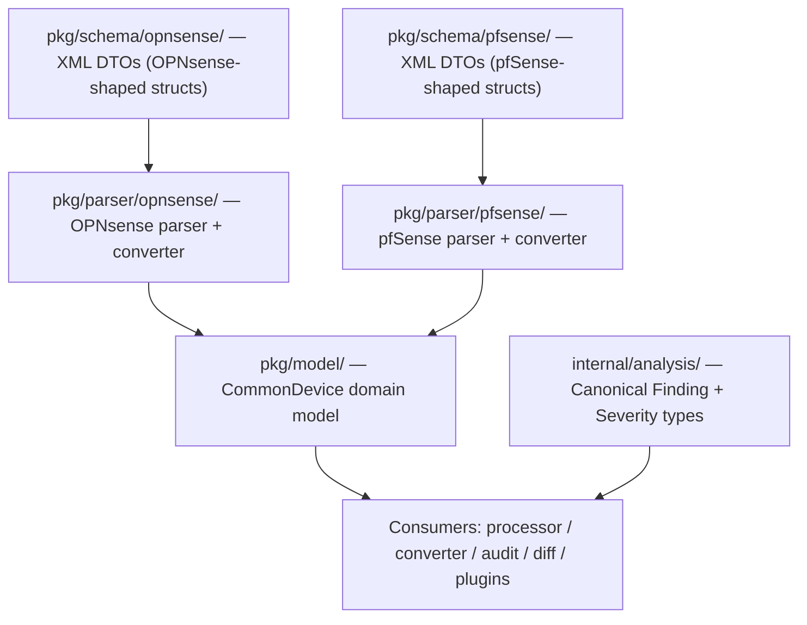
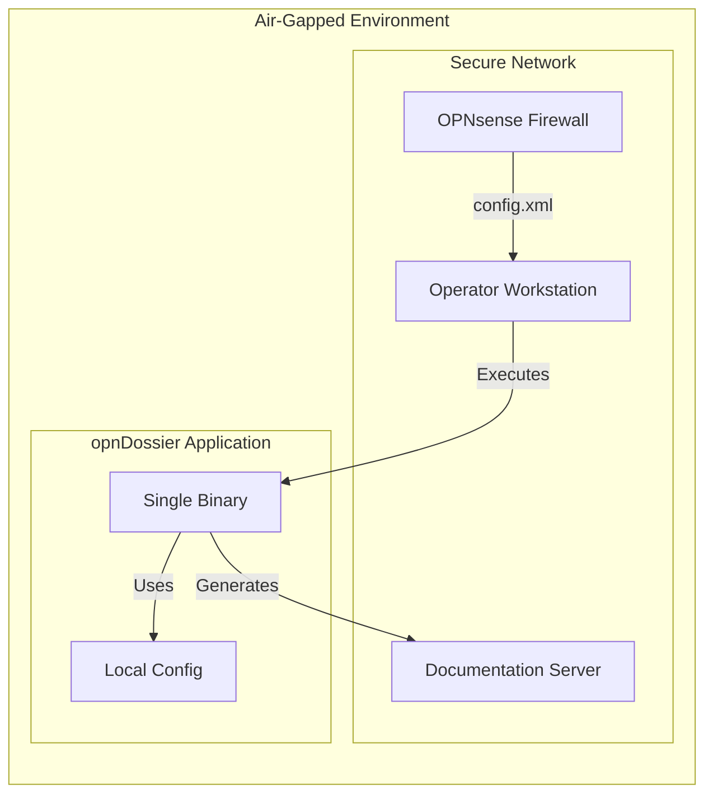

# Architecture Overview

This document covers the high-level system architecture of opnDossier: core design principles, the technology stack, public package boundaries, top-level components, the data model, multi-device support, and cross-cutting concerns (air-gap/offline, security, deployment). For the data processing pipeline and report-generation details see [pipelines.md](pipelines.md). For the compliance plugin system see the [Plugin Development Guide](../plugin-development.md).

## Overview

opnDossier is a **CLI-based multi-device firewall configuration processor** designed with an **offline-first, operator-focused architecture**. Currently supports OPNsense and pfSense with an extensible architecture for additional device types. The system transforms complex XML configuration files into human-readable markdown documentation, following security-first principles and air-gap compatibility.


## High-Level Architecture

### Core Design Principles

1. **Offline-First**: Zero external dependencies, complete air-gap compatibility, no runtime network calls
2. **Operator-Focused**: Built for network administrators and operators, preserves operator control and visibility
3. **Framework-First**: Leverages established Go libraries (Cobra, Charm ecosystem) before custom plumbing
4. **Structured Data**: Maintains configuration hierarchy and relationships, prefers typed models over ad-hoc strings
5. **Security-First**: No telemetry, input validation, secure processing, restrictive file permissions
6. **Polish Over Scale**: Smaller, well-documented feature set with sane defaults over large inconsistent surface area

For the complete philosophical foundation and ethical constraints, see **[CONTRIBUTING.md](https://github.com/EvilBit-Labs/opnDossier/blob/main/CONTRIBUTING.md) Core Philosophy** section.

### Architecture Pattern

- **Monolithic CLI Application** with clear separation of concerns
- **Single Binary Distribution** for easy deployment
- **Local Processing Only** - no external network calls
- **Streaming Data Pipeline** from XML input to various output formats

### Technology Stack

Built with modern Go practices and established libraries:

| Component           | Technology                                                  |
| ------------------- | ----------------------------------------------------------- |
| CLI Framework       | [Cobra](https://github.com/spf13/cobra)                     |
| Configuration       | [Viper](https://github.com/spf13/viper)                     |
| CLI Enhancement     | [Charm Fang](https://github.com/charmbracelet/fang)         |
| Terminal Styling    | [Charm Lipgloss](https://github.com/charmbracelet/lipgloss) |
| Markdown Rendering  | [Charm Glamour](https://github.com/charmbracelet/glamour)   |
| Markdown Generation | [nao1215/markdown](https://github.com/nao1215/markdown)     |
| XML Processing      | Go's built-in `encoding/xml`                                |
| Structured Logging  | [Charm Log](https://github.com/charmbracelet/log)           |
| Minimum Go Version  | Go 1.26+                                                    |

The CLI uses a layered architecture: **Cobra** provides command structure and argument parsing, **Viper** handles layered configuration management (files, env, flags) for opnDossier's own settings (CLI preferences, display options), and **Fang** adds enhanced UX features like styled help, automatic version flags, and shell completion. Note that **Viper** manages opnDossier configuration, while OPNsense `config.xml` parsing is handled separately by `internal/cfgparser/`.

## Public Package Boundaries and Interface Injection

### The pkg/internal/ Import Boundary

`pkg/` packages must **NEVER** import `internal/` packages. Any type exposed through a `pkg/` struct field must itself live in `pkg/` or stdlib. This enforces a strict architectural boundary that ensures external consumers can use the public API without encountering Go's `internal/` access restrictions.

**Key Principle**: When moving types from `internal/` to `pkg/`, audit all struct fields for leaked internal types and define public equivalents in `pkg/` (e.g., `pkg/model.Severity` replaces `internal/analysis.Severity` in `ConversionWarning`).

### Boundary Verification

Before committing changes to `pkg/` packages, run this command to catch boundary violations:

```bash
grep -rn 'internal/' --include='*.go' pkg/ | grep -v _test.go
```

This checks for any production code in `pkg/` that imports `internal/` packages. Test files (`*_test.go`) are allowed to import `internal/` packages since Go's access restrictions only apply to external consumers.

### Interface Injection Pattern

When `pkg/` packages need functionality from `internal/` packages, use **interface injection** instead of moving entire dependency chains:

1. **Define an interface in `pkg/`** with the required methods
2. **Inject the concrete implementation at the `cmd/` layer** where both `pkg/` and `internal/` packages are accessible
3. **Use the interface type** in `pkg/` package constructors and fields

#### Canonical Example: XMLDecoder

The `pkg/parser.XMLDecoder` interface demonstrates this pattern:

```go
// pkg/parser/factory.go
type XMLDecoder interface {
    Parse(ctx context.Context, r io.Reader) (*schema.OpnSenseDocument, error)
    ParseAndValidate(ctx context.Context, r io.Reader) (*schema.OpnSenseDocument, error)
}

func NewFactory(decoder XMLDecoder) *Factory {
    return &Factory{xmlDecoder: decoder, registry: DefaultRegistry()}
}

// NewFactoryWithRegistry allows test isolation with a custom registry.
func NewFactoryWithRegistry(decoder XMLDecoder, reg *DeviceParserRegistry) *Factory {
    return &Factory{xmlDecoder: decoder, registry: reg}
}
```

Application code in `cmd/` wires the concrete implementation:

```go
// cmd/convert.go
factory := parser.NewFactory(cfgparser.NewXMLParser())
```

This allows `pkg/parser` to use XML parsing functionality from `internal/cfgparser` without importing it directly.

### Structural Typing for Sub-Packages

Go's structural typing allows `pkg/` sub-packages to define their own interface that `internal/` types satisfy without importing them. In **PR #437**, the OPNsense parser was refactored to use the exported `parser.XMLDecoder` interface directly instead of a local `xmlDecoder` interface. This change was made because:

1. The `parser.XMLDecoder` interface is already exported in the public API
2. The local interface was redundant and added unnecessary indirection
3. Using the exported interface enables better type safety and documentation
4. It clarifies the dependency contract for external consumers

```go
// pkg/parser/opnsense/parser.go
func NewParser(decoder parser.XMLDecoder) *Parser {
    return &Parser{decoder: decoder}
}
```

The `internal/cfgparser.XMLParser` type satisfies the `parser.XMLDecoder` interface through structural compatibility, without requiring an explicit import of `internal/cfgparser`.

### Unexporting Types Pattern

When making a type unexported (e.g., `Converter` → `converter`) to reduce API surface area, provide a **convenience function** for external test packages that cannot access unexported constructors:

```go
// pkg/parser/opnsense/converter.go
type converter struct {
    // unexported fields
}

// ConvertDocument provides public access for testing and external consumers
func ConvertDocument(doc *schema.OpnSenseDocument) (*common.CommonDevice, []common.ConversionWarning, error) {
    c := &converter{}
    return c.ToCommonDevice(doc)
}
```

This allows external test packages to use the conversion functionality without accessing the unexported `converter` type directly.

### Related Documentation

For detailed examples and the historical context of fixing `pkg/internal/` boundary violations, see:

- **[docs/solutions/architecture-issues/pkg-internal-import-boundary.md](../../solutions/architecture-issues/pkg-internal-import-boundary.md)**

For practical developer guidance on public package purity and the boundary verification command, see **[CONTRIBUTING.md](https://github.com/EvilBit-Labs/opnDossier/blob/main/CONTRIBUTING.md) Go Development Standards** section.

## Services and Components

### 1. CLI Interface Layer

- **Framework**: Cobra CLI
- **Responsibility**: Command parsing, user interaction, error handling, warning propagation
- **Key Files**: `cmd/root.go`, `cmd/convert.go`, `cmd/display.go`, `cmd/validate.go`, `cmd/audit.go`, `cmd/audit_output.go`
- **Warning Handling**: All commands log conversion warnings via structured logging; warnings suppressed when `--quiet` flag is used
- **File Organization**: Audit command split into two files following file-size guidelines:
  - `audit.go` — Command definition, flags, `PreRunE` validation, `runAudit`, and `generateAuditOutput`
  - `audit_output.go` — Output emission logic (`emitAuditResult`), path derivation (`deriveAuditOutputPath`), and segment escaping (`escapePathSegment`)

### 2. Configuration Management

- **Framework**: spf13/viper
- **Sources**: CLI flags > Environment variables > Config file > Defaults
- **Format**: YAML configuration files
- **Precedence**: Standard order where environment variables override config files for deployment flexibility

### 3. Analysis Infrastructure

- **Package**: `internal/analysis/`
- **Responsibility**: Shared analysis logic and canonical finding types for converter, processor, audit, and compliance packages
- **Key Types**: `Finding` struct, `Severity` type with validation helpers
- **Shared Functions**:
  - `ComputeStatistics()` - Statistics computation for configuration items, services, and security features
  - `ComputeAnalysis()` - Detection logic for dead rules, unused interfaces, security, performance, and consistency issues
  - `DetectDeadRules()` - Dead rule detection with structured `Kind` field (`"unreachable"` or `"duplicate"`). **Uses typed constants for rule type comparisons** (e.g., `rule.Type == common.RuleTypeBlock`)
  - `DetectUnusedInterfaces()` - Unused interface detection across rules, DHCP, DNS, VPN, and load balancer
  - `RulesEquivalent()` - Rule comparison including `Disabled` field and normalized interface order
- **Defensive API**: All exported `Compute*` functions include nil guards for safe use with nil arguments
- **Export Model**: `ComplianceResults`, `ComplianceFinding`, `PluginComplianceResult`, `ComplianceControl`, `ComplianceResultSummary`, `CompliancePluginInfo`, `ComplianceAttackSurface` in `pkg/model/enrichment.go`
- **Purpose**: Eliminates duplicated detection and statistics logic, ensures consistency across all analysis-related packages. **Analysis code uses typed enum constants instead of string literals**, providing compile-time safety for rule type checks and security severity levels
- **Usage**: Also used in `ConversionWarning` type for severity classification of non-fatal conversion issues

### 4. Data Processing Engine

#### Device Parser Registry

- **Package**: `pkg/parser/`
- **Pattern**: Self-registration via `init()` + blank imports (mirrors `database/sql` driver pattern)
- **Key Types**: `DeviceParserRegistry`, `ConstructorFunc`, `DeviceParser` interface
- **Singleton**: `parser.DefaultRegistry()` returns the global registry; `parser.NewDeviceParserRegistry()` for test isolation
- **Registration**: Each parser package calls `parser.Register("rootElement", factory)` from `init()`
- **Dispatch**: `Factory.CreateDevice()` auto-detects device type from the XML root element via registry lookup, or accepts an explicit `--device-type` override
- **Built-in**: OPNsense parser self-registers in `pkg/parser/opnsense/parser.go`
- **Extensibility**: External parsers register via blank import in the consumer binary (see [Plugin Development Guide](../plugin-development.md#device-parser-development))
- **Blank Import Requirement**: `cmd/root.go` (and test files using `parser.NewFactory()`) must import both device parsers to trigger registration:
  ```go
  _ "github.com/EvilBit-Labs/opnDossier/pkg/parser/opnsense"
  _ "github.com/EvilBit-Labs/opnDossier/pkg/parser/pfsense"
  ```

For the full registry pattern (thread safety, self-registration, factory integration, test isolation) see [pipelines.md](pipelines.md#deviceparser-registry-pattern).

#### XML Parser Component

- **Technology**: Go's built-in `encoding/xml`
- **Input**: OPNsense and pfSense config.xml files
- **Output**: Structured Go data types
- **Features**: Schema validation, error reporting, automatic charset conversion (UTF-8, US-ASCII, ISO-8859-1, Windows-1252)
- **Shared Security Hardening**: `pkg/parser/xmlutil.go` provides `NewSecureXMLDecoder()` and `CharsetReader()` for XXE protection, input size limits, and charset handling used by both OPNsense and pfSense parsers

#### Data Converter Component

- **Input**: Parsed XML structures
- **Output**: Markdown content, conversion warnings
- **Features**: Hierarchy preservation, metadata injection, non-fatal issue tracking
- **Warning Generation**: Accumulates conversion warnings for incomplete or problematic configuration elements (empty firewall rule fields, missing NAT rule data, gateway issues, user/certificate problems, HA configuration warnings)
- **Analysis Integration**: Delegates to `internal/analysis/` for `ComputeStatistics()` and `ComputeAnalysis()` (shared, not mirrored)
- **Audit Report Rendering**: Delegates compliance audit report rendering to `internal/converter/builder/` via `BuildAuditSection()` and `WriteAuditSection()` methods
- **Audit Mode Integration**: In audit mode, `cmd/audit_handler.go` maps `audit.Report` to `common.ComplianceResults` and populates the `ComplianceChecks` field on a shallow copy of `CommonDevice`, enabling multi-format output (markdown, JSON, YAML, text, HTML) through the standard generation pipeline

#### Output Renderer Component

- **Formats**: Markdown, JSON, YAML, plain text, HTML (registered as handlers in `DefaultRegistry`)
- **Format Dispatch**: `FormatRegistry` pattern provides centralized format metadata and handler dispatch
- **Technologies**: Charm Lipgloss (styling) + Charm Glamour (rendering)
- **Format Registration**: `DefaultRegistry` manages format names, aliases (txt, htm, md, yml), file extensions, and validation

### 5. Output Systems

- **Terminal Display**: Syntax-highlighted, styled terminal output via `display` command and `audit` command (glamour rendering for markdown to stdout)
- **File Export**: Multi-format file generation (markdown, JSON, YAML, text, HTML)
- **Multi-File Audit Output**: Auto-naming with lossless tilde-based path escaping prevents filename collisions (e.g., `prod/site-a/config.xml` → `prod_site-a_config-audit.md`)

## Data Model Architecture

opnDossier uses a hierarchical model structure that mirrors the OPNsense XML configuration while organizing functionality into logical domains:

```mermaid
graph TB
    subgraph "Root Configuration"
        ROOT[Opnsense Root]
        META[Metadata & Global Settings]
    end

    subgraph "System Domain"
        SYS[System Configuration]
        USERS[User Management]
        GROUPS[Group Management]
        SYSCFG[System Services Config]
    end

    subgraph "Network Domain"
        NET[Network Configuration]
        IFACES[Interface Management]
        ROUTING[Routing & Gateways]
        VLAN[VLAN Configuration]
    end

    subgraph "Security Domain"
        SEC[Security Configuration]
        FIREWALL[Firewall Rules]
        NAT[NAT Configuration]
        VPN[VPN Services]
        CERTS[Certificate Management]
    end

    subgraph "Services Domain"
        SVC[Services Configuration]
        DNS[DNS Services]
        DHCP[DHCP Services]
        MONITOR[Monitoring Services]
        WEB[Web Services]
    end

    ROOT --> META
    ROOT --> SYS
    ROOT --> NET
    ROOT --> SEC
    ROOT --> SVC

    SYS --> USERS
    SYS --> GROUPS
    SYS --> SYSCFG

    NET --> IFACES
    NET --> ROUTING
    NET --> VLAN

    SEC --> FIREWALL
    SEC --> NAT
    SEC --> VPN
    SEC --> CERTS

    SVC --> DNS
    SVC --> DHCP
    SVC --> MONITOR
    SVC --> WEB
```



This hierarchical structure provides:

- **Logical Organization**: Related configuration grouped by functional domain
- **Maintainability**: Easier to locate and modify specific configuration types
- **Extensibility**: New features can be added to appropriate domains
- **Validation**: Domain-specific validation rules improve data integrity
- **API Evolution**: JSON tags enable better REST API integration
- **Compliance Data**: `ComplianceResults` field (formerly `ComplianceChecks`) is a rich nested structure containing `Mode`, `Findings`, `PluginResults` map with per-plugin `PluginComplianceResult` instances, `Summary`, and `Metadata`

### Type Safety with Enums

The model package enforces type safety through **typed string enums** for configuration domains where arbitrary string values historically led to validation and refactoring challenges:

#### Firewall Rule Types

```go
type FirewallRuleType string

const (
    RuleTypePass   FirewallRuleType = "pass"    // Allow traffic
    RuleTypeBlock  FirewallRuleType = "block"   // Silently drop traffic
    RuleTypeReject FirewallRuleType = "reject"  // Drop and send rejection
)
```

#### NAT Configuration

```go
type NATOutboundMode string

const (
    OutboundAutomatic NATOutboundMode = "automatic"  // Automatic rules
    OutboundHybrid    NATOutboundMode = "hybrid"     // Mixed auto/manual
    OutboundAdvanced  NATOutboundMode = "advanced"   // Manual only
    OutboundDisabled  NATOutboundMode = "disabled"   // NAT disabled
)
```

#### Network Configuration

```go
type IPProtocol string

const (
    IPProtocolInet  IPProtocol = "inet"   // IPv4
    IPProtocolInet6 IPProtocol = "inet6"  // IPv6
)

type FirewallDirection string

const (
    DirectionIn  FirewallDirection = "in"   // Inbound traffic
    DirectionOut FirewallDirection = "out"  // Outbound traffic
    DirectionAny FirewallDirection = "any"  // Bidirectional
)

type LAGGProtocol string

const (
    LAGGProtocolLACP        LAGGProtocol = "lacp"        // IEEE 802.3ad
    LAGGProtocolFailover    LAGGProtocol = "failover"    // Active/standby
    LAGGProtocolLoadBalance LAGGProtocol = "loadbalance" // Hash-based
    LAGGProtocolRoundRobin  LAGGProtocol = "roundrobin"  // Round-robin
)

type VIPMode string

const (
    VIPModeCarp     VIPMode = "carp"     // CARP failover
    VIPModeIPAlias  VIPMode = "ipalias"  // IP alias
    VIPModeProxyARP VIPMode = "proxyarp" // ARP proxy
)
```

#### Benefits of Typed Enums

1. **Compile-Time Safety**: Type system prevents invalid assignments like `rule.Type = "invalid"` — compiler enforces valid constants
2. **Refactoring Support**: IDE rename operations update all references across 70 files without grep-based search/replace
3. **Documentation**: Enum constants provide inline documentation at usage sites (`RuleTypePass` is self-documenting vs `"pass"`)
4. **Autocomplete**: IDEs offer completion suggestions for valid enum values
5. **Magic String Elimination**: No bare string literals like `"pass"`, `"block"`, `"reject"` scattered across analysis, diff, converter, and plugin packages

## Multi-Device Model Layer Architecture

opnDossier separates XML-specific DTOs from the domain model consumed by all downstream components. This enables support for multiple device types (OPNsense and pfSense today, Cisco ASA in the future) behind a single `CommonDevice` abstraction.



### Layer Responsibilities

- **`pkg/schema/opnsense/`** — XML DTO layer. Carries `xml:""` tags and mirrors the OPNsense config.xml structure. This layer is untouched by downstream consumers.
- **`pkg/parser/opnsense/`** — Contains `parser.go` and `converter.go`. Reads schema DTOs and emits `*common.CommonDevice` with conversion warnings. **Converts OPNsense XML string values to typed enum constants** (e.g., `"pass"` → `common.RuleTypePass`, `"automatic"` → `common.OutboundAutomatic`). This is the only package that imports `pkg/schema/opnsense/`.
- **`pkg/schema/pfsense/`** — XML DTO layer for pfSense. Follows **copy-on-write pattern**: reuses OPNsense types where XML structures are identical (e.g., `Interface`, `Destination`, `Source`, `Outbound`), forks locally at divergence points (e.g., `InboundRule` uses `<target>` instead of `<internalip>`, `FilterRule` adds pfSense-specific fields like `ID`, `Tag`, `OS`, `AssociatedRuleID`, `IPsec` contains Phase1/Phase2 arrays with BoolFlag fields). Documented in `pkg/schema/pfsense/README.md`.
- **`pkg/parser/pfsense/`** — Contains `parser.go`, `converter.go`, and subsystem converters (`converter_services.go`). Manages its own XML decoding via `parser.NewSecureXMLDecoder()` (pfSense parser doesn't use `internal/cfgparser.NewXMLParser()` because the shared `XMLDecoder` interface returns `*schema.OpnSenseDocument`). Converts pfSense-specific VPN subsystems (OpenVPN and IPsec with Phase1/Phase2 tunnels and mobile client) to `*common.CommonDevice`. Emits `*common.CommonDevice` with conversion warnings.
- **`pkg/model/`** — Device-agnostic domain model. No XML tags. Defines typed string enums for firewall rules (`RuleType`, `Direction`, `IPProtocol`), NAT configurations (`OutboundMode`), and network elements (`LAGGProtocol`, `VIPMode`). All consumer code (processor, converter, audit, diff, compliance plugins) operates on `CommonDevice`. Includes `ConversionWarning` type for non-fatal issues and `ComplianceResults` type (with nested `ComplianceFinding`, `PluginComplianceResult`, `ComplianceControl`, `ComplianceResultSummary`, `CompliancePluginInfo`, `ComplianceAttackSurface`) for compliance audit data representation. VPN model includes `IPsecConfig` with `Phase1Tunnels`, `Phase2Tunnels`, and `MobileClient` fields for platform-agnostic IPsec representation. Adds `DeviceType.DisplayName()` method for dynamic report headers (e.g., "OPNsense" vs "pfSense").
- **`internal/analysis/`** — Shared analysis logic and canonical finding types. Provides detection functions (`DetectDeadRules`, `DetectUnusedInterfaces`, `DetectSecurityIssues`, `DetectPerformanceIssues`, `DetectConsistency`), statistics computation (`ComputeStatistics`), analysis aggregation (`ComputeAnalysis`), and rule comparison (`RulesEquivalent`). **Uses typed constants for rule type comparisons** (e.g., `rule.Type == common.RuleTypeBlock`) instead of string literals. Used by both `internal/converter` and `internal/processor` to eliminate duplicated logic.
- **`pkg/parser/factory.go`** — `Factory` and `DeviceParser` interface. Uses the `DeviceParserRegistry` for device type dispatch. Auto-detects the device type from the XML root element or uses the `--device-type` flag to bypass auto-detection. Returns 3 values: device model, warnings slice, and error.

### Schema Reuse Pattern

pfSense schema follows a **copy-on-write** approach to minimize duplication:

- **Reuse OPNsense types** when XML structure is identical (e.g., `opnsense.Interface`, `opnsense.Source`, `opnsense.Destination`, `opnsense.Outbound`, `opnsense.SSHConfig`)
- **Fork locally** when pfSense diverges (e.g., `InboundRule` for `<target>` vs `<internalip>`, `Group` for `[]string Priv` vs single privilege, `System` for `[]string DNSServers` vs single server, `FilterRule` for pfSense-specific fields, `IPsec` subsystem with Phase1/Phase2 arrays using `BoolFlag` for presence-based XML elements)
- **Document differences** in `pkg/schema/pfsense/README.md` with complete structural reference covering 50+ top-level sections

### pfSense-Specific Types

Key pfSense types that differ from OPNsense:

- **`InboundRule`** — NAT port forward rule using `<target>` field instead of OPNsense's `<internalip>`
- **`FilterRule`** — Firewall rule with pfSense-specific fields: `ID`, `Tag`, `Tagged`, `OS`, `AssociatedRuleID`, `MaxSrcStates`, plus additional rate-limiting and state fields
- **`Group`** — Group with `[]string Priv` array (per-group privileges) instead of OPNsense's single privilege model
- **`System`** — System config with `[]string DNSServers` (repeating `<dnsserver>` elements) instead of single DNS server string
- **`User`** — User account with `BcryptHash` field instead of OPNsense's `Password` field (SHA-based)
- **`IPsec`** — IPsec VPN subsystem with Phase1/Phase2 tunnel arrays and mobile client configuration:
  - **`IPsecPhase1`** (27 fields) — IKE Phase 1 tunnel with IKE identity, crypto algorithms, timing (rekey/reauth/rand), NAT traversal, MOBIKE, DPD, certificate references, custom ports, split connection
  - **`IPsecPhase2`** (20 fields) — IPsec Phase 2 child SA with network identities (type/address/netbits), NAT local ID, encryption/hash algorithms with key lengths, PFS group, ping host for keep-alive
  - **`IPsecClient`** (13 fields) — Mobile client pool with user/group authentication sources, IPv4/IPv6 address pools, DNS/WINS servers, split DNS, login banner, password persistence
  - **`IPsecLogging`** — Per-subsystem IPsec log levels (dmn, mgr, ike, chd, job, cfg, knl, net, asn, enc, lib)

### Parser Independence

The pfSense parser operates independently from the OPNsense parser:

- **Self-contained XML decoding**: Uses `parser.NewSecureXMLDecoder()` directly instead of `internal/cfgparser.NewXMLParser()` because the shared `XMLDecoder` interface is typed to return `*schema.OpnSenseDocument`
- **Shared security hardening**: Both parsers use the same `NewSecureXMLDecoder()` and `CharsetReader()` from `pkg/parser/xmlutil.go` for XXE protection, input size limits, and charset handling (UTF-8, US-ASCII, ISO-8859-1, Windows-1252)
- **Registry-based registration**: Self-registers via `init()` in `pkg/parser/pfsense/parser.go` to handle `<pfsense>` root elements

### Device Type Detection

The `--device-type` flag is exposed on all config-reading commands (`convert`, `display`, `audit`, `diff`, `validate`). When specified, it bypasses auto-detection and validates against the parser registry; error messages dynamically list supported devices from `registry.List()`. When omitted, `parser.Factory` inspects the root XML element to select the correct parser from the registry.

## Data Storage Strategy

### Local File System

- **Configuration**: `~/.opnDossier.yaml` (user preferences)
- **Input**: OPNsense XML files (any location)
- **Output**: Markdown files (user-specified or current directory)

### Memory Management

- **Structured Data**: Go structs with XML/JSON tags
- **Large Files**: Streaming processing for memory efficiency
- **Type Safety**: Strong typing throughout the pipeline

### No Persistent Storage

- **Stateless Operation**: Each run is independent
- **No Database**: All data flows through memory
- **Temporary Files**: Cleaned up automatically

## External Integrations

### Documentation System

- **Technology**: MkDocs with Material theme
- **Purpose**: Static documentation generation
- **Deployment**: Local development server, no runtime dependencies

### Package Distribution

- **Build System**: GoReleaser for multi-platform builds
- **Platforms**: Linux, macOS, Windows (amd64, arm64)
- **Distribution**: GitHub Releases, package managers, direct download
- **Formats**: Binary archives, system packages (deb, rpm, apk)

### Development Integration

- **CI/CD**: GitHub Actions
- **Quality**: golangci-lint, pre-commit hooks
- **Testing**: Go's built-in testing framework
- **Task Runner**: Just for development workflows

## Air-Gap/Offline Considerations

### Design for Isolation



### Offline Capabilities

1. **Zero External Dependencies**: All libraries embedded in binary
2. **No Network Calls**: Completely self-contained operation
3. **Portable Deployment**: Single binary, no installation required
4. **Data Exchange**: File-based import/export only

### Data Exchange Patterns

- **Import**: Local files, USB drives, network shares
- **Export**: Markdown, JSON, YAML, plain text, HTML
- **Transfer**: Standard file transfer protocols (SCP, SFTP, etc.)

## Security Architecture

### Threat Model

- **Primary Threats**: Malicious XML files, path traversal, resource exhaustion
- **Not Addressed**: Network attacks (offline operation), privilege escalation (user-level tool)

### Security Controls

- **Input Validation**: XML schema validation, path sanitization, size limits at system boundaries
- **Processing Security**: Memory safety (Go runtime), type safety, error handling that prevents credential leakage
- **Output Security**: Path validation, restrictive file permissions (0600 for sensitive data), content sanitization

For secure coding principles, SNMP redaction patterns, and the canonical approach to safe error messages, see **[CONTRIBUTING.md](https://github.com/EvilBit-Labs/opnDossier/blob/main/CONTRIBUTING.md) Secure Coding Principles** section and `internal/processor/report.go`.

### Air-Gap Security Benefits

- **No Network Attack Surface**: Offline operation eliminates network-based threats
- **No Data Exfiltration**: Local processing only
- **No Unauthorized Updates**: Manual deployment only
- **Audit-Friendly**: All operations are local and traceable

## Deployment Patterns

### Single Binary Distribution

- **Build**: Cross-compiled Go binary
- **Size**: Minimal footprint (~10-20MB)
- **Dependencies**: None (all embedded)
- **Installation**: Drop-in replacement, no setup required

### Multi-Platform Support

- **Operating Systems**: Linux, macOS, Windows
- **Architectures**: amd64, arm64
- **Special**: macOS universal binaries
- **Packages**: Native package formats for each platform

### Enterprise Deployment

- **Package Management**: APT, RPM, Homebrew integration
- **Code Signing**: Verified binaries for security
- **Bulk Deployment**: Network share or USB distribution
- **Configuration Management**: YAML-based configuration

---

## Quick Start Architecture Summary

1. **User provides** OPNsense or pfSense config.xml file
2. **CLI parses** command-line arguments and loads configuration (via `convert`, `display`, `audit`, `validate`, or `diff` commands)
3. **Factory** auto-detects device type from XML root element (`<opnsense>` or `<pfsense>`) and dispatches to appropriate parser
4. **Converter** transforms XML to `CommonDevice`, accumulating conversion warnings for non-fatal issues
5. **Parser returns** 3 values: device model, warnings slice, error
6. **CLI logs** warnings via structured logging (suppressed with `--quiet` flag)
7. **FormatRegistry** provides handler for requested format (markdown, JSON, YAML, text, HTML)
8. **Output Renderer** generates documentation via format-specific handler with dynamic headers using `DeviceType.DisplayName()`
9. **User receives** human-readable documentation in the requested format

**Key Benefits**: Offline operation, security-first design, operator-focused workflows, cross-platform compatibility, and comprehensive documentation generation from complex network configurations.

**Audit Command**: The `opndossier audit` command provides the supported entry point for security audit and compliance checks, with concurrent multi-file processing, glamour-styled terminal output, and auto-named report files to prevent collisions.
