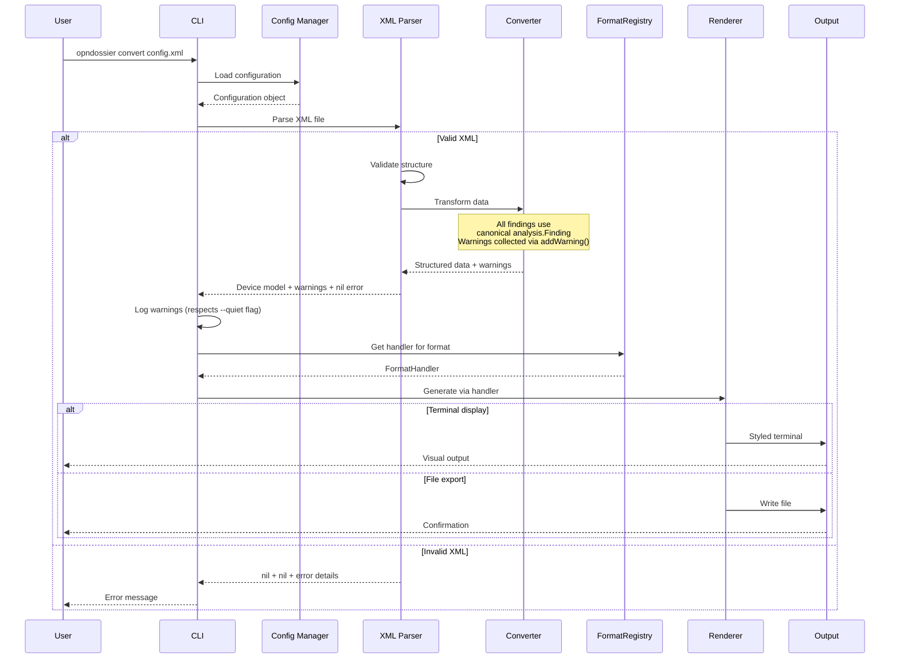
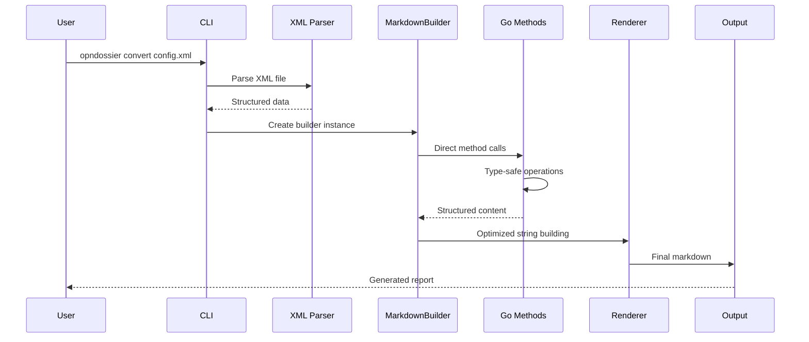
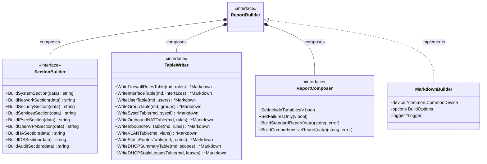
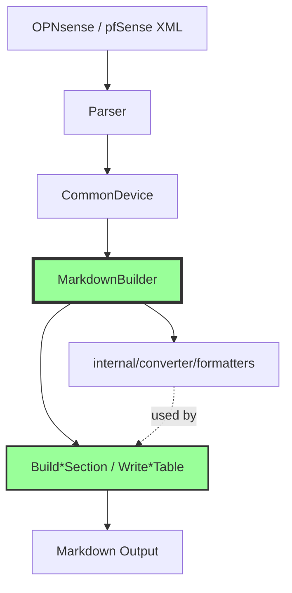
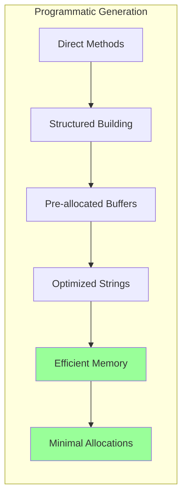
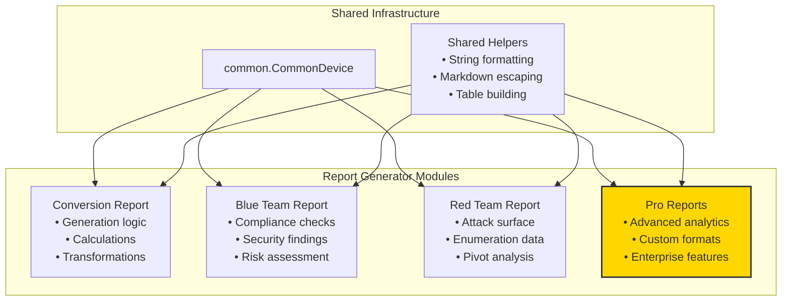

# Data Processing Pipelines

This document describes how data flows through opnDossier from a raw `config.xml` to the emitted report: the DeviceParser registry, the parse → convert → enrich → render pipeline, the programmatic markdown generation architecture, the FormatRegistry dispatch layer, the warning system, and the versioning strategy that holds it all together. For high-level system context see [overview.md](overview.md); for compliance-plugin specifics see the [Plugin Development Guide](../plugin-development.md).

> **Related work (not yet landed):** issue #142 proposes a dedicated CommonDevice pipeline doc-preamble. When that lands, cross-link from this document and trim any duplicated CommonDevice-layer narrative.

## DeviceParser Registry Pattern

opnDossier uses a **pluggable DeviceParser registry** that enables external Go projects to register custom device parsers at compile time. This pattern follows the `database/sql` driver registration model, replacing hardcoded switch statements with a thread-safe registry.

### Registry Architecture

```go
// ConstructorFunc is the factory function signature for creating DeviceParser instances
type ConstructorFunc = func(OPNsenseXMLDecoder) DeviceParser

// DeviceParserRegistry manages registered DeviceParser constructors
type DeviceParserRegistry struct {
    mu      sync.RWMutex
    parsers map[string]ConstructorFunc
}
```

### Key Components

#### 1. Thread-Safe Operations

The registry uses `sync.RWMutex` for concurrent access:

- **`Register(deviceType, fn)`** — Registers a parser constructor (panics on duplicates, nil functions, or empty device types)
- **`Get(deviceType)`** — Returns `(ConstructorFunc, bool)` for thread-safe lookups with nil guards
- **`List()`** — Returns sorted slice of registered device type names

#### 2. Self-Registration via init()

Parser packages register themselves using `init()` functions:

```go
// pkg/parser/opnsense/parser.go
func NewParserFactory(decoder parser.OPNsenseXMLDecoder) parser.DeviceParser {
    return NewParser(decoder)
}

func init() {
    parser.Register("opnsense", NewParserFactory)
}
```

#### 3. CRITICAL: Blank Import Requirement

**All code using `parser.NewFactory()` MUST include blank imports for parser packages** to ensure `init()` functions execute:

```go
import (
    _ "github.com/EvilBit-Labs/opnDossier/pkg/parser/opnsense"  // Register OPNsense parser
    _ "github.com/EvilBit-Labs/opnDossier/pkg/parser/pfsense"   // Register pfSense parser
)
```

Without these blank imports, the parsers never register and the factory has no parsers available. This gotcha is documented in **GOTCHAS.md §7.1** and affects:

- `cmd/root.go` — CLI entry point
- All test files using `parser.NewFactory()` or `parser.DefaultRegistry()`

#### 4. Factory Integration

`factory.go` uses registry-based dispatch instead of hardcoded switch statements:

```go
func (f *Factory) createWithOverride(ctx context.Context, r io.Reader, override string, validateMode bool) (*common.CommonDevice, []common.ConversionWarning, error) {
    fn, ok := f.registry.Get(override)
    if !ok {
        return nil, nil, fmt.Errorf(
            "unsupported device type override: %s; supported: %s",
            override, strings.Join(f.registry.List(), ", "),
        )
    }
    
    return parseDevice(ctx, fn(f.xmlDecoder), r, validateMode)
}
```

Error messages dynamically list supported devices from `registry.List()`, eliminating hardcoded device type strings.

#### 5. Test Isolation with NewFactoryWithRegistry()

Tests requiring isolated registry state use `NewFactoryWithRegistry()`:

```go
func TestCustomParser(t *testing.T) {
    reg := parser.NewDeviceParserRegistry()
    reg.Register("testdevice", testParserFactory)
    factory := parser.NewFactoryWithRegistry(mockDecoder, reg)
    // Test without polluting global registry
}
```

### CLI Integration

`cmd/shared_flags.go` functions derive device type lists dynamically from `parser.DefaultRegistry()`:

- **`ValidDeviceTypes()`** — Shell completion using `registry.List()`
- **`validateDeviceType()`** — Validation using `registry.Get()` with dynamic error messages
- **`resolveDeviceType()`** — Type-safe device type resolution that converts the raw `--device-type` flag value into a `common.DeviceType` enum constant for built-in types (opnsense, pfsense) or falls back to casting the normalized registry key for third-party parsers

The `resolveDeviceType()` function replaces the previous `sharedDeviceType` string pattern, providing compile-time safety for built-in device types while maintaining extensibility for externally registered parsers. This approach eliminates hardcoded "opnsense" strings with registry queries, enabling automatic CLI support for new parsers via self-registration.

### Benefits

1. **Compile-Time Extensibility**: External projects register parsers via blank imports
2. **Zero Hardcoded Strings**: Device types discovered from registry at runtime
3. **Thread-Safe**: Concurrent access protected by RWMutex
4. **Test Isolation**: Custom registries prevent global state pollution
5. **Dynamic Error Messages**: Supported device lists always accurate

### Related Documentation

For complete implementation details, error-handling patterns, and gotchas, see:

- **[docs/solutions/architecture-issues/pluggable-deviceparser-registry-pattern.md](../../solutions/architecture-issues/pluggable-deviceparser-registry-pattern.md)**
- **[GOTCHAS.md §7.1](https://github.com/EvilBit-Labs/opnDossier/blob/main/GOTCHAS.md#71-blank-import-requirement)** — Blank import requirement

For practical developer guidance on the DeviceParser registry pattern and blank import footgun, see **[CONTRIBUTING.md](https://github.com/EvilBit-Labs/opnDossier/blob/main/CONTRIBUTING.md) Go Development Standards** section.

## Data Flow Architecture

The data processing pipeline follows a clear multi-stage architecture documented in **[CONTRIBUTING.md](https://github.com/EvilBit-Labs/opnDossier/blob/main/CONTRIBUTING.md) Data Processing Pipeline** section:

1. **Ingestion**: Device-specific parsers parse configuration files → schema documents
   - OPNsense: `internal/cfgparser/` parses `config.xml` → `pkg/schema/opnsense.OpnSenseDocument`
   - pfSense: `pkg/parser/pfsense/parser.go` parses `config.xml` → `pkg/schema/pfsense.Document`
2. **Conversion**: Device-specific converters transform schema documents → `pkg/model.CommonDevice` with conversion warnings
   - OPNsense: `pkg/parser/opnsense/` transforms `OpnSenseDocument` → `CommonDevice`
   - pfSense: `pkg/parser/pfsense/` transforms `Document` → `CommonDevice`
   - **XML string values are converted to typed enum constants** (e.g., `rule.Type` XML string `"pass"` becomes `common.RuleTypePass`)
3. **Export Enrichment**: `internal/converter/enrichment.go` populates statistics, analysis, security assessment via `prepareForExport()`
4. **Export**: Registry-driven multi-format output (markdown, json, yaml, text, html) via `FormatRegistry`. **Typed enums serialize back to string values** during JSON/YAML marshaling (e.g., `common.RuleTypePass` → `"pass"`)
5. **Report Generation**: Audience-aware reports built through `builder.MarkdownBuilder` with dynamic headers using `DeviceType.DisplayName()` (e.g., "OPNsense Configuration Summary" vs "pfSense Configuration Summary")



**Note on Format Dispatch**: The `Renderer` component uses the `FormatRegistry` for format dispatch rather than switch statements. `DefaultRegistry` manages all format metadata (names, aliases, extensions) and provides `FormatHandler` implementations for centralized format handling.

## Programmatic Generation Architecture

### Core Architecture

opnDossier uses programmatic markdown generation via the `MarkdownBuilder` component, delivering high performance, type safety, and enhanced developer experience.



### Key Architectural Features

#### 1. Performance Optimizations

The programmatic approach delivers significant performance improvements:

- **Memory Usage**: Reduced allocations through direct string building
- **Generation Speed**: Fast generation via method-based approach
- **Throughput**: High reports per second
- **Scalability**: Consistent performance across all dataset sizes

Performance can be measured using benchmarks in `internal/converter/markdown_bench_test.go`.

#### 2. Type Safety


#### 3. Security Enhancements (Red Team Focus)

- **Output Obfuscation**: Built-in capabilities for sensitive data handling
- **Complete Offline Support**: No external dependencies
- **Memory Safety**: Improved handling of large configurations
- **Error Isolation**: Structured error handling prevents information leakage

### MarkdownBuilder Component Architecture

The `ReportBuilder` interface follows the Interface Segregation Principle (SOLID), composing three focused sub-interfaces that were split from the original monolithic interface in PR #431 (issue #323):

- **`SectionBuilder`** (9 methods): Build\*Section methods for rendering individual configuration domains
- **`TableWriter`** (11 methods): Write\*Table methods for formatting data tables
- **`ReportComposer`** (4 methods): SetIncludeTunables, SetFailuresOnly, BuildStandardReport, and BuildComprehensiveReport

This composition provides full backward compatibility—existing code using `ReportBuilder` continues to work unchanged—while enabling consumers to depend only on the methods they actually use.



Helper functions used by `MarkdownBuilder` (risk scoring, severity classification, markdown escaping, timestamp formatting, etc.) live as package-level functions under [`internal/converter/formatters/`](https://github.com/EvilBit-Labs/opnDossier/tree/main/internal/converter/formatters). They are not modelled as separate types here because they have no per-call state; treat them as stateless pure functions that `MarkdownBuilder` calls.

#### Consumer-Local Interface Narrowing

`HybridGenerator` demonstrates the consumer-local interface narrowing pattern (documented in AGENTS.md §5.9a). It defines a private `reportGenerator` interface that exposes only the four methods it directly calls:

- `SetIncludeTunables`, `BuildAuditSection`, `BuildStandardReport`, and `BuildComprehensiveReport` -- all listed directly, not via embedded sub-interfaces

The `HybridGenerator.builder` field is typed as this narrower `reportGenerator` interface internally. Public methods (`SetBuilder`, `GetBuilder`) continue to accept and return the full `ReportBuilder` interface, maintaining backward compatibility. The `GetBuilder` method uses a two-value type assertion to recover the full interface when needed.

#### FormatRegistry Integration

`HybridGenerator` delegates format-specific generation to `FormatHandler` implementations retrieved from `DefaultRegistry` (documented in AGENTS.md §5.9b). The `handlerForFormat()` helper function resolves the format string to a handler via the registry; format defaulting (to markdown) is handled earlier via `DefaultOptions` / CLI configuration, so `handlerForFormat()` expects a non-empty, registered format string. Each handler implements:

- **`FileExtension()`** - Returns the file extension for the format (e.g., ".md", ".json")
- **`Aliases()`** - Returns alternative format names (e.g., "md" for markdown, "yml" for yaml)
- **`Generate()`** - Creates documentation as a string via the generator
- **`GenerateToWriter()`** - Streams documentation directly to an io.Writer

Handler dispatch replaces the previous switch statement approach, enabling centralized format metadata management and simplified addition of new formats through `DefaultRegistry` registration.

### Data Flow Pipeline (Programmatic Mode)



### Method Categories

The Build*Section / Write*Table methods on `MarkdownBuilder` render individual configuration domains; the helper functions in `internal/converter/formatters/` cover risk scoring (`AssessRiskLevel`, `CalculateSecurityScore`), severity classification, markdown escaping, and timestamp formatting. For current performance numbers, run the benchmarks in `internal/converter/markdown_formatters_test.go` locally — hardcoded figures in docs drift quickly and were removed deliberately.

- **Build\*Section** (on `MarkdownBuilder`): render one configuration domain as a markdown section (system, network, security, services, IPsec, OpenVPN, HA, IDS, audit).
- **Write\*Table** (on `MarkdownBuilder`): write a data table to the current markdown document (firewall rules, interfaces, users, groups, sysctl, NAT, VLANs, static routes, DHCP).
- **BuildAuditSection**: renders compliance audit output including summary, plugin results, findings tables, and metadata.
- **Formatters**: stateless helpers in `internal/converter/formatters/` (security, severity, strings, timestamps).

### Memory Management Architecture



### Error Handling Architecture

```go
// Structured error types
type ValidationError struct {
    Field   string
    Value   any
    Message string
}

type GenerationError struct {
    Component string
    Operation string
    Cause     error
}

// Context-aware error handling
func (b *MarkdownBuilder) BuildSection(device *common.CommonDevice) (string, error) {
    if err := b.validateInput(device); err != nil {
        return "", &ValidationError{
            Field:   "input_data",
            Value:   device,
            Message: fmt.Sprintf("invalid input: %v", err),
        }
    }

    result, err := b.generateContent(device)
    if err != nil {
        return "", &GenerationError{
            Component: "section_builder",
            Operation: "content_generation",
            Cause:     err,
        }
    }

    return result, nil
}
```

## Modular Report Generator Architecture

### Design Principles

Report generators in opnDossier follow a **modular, self-contained architecture** designed to support:

1. **Build-time feature selection** via Go build flags
2. **Pro-level features** through optional modules
3. **Independent development** of report types
4. **Clean separation** between shared infrastructure and report-specific logic

### Module Structure

Each report generator should be a self-contained module with its own:

- **Generation logic** - All markdown/output construction
- **Calculation logic** - Security scoring, risk assessment, statistics
- **Data transformations** - Report-specific data processing
- **Constants and mappings** - Report-specific configuration



### Build Flag Integration

Report generators can be conditionally included using Go build tags:

```go
//go:build pro

package reports

// Pro-level report generators included only with -tags=pro
```

This enables:

- **Core builds** with conversion and audit report types
- **Pro builds** with additional enterprise features
- **Custom builds** with specific report combinations

### Implementation Guidelines

#### What Each Report Module Should Contain

Report modules are self-contained packages. Currently, report generation lives in `internal/converter/builder/` and `internal/converter/formatters/`. As the system evolves to support Pro-level features, each report type may be extracted to its own package following this structure:

```
internal/converter/<report-type>/
├── generator.go       # Main generation logic
├── calculations.go    # Report-specific calculations
├── transformers.go    # Data transformation functions
├── constants.go       # Report-specific constants
└── <report-type>_test.go
```

#### What Should Remain Shared

- **`common.CommonDevice`** - The parsed device-agnostic configuration model
- **`analysis.Finding`** - Canonical finding type for all analysis results
- **String helpers** - Markdown escaping, formatting utilities
- **Table builders** - Generic markdown table construction
- **Common interfaces** - `ReportBuilder`, `Generator` interfaces

#### Example Module Structure

```go
// internal/reports/blueteam/generator.go
package blueteam

import (
    "github.com/EvilBit-Labs/opnDossier/internal/analysis"
    common "github.com/EvilBit-Labs/opnDossier/pkg/model"
    "github.com/EvilBit-Labs/opnDossier/internal/converter/formatters"
)

type BlueTeamGenerator struct {
    // All state and configuration for blue team reports
}

func (g *BlueTeamGenerator) Generate(device *common.CommonDevice) (string, error) {
    // Self-contained generation using only model and helpers
    score := g.calculateSecurityScore(device)
    findings := g.analyzeCompliance(device)
    return g.buildReport(device, score, findings)
}

// All calculation logic is internal to this module
func (g *BlueTeamGenerator) calculateSecurityScore(device *common.CommonDevice) int {
    // Blue team specific scoring algorithm
}

// All findings returned use the canonical analysis.Finding type
func (g *BlueTeamGenerator) analyzeCompliance(device *common.CommonDevice) []analysis.Finding {
    // Compliance analysis returning standardized findings
}
```

### Benefits

1. **Independent Testing** - Each report module can be tested in isolation
2. **Feature Gating** - Pro features excluded from core builds
3. **Reduced Coupling** - Changes to one report type don't affect others
4. **Clear Ownership** - Each module has defined boundaries
5. **Extensibility** - New report types added without modifying core

## Audit-to-Export Mapping

The `cmd/audit_handler.go` module contains `mapAuditReportToComplianceResults()`, which converts the internal `audit.Report` structure into the export model `common.ComplianceResults`. This mapping enables multi-format output (markdown, JSON, YAML, text, HTML) for compliance audit data through the standard generation pipeline.

### Mapping Process

1. **Top-level findings**: Converts `audit.Finding` instances (which embed `analysis.Finding`) to `common.ComplianceFinding` instances, preserving `AttackSurface`, `ExploitNotes`, and `Control` fields
2. **Per-plugin results**: Maps each `audit.ComplianceResult` in the `report.Compliance` map to `common.PluginComplianceResult`, including:
   - Plugin metadata (`PluginInfo`)
   - Plugin-specific findings
   - Summary statistics (`ComplianceResultSummary`)
   - Control definitions (`ComplianceControl`)
   - Per-control compliance status (boolean map)
3. **Aggregate summary**: Computes summary statistics across all plugins and direct findings, including total/critical/high/medium/low counts and compliant/non-compliant control counts
4. **Metadata preservation**: Clones the audit metadata map

### Integration with Builder Layer

Once the mapping is complete, `handleAuditMode()` creates a shallow copy of the `CommonDevice` and populates its `ComplianceResults` field with the mapped `ComplianceResults`. This enriched device is then passed to `generateWithProgrammaticGenerator()`, which delegates to the appropriate format handler via `FormatRegistry`. For Markdown, `BuildAuditSection()` renders compliance sections; for JSON/YAML/text/HTML, the `ComplianceResults` field is serialized directly or formatted according to the target format.

## FormatRegistry Pattern

### Overview

The `FormatRegistry` pattern provides a **centralized format dispatch mechanism** that replaced scattered switch statements across 8+ locations. `DefaultRegistry` is the single source of truth for supported output formats, managing format names, aliases, file extensions, validation, and generation dispatch.

### Key Components

#### FormatHandler Interface

Each format implements the `FormatHandler` interface:

```go
type FormatHandler interface {
    FileExtension() string
    Aliases() []string
    Generate(g *HybridGenerator, data *common.CommonDevice, opts Options) (string, error)
    GenerateToWriter(g *HybridGenerator, w io.Writer, data *common.CommonDevice, opts Options) error
}
```

#### Registered Formats

`DefaultRegistry` manages five built-in format handlers:

| Format   | Extension | Aliases | Handler Implementation |
| -------- | --------- | ------- | ---------------------- |
| markdown | `.md`     | md      | `markdownHandler`      |
| json     | `.json`   | -       | `jsonHandler`          |
| yaml     | `.yaml`   | yml     | `yamlHandler`          |
| text     | `.txt`    | txt     | `textHandler`          |
| html     | `.html`   | htm     | `htmlHandler`          |

### Adding a New Format

Adding a new format requires only registering a `FormatHandler` in `newDefaultRegistry()`:

```go
func newDefaultRegistry() *FormatRegistry {
    r := NewFormatRegistry()
    r.Register("markdown", &markdownHandler{})
    r.Register("json", &jsonHandler{})
    r.Register("yaml", &yamlHandler{})
    r.Register("text", &textHandler{})
    r.Register("html", &htmlHandler{})
    // Add new formats here
    return r
}
```

All validation, shell completion, and dispatch logic automatically picks up the new format.

### Format Resolution and Validation

- **`DefaultRegistry.Canonical(format)`** - Resolves aliases to canonical names (e.g., "md" → "markdown", "yml" → "yaml")
- **`DefaultRegistry.Get(format)`** - Returns the `FormatHandler` for a format or alias, returning `ErrUnsupportedFormat` for unknown formats
- **`DefaultRegistry.ValidFormats()`** - Returns sorted slice of canonical format names for validation
- **`DefaultRegistry.Extensions()`** - Returns map of format name to file extension for file output

### Integration Points

#### CLI Layer (`cmd/`)

- Format validation and shell completions use `DefaultRegistry.ValidFormats()`
- File extension lookup replaced switch statements with `handler.FileExtension()`
- Format descriptions maintained separately in `formatDescriptions` map in `cmd/shared_flags.go`

#### Config Layer (`internal/config/`)

- `ValidFormats` derived from registry with `slices.Clone()` for immutability

#### Generator Layer (`internal/converter/`)

- `HybridGenerator.Generate()` uses `handlerForFormat()` to retrieve handlers
- Handler dispatch via `handler.Generate()` and `handler.GenerateToWriter()`
- Each handler delegates to generator's private format-specific methods

#### Processor Layer (`internal/processor/`)

- `processor.Transform()` resolves aliases via `DefaultRegistry.Canonical()`
- Supports all five formats (markdown, json, yaml, text, html)
- Text and HTML formats delegate to exported `converter.StripMarkdownFormatting()` and `converter.RenderMarkdownToHTML()`

### Design Rationale

- **Single Source of Truth**: Eliminates duplicated format lists across CLI, config, and generator layers
- **Centralized Validation**: Format validation occurs in one place via the registry
- **Extensibility**: New formats require only handler registration, no changes to dispatch logic
- **Alias Support**: Consistent alias resolution (txt, htm, md, yml) across all code paths
- **Type Safety**: Handler interface ensures consistent format implementation

### Related Documentation

For detailed guidance on the FormatRegistry pattern and consumer-local interface narrowing, see AGENTS.md §5.9b.

For practical developer guidance on the FormatRegistry pattern, format addition workflow, and avoiding hardcoded switch statements, see **[CONTRIBUTING.md](https://github.com/EvilBit-Labs/opnDossier/blob/main/CONTRIBUTING.md) Go Development Standards** section.

## Versioned Data Strategy

### Configuration Versioning

- **Backward Compatibility**: Support for older OPNsense versions
- **Forward Compatibility**: Graceful handling of newer configurations
- **Version Detection**: Automatic OPNsense version identification
- **Migration Support**: Utilities for format changes

### Non-Destructive Processing

- **Original Preservation**: Input files never modified
- **Timestamped Outputs**: Version metadata in all outputs
- **Audit Trail**: Change tracking and diff generation
- **Rollback Support**: Easy reversion to previous states

### Schema Evolution

```mermaid
graph TB
    subgraph "Version Management"
        V1[OPNsense v1.x<br/>Basic features]
        V2[OPNsense v2.x<br/>Enhanced features]
        V3[OPNsense v3.x<br/>Latest features]
    end

    subgraph "Compatibility Layer"
        COMPAT[Version Handler]
        MIGRATE[Migration Engine]
        VALIDATE[Schema Validator]
    end

    subgraph "Processing Pipeline"
        PARSER[XML Parser]
        CONVERTER[Data Converter]
        RENDERER[Output Renderer]
    end

    V1 --> COMPAT
    V2 --> COMPAT
    V3 --> COMPAT

    COMPAT --> VALIDATE
    COMPAT --> MIGRATE
    MIGRATE --> PARSER
    VALIDATE --> PARSER

    PARSER --> CONVERTER
    Note over CONVERTER: Accumulates warnings<br/>for incomplete data
    CONVERTER --> RENDERER
```

## Warning System

### ConversionWarning Type

The `ConversionWarning` type captures non-fatal issues encountered during schema-to-CommonDevice conversion:

```go
// ConversionWarning represents a non-fatal issue encountered during conversion
type ConversionWarning struct {
    Field    string          // Dot-path of problematic field (e.g., "FirewallRules[0].Type")
    Value    string          // Problematic value encountered
    Message  string          // Human-readable description
    Severity common.Severity // Importance of the warning
}
```

`ConversionWarning.Severity` is `pkg/model.Severity` (string alias) — the same package that defines the `ConversionWarning` struct itself. Use the `common.Severity*` constants, NOT the `analysis.Severity*` constants used by compliance findings.

### Warning Generation

The OPNsense converter (`pkg/parser/opnsense/converter.go`) accumulates warnings during conversion via the `addWarning()` method:

```go
func (c *Converter) addWarning(field, value, message string, severity common.Severity) {
    c.warnings = append(c.warnings, common.ConversionWarning{
        Field:    field,
        Value:    value,
        Message:  message,
        Severity: severity,
    })
}
```

### Common Warning Scenarios

Warnings are generated for configuration elements with missing or incomplete data:

#### Firewall Rules

- **Empty rule type**: High severity warning when firewall rule has no type specified
- **Missing source address**: Medium severity warning for rules without source address
- **Missing destination address**: Medium severity warning for rules without destination address
- **No interface assigned**: Medium severity warning when interface field is empty

#### NAT Rules

- **Outbound NAT without interface**: Medium severity warning for unassigned outbound rules
- **Inbound NAT missing internal IP**: High severity warning for port forwards without target IP
- **Inbound NAT without interface**: Medium severity warning for unassigned inbound rules

#### Network Configuration

- **Gateway missing address**: Warnings for incomplete gateway definitions
- **Gateway missing name**: Warnings for unnamed gateways

#### System Configuration

- **User missing name**: Warnings for incomplete user accounts
- **User missing UID**: Warnings for users without unique identifiers
- **Certificate problems**: Warnings for invalid or incomplete certificates
- **HA configuration issues**: Warnings for high-availability misconfigurations

### Warning Propagation

Warnings flow through the system alongside the device model:

1. **Converter generates warnings** during `ToCommonDevice()` conversion
2. **DeviceParser returns warnings** from `Parse()` and `ParseAndValidate()` methods
3. **The Factory propagates warnings** through `CreateDevice()`
4. **CLI commands log warnings** via structured logging using `ctxLogger.Warn()`

### DeviceParser Interface

The `DeviceParser` interface signature returns 3 values to support warnings:

```go
type DeviceParser interface {
    // Parse reads and converts the configuration, returning non-fatal conversion warnings.
    Parse(ctx context.Context, r io.Reader) (*common.CommonDevice, []common.ConversionWarning, error)
    
    // ParseAndValidate reads, converts, and validates the configuration, returning non-fatal conversion warnings.
    ParseAndValidate(ctx context.Context, r io.Reader) (*common.CommonDevice, []common.ConversionWarning, error)
}
```

### Factory

The `Factory.CreateDevice()` method returns 3 values:

```go
func (f *Factory) CreateDevice(
    ctx context.Context,
    r io.Reader,
    deviceTypeOverride string,
    validateMode bool,
) (*common.CommonDevice, []common.ConversionWarning, error)
```

### CLI Integration

All configuration-reading commands (`convert`, `display`, `validate`, `diff`) handle warnings consistently:

```go
device, warnings, err := parser.NewFactory(cfgparser.NewXMLParser()).CreateDevice(ctx, file, deviceType, validateMode)
if err != nil {
    // Handle fatal error
}

// Log warnings unless --quiet flag is set
if cmdConfig == nil || !cmdConfig.IsQuiet() {
    for _, w := range warnings {
        ctxLogger.Warn("conversion warning",
            "field", w.Field,
            "message", w.Message,
            "severity", w.Severity,
        )
    }
}
```

### Quiet Mode Behavior

When the `--quiet` flag is used:

- Warnings are collected but not logged
- Only errors are reported
- Processing continues normally with warning suppression
- Useful for automated processing pipelines
