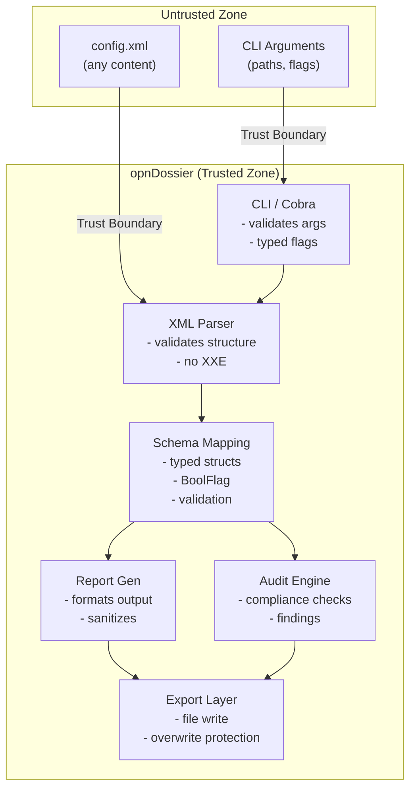

# Security Assurance Case

This document provides a structured argument that opnDossier meets its security requirements. It follows the assurance case model described in [NIST IR 7608](https://csrc.nist.gov/publications/detail/nistir/7608/final).

## 1. Security Requirements

opnDossier is an OPNsense configuration parser, auditor, and reporting tool. Its security requirements are:

1. **SR-1**: Must not crash or panic when processing any config.xml input
2. **SR-2**: Must not allow XML External Entity (XXE) or entity expansion attacks
3. **SR-3**: Must not allow path traversal via CLI arguments or output paths
4. **SR-4**: Must not execute arbitrary code based on configuration file contents
5. **SR-5**: Must not leak sensitive configuration data (passwords, keys, SNMP communities) in error messages or logs
6. **SR-6**: Must not consume unbounded resources (memory, CPU) during parsing or report generation
7. **SR-7**: Must handle sensitive data in generated reports with appropriate visibility controls

## 2. Threat Model

### 2.1 Assets

- **Host system**: The machine running opnDossier
- **OPNsense/pfSense configuration**: Contains network topology, firewall rules, credentials, VPN keys (including IPsec pre-shared keys), and other sensitive operational data
- **Generated reports**: May contain extracts of sensitive configuration data

### 2.2 Threat Actors

| Actor                      | Motivation                                             | Capability                               |
| -------------------------- | ------------------------------------------------------ | ---------------------------------------- |
| Malicious config author    | Exploit the parser to gain code execution or cause DoS | Can craft arbitrary config.xml content   |
| Insider with report access | Extract sensitive data from generated reports          | Can access report output files           |
| Supply chain attacker      | Compromise a dependency to inject malicious code       | Can publish malicious Go module versions |

### 2.3 Attack Vectors

| ID   | Vector                                                                  | Target SR        |
| ---- | ----------------------------------------------------------------------- | ---------------- |
| AV-1 | XXE or entity expansion in crafted config.xml                           | SR-2, SR-6       |
| AV-2 | Deeply nested XML elements cause stack overflow or resource exhaustion  | SR-1, SR-6       |
| AV-3 | Extremely large config.xml causes memory exhaustion                     | SR-6             |
| AV-4 | CLI argument with path traversal writes reports to unintended locations | SR-3             |
| AV-5 | Crafted XML triggers panic in parser or schema mapping                  | SR-1             |
| AV-6 | Error messages include raw credential values from config                | SR-5             |
| AV-7 | Compromised Go module introduces malicious code                         | SR-4             |
| AV-8 | Crafted IPsec XML elements exploit pfSense IPsec parser paths           | SR-1, SR-2, SR-6 |

## 3. Trust Boundaries

All data crossing the trust boundary (config.xml content, CLI arguments, output paths) is treated as untrusted and validated before use.

## 4. Secure Design Principles (Saltzer and Schroeder)

| Principle                       | How Applied                                                                                                                                                                                                                                                                                                                                                                                                |
| ------------------------------- | ---------------------------------------------------------------------------------------------------------------------------------------------------------------------------------------------------------------------------------------------------------------------------------------------------------------------------------------------------------------------------------------------------------- |
| **Economy of mechanism**        | Go with minimal dependencies. Simple parser-schema-report pipeline. No plugin downloads, no scripting engine, no network I/O at runtime.                                                                                                                                                                                                                                                                   |
| **Fail-safe defaults**          | Both OPNsense and pfSense parsers (including IPsec configuration parsing) use shared `pkg/parser/xmlutil.go` (`NewSecureXMLDecoder()`) for secure XML decoding: entity expansion disabled, input size limited to 10 MB, charset normalization for UTF-8/ASCII/ISO-8859-1/Windows-1252. Overwrite protection on output files requires explicit `--force` flag. Offline-first design means no network calls. |
| **Complete mediation**          | Every XML element is mapped to typed Go structs. Every CLI argument is validated by Cobra. Every output path is checked for overwrite conflicts.                                                                                                                                                                                                                                                           |
| **Open design**                 | Fully open source (Apache-2.0). Security does not depend on obscurity. All security mechanisms are publicly documented.                                                                                                                                                                                                                                                                                    |
| **Separation of privilege**     | Parser, schema, audit, and export are separate packages with distinct responsibilities. Parse errors cannot bypass audit safety checks.                                                                                                                                                                                                                                                                    |
| **Least privilege**             | The tool reads config.xml files and writes reports; it never modifies source configurations, executes commands, or makes network connections. No elevated permissions required.                                                                                                                                                                                                                            |
| **Least common mechanism**      | No shared mutable state between report generations. Each invocation operates on its own parsed data. No global caches that could leak information between runs.                                                                                                                                                                                                                                            |
| **Psychological acceptability** | CLI follows standard conventions via Cobra. Error messages are descriptive and actionable. Default behavior is safe (no overwrite, no network, offline-first).                                                                                                                                                                                                                                             |

## 5. Common Weakness Countermeasures

### 5.1 CWE/SANS Top 25

| CWE     | Weakness                            | Countermeasure                                                                                                                                                                                                                                                                                                                                                                                                                                                                                                                                                                                                                                                                                                                                                                                                                                                                                                                                                                                                                                                                                                                                                                                                              | Status    |
| ------- | ----------------------------------- | --------------------------------------------------------------------------------------------------------------------------------------------------------------------------------------------------------------------------------------------------------------------------------------------------------------------------------------------------------------------------------------------------------------------------------------------------------------------------------------------------------------------------------------------------------------------------------------------------------------------------------------------------------------------------------------------------------------------------------------------------------------------------------------------------------------------------------------------------------------------------------------------------------------------------------------------------------------------------------------------------------------------------------------------------------------------------------------------------------------------------------------------------------------------------------------------------------------------------- | --------- |
| CWE-787 | Out-of-bounds write                 | Go is memory-safe; slice/array access is bounds-checked at runtime. No `unsafe` package usage.                                                                                                                                                                                                                                                                                                                                                                                                                                                                                                                                                                                                                                                                                                                                                                                                                                                                                                                                                                                                                                                                                                                              | Mitigated |
| CWE-79  | XSS                                 | Not applicable (no web output). Markdown reports are static files.                                                                                                                                                                                                                                                                                                                                                                                                                                                                                                                                                                                                                                                                                                                                                                                                                                                                                                                                                                                                                                                                                                                                                          | N/A       |
| CWE-89  | SQL injection                       | Not applicable (no database).                                                                                                                                                                                                                                                                                                                                                                                                                                                                                                                                                                                                                                                                                                                                                                                                                                                                                                                                                                                                                                                                                                                                                                                               | N/A       |
| CWE-416 | Use after free                      | Go's garbage collector prevents use-after-free. No manual memory management.                                                                                                                                                                                                                                                                                                                                                                                                                                                                                                                                                                                                                                                                                                                                                                                                                                                                                                                                                                                                                                                                                                                                                | Mitigated |
| CWE-78  | OS command injection                | No shell invocation or command execution. CLI arguments parsed by Cobra, not passed to shell.                                                                                                                                                                                                                                                                                                                                                                                                                                                                                                                                                                                                                                                                                                                                                                                                                                                                                                                                                                                                                                                                                                                               | Mitigated |
| CWE-20  | Improper input validation           | All inputs validated: XML parsed by `encoding/xml` into typed structs, CLI args validated by Cobra, output paths checked for conflicts.                                                                                                                                                                                                                                                                                                                                                                                                                                                                                                                                                                                                                                                                                                                                                                                                                                                                                                                                                                                                                                                                                     | Mitigated |
| CWE-125 | Out-of-bounds read                  | Go slice access is bounds-checked at runtime. Panics on out-of-bounds access (caught by recovery or test suite).                                                                                                                                                                                                                                                                                                                                                                                                                                                                                                                                                                                                                                                                                                                                                                                                                                                                                                                                                                                                                                                                                                            | Mitigated |
| CWE-22  | Path traversal                      | CLI accepts file paths as arguments. Output paths validated for overwrite protection. No path construction from config.xml contents.                                                                                                                                                                                                                                                                                                                                                                                                                                                                                                                                                                                                                                                                                                                                                                                                                                                                                                                                                                                                                                                                                        | Mitigated |
| CWE-352 | CSRF                                | Not applicable (no web interface).                                                                                                                                                                                                                                                                                                                                                                                                                                                                                                                                                                                                                                                                                                                                                                                                                                                                                                                                                                                                                                                                                                                                                                                          | N/A       |
| CWE-434 | Unrestricted upload                 | Not applicable (no file upload).                                                                                                                                                                                                                                                                                                                                                                                                                                                                                                                                                                                                                                                                                                                                                                                                                                                                                                                                                                                                                                                                                                                                                                                            | N/A       |
| CWE-476 | NULL pointer dereference            | Go does not have null pointers in the C sense; nil pointer dereferences cause a recoverable panic. Pointer fields use nil checks or `*string` patterns with accessor methods.                                                                                                                                                                                                                                                                                                                                                                                                                                                                                                                                                                                                                                                                                                                                                                                                                                                                                                                                                                                                                                               | Mitigated |
| CWE-190 | Integer overflow                    | Go integer arithmetic wraps silently but opnDossier performs no security-critical arithmetic. Linter (`gosec G115`) flags unsafe integer conversions.                                                                                                                                                                                                                                                                                                                                                                                                                                                                                                                                                                                                                                                                                                                                                                                                                                                                                                                                                                                                                                                                       | Mitigated |
| CWE-502 | Deserialization of untrusted data   | Config.xml is parsed by Go's `encoding/xml` into strictly typed structs, not arbitrary deserialization.                                                                                                                                                                                                                                                                                                                                                                                                                                                                                                                                                                                                                                                                                                                                                                                                                                                                                                                                                                                                                                                                                                                     | Mitigated |
| CWE-400 | Resource exhaustion                 | `parser.NewSecureXMLDecoder()` wraps input with `io.LimitReader` (10 MB default). Entity map cleared to prevent expansion. Both OPNsense and pfSense parsers share this hardening.                                                                                                                                                                                                                                                                                                                                                                                                                                                                                                                                                                                                                                                                                                                                                                                                                                                                                                                                                                                                                                          | Mitigated |
| CWE-611 | XXE (XML External Entity)           | `parser.NewSecureXMLDecoder()` sets `dec.Entity = map[string]string{}`, disabling all entity resolution. Go's `encoding/xml` does not support DTD processing.                                                                                                                                                                                                                                                                                                                                                                                                                                                                                                                                                                                                                                                                                                                                                                                                                                                                                                                                                                                                                                                               | Mitigated |
| CWE-312 | Cleartext storage of sensitive data | Credentials are redacted via two mechanisms: (1) The `sanitize` command uses field-pattern matching to redact credentials in configuration files (device-specific field names like pfSense `<bcrypt-hash>` and `<pre-shared-key>` require explicit patterns in `internal/sanitizer/rules.go`). (2) Report serialization (JSON/YAML output via `ToJSON`/`ToYAML`) redacts sensitive fields including certificate private keys (`Certificate.PrivateKey`), CA private keys (`CertificateAuthority.PrivateKey`), and SNMP community strings. IPsec pre-shared keys are excluded from the common model entirely (`json:"-"` tag on `pfsense.IPsecPhase1.PreSharedKey`) and a conversion warning is emitted when a PSK is present, providing defense-in-depth. The sanitizer also covers PSKs at the XML level via the `"psk"` substring pattern. The serialization redaction is implemented using conditional deep-copy logic that only processes entries with non-empty sensitive values, ensuring both security and performance. This prevents accidental exposure of private keys in exported reports even when users don't explicitly use the `sanitize` command. Implementation details are documented in AGENTS.md §5.25. | Mitigated |

### 5.2 OWASP Top 10 (Where Applicable)

Most OWASP Top 10 categories target web applications and are not applicable to a CLI configuration parser. The applicable items are:

| Category                   | Applicability          | Countermeasure                                                                                    |
| -------------------------- | ---------------------- | ------------------------------------------------------------------------------------------------- |
| A03: Injection             | Partial -- XML parsing | Go's `encoding/xml` maps to typed structs; no dynamic query construction                          |
| A04: Insecure Design       | Applicable             | Secure design principles applied throughout (see Section 4)                                       |
| A06: Vulnerable Components | Applicable             | Grype and Snyk in CI, Dependabot for automated updates, OSSF Scorecard                            |
| A09: Security Logging      | Partial                | Parse/audit errors logged via `charmbracelet/log`; security events reported via GitHub Advisories |

## 6. Supply Chain Security

| Measure             | Implementation                                                            |
| ------------------- | ------------------------------------------------------------------------- |
| Dependency auditing | Grype and Snyk run in CI; CodeQL for static analysis                      |
| Dependency updates  | Dependabot configured for automated PRs                                   |
| Pinned toolchain    | Go version pinned via `mise` and `go.mod`                                 |
| Reproducible builds | `go.sum` committed; `CGO_ENABLED=0` static builds                         |
| Build provenance    | Sigstore attestations via `actions/attest-build-provenance`               |
| Artifact signing    | Cosign keyless signing (Sigstore) + GPG signing via GoReleaser            |
| SBOM generation     | CycloneDX SBOM generated per release via `cyclonedx-gomod`                |
| CI integrity        | All GitHub Actions pinned to SHA hashes                                   |
| Code review         | Required on all PRs; automated by CodeRabbit with security-focused checks |
| License compliance  | FOSSA scanning for Apache-2.0 compatible dependencies                     |

## 7. Ongoing Assurance

This assurance case is maintained as a living document. It is updated when:

- New features introduce new attack surfaces
- New threat vectors are identified
- Dependencies change significantly
- Security incidents occur

The project maintains continuous assurance through automated CI checks (golangci-lint, CodeQL, Grype, Snyk) that run on every commit.
