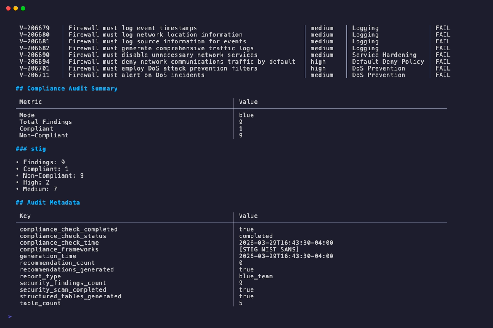

# audit

The `audit` command runs security audit and compliance checks on one or more OPNsense config.xml files. It produces a report with compliance findings, security recommendations, and risk assessments based on the selected audit mode and compliance plugins.

**When to use it:**

- Running a security posture assessment against a firewall configuration
- Generating STIG/SANS/firewall compliance reports for auditors
- Red team reconnaissance to identify attack surfaces and pivot points
- Producing redacted audit reports safe for sharing with external parties
- Batch-auditing multiple configs for fleet-wide compliance visibility

## Usage

```text
opndossier audit [flags] <config.xml> [config2.xml ...]
```

## Flags

| Flag                 | Short | Default        | Description                                                                                                                                                                            |
| -------------------- | ----- | -------------- | -------------------------------------------------------------------------------------------------------------------------------------------------------------------------------------- |
| `--mode`             |       | `blue`         | Audit mode: `blue`, `red`                                                                                                                                                              |
| `--plugins`          |       |                | Comma-separated compliance plugins to run: `stig`, `sans`, `firewall` (blue mode only)                                                                                                 |
| `--plugin-dir`       |       |                | Directory containing dynamic `.so` compliance plugins. Plugins run with full process privileges; signatures are not verified. See [Dynamic Plugin Security](#dynamic-plugin-security). |
| `--output`           | `-o`  | stdout         | Output file path                                                                                                                                                                       |
| `--format`           | `-f`  | `markdown`     | Output format: `markdown` (`md`), `json`, `yaml` (`yml`), `text` (`txt`), `html` (`htm`)                                                                                               |
| `--failures-only`    |       | `false`        | Show only failing controls in blue mode plugin results tables                                                                                                                          |
| `--force`            |       | `false`        | Overwrite existing output file without prompt                                                                                                                                          |
| `--comprehensive`    |       | `false`        | Generate detailed comprehensive report                                                                                                                                                 |
| `--redact`           |       | `false`        | Redact sensitive fields (passwords, keys, community strings)                                                                                                                           |
| `--wrap`             |       | terminal width | Set text wrap width in columns                                                                                                                                                         |
| `--no-wrap`          |       | `false`        | Disable text wrapping                                                                                                                                                                  |
| `--include-tunables` |       | `false`        | Include all system tunables in report output (markdown, text, HTML only; JSON/YAML always include all tunables)                                                                        |
| `--section`          |       | all            | Comma-separated list of sections to include: `system`, `network`, `firewall`, `services`, `security`                                                                                   |

For global flags (`--verbose`, `--quiet`, `--config`, etc.), see [Configuration Reference](../configuration-reference.md).



## Audit Modes

| Mode   | Audience  | Focus                                  |
| ------ | --------- | -------------------------------------- |
| `blue` | Blue Team | Defensive audit with security findings |
| `red`  | Red Team  | Attack surface and pivot points        |

### Blue

The default mode. Defensive audit mode targeting blue team operators. Runs compliance plugins and produces a report with security findings, control pass/fail results, and remediation recommendations.

When no `--plugins` flag is specified, all available plugins are run by default. The `--plugins` flag is only accepted in blue mode and is rejected for red mode.

### Red

!!! warning "Experimental"
    Red team mode is not yet fully implemented. Its analysis methods are placeholder stubs that return static metadata. Results will be incomplete and should not be relied upon for real assessments. A CLI warning is emitted when this mode is selected.

Attacker-focused recon mode highlighting attack surfaces, pivot points, and exposed services.

## Compliance Plugins

| Plugin     | Control Pattern | Description                             |
| ---------- | --------------- | --------------------------------------- |
| `stig`     | `V-XXXXXX`      | Security Technical Implementation Guide |
| `sans`     | `SANS-FW-XXX`   | SANS Firewall Baseline                  |
| `firewall` | `FIREWALL-XXX`  | Firewall Configuration Analysis         |

The `--plugins` flag requires `--mode blue`. It is rejected for red mode.

## Dynamic Plugins

The `--plugin-dir` flag specifies a directory containing dynamic `.so` files that implement the `compliance.Plugin` interface.

```bash
opndossier audit config.xml --mode blue --plugin-dir /opt/plugins
```

- Loading is **opt-in**. Without `--plugin-dir`, no dynamic plugins are loaded.
- Failed plugin loads are **non-fatal** — the audit continues with the plugins that did load, and each failure is recorded in the audit log.
- If `--plugin-dir` points at a missing directory, opnDossier returns an error before running the audit.

Before you use `--plugin-dir` in production, read the next section. Dynamic plugins run inside the opnDossier process with full user privileges, and opnDossier does not verify who built them.

See the [Plugin Development Guide](../../development/plugin-development.md) if you need to write your own compliance plugin.

## Dynamic Plugin Security

!!! info "Platform support"
    **Dynamic plugin loading only works on Linux, macOS, and FreeBSD.** Go's [`plugin`](https://pkg.go.dev/plugin) package — which opnDossier uses for `--plugin-dir` — is not implemented on Windows. On Windows and other unsupported platforms, the flag is accepted for CLI parity, but `--plugin-dir` becomes a no-op: opnDossier emits a single stderr warning naming the current platform and continues the audit with the built-in compliance plugins only. No `.so` files are opened, and no spurious per-file load errors are produced. If you need compliance plugins on Windows, run opnDossier under WSL2 or in a Linux container.

!!! danger "Trust model"
    A dynamic plugin runs with the same privileges as opnDossier itself. There is no sandbox, no signature check, and no provenance verification. Treat every `.so` file you drop into `--plugin-dir` exactly as you would treat an unsigned executable that you are about to run as the current user — because that is effectively what happens.

Every time you pass a non-empty `--plugin-dir`, opnDossier writes a warning to stderr to make the risk visible at invocation time.

### What the loader does for you

These restrictions are enforced automatically on every supported platform (Linux, macOS, FreeBSD). A plugin file that fails any of them is rejected before it is loaded, and the rejection is written to the audit log with enough metadata (path, SHA-256, file mode, owner UID, size, verdict, reason) for a security team to investigate:

| Check                           | Behavior                                                                                                                                                                                    |
| ------------------------------- | ------------------------------------------------------------------------------------------------------------------------------------------------------------------------------------------- |
| **Symlink rejection**           | The `.so` itself cannot be a symlink. A symlink planted in `--plugin-dir` that points at an attacker-controlled file elsewhere is refused.                                                  |
| **File permission check**       | The `.so` must not be group-writable or world-writable (`mode & 0o022 == 0`).                                                                                                               |
| **Directory permission check**  | The `--plugin-dir` directory itself must not be group-writable or world-writable. A locked-down `.so` inside a world-writable directory is refused because an attacker could swap the file. |
| **Absolute path normalization** | A relative `--plugin-dir` (e.g. `./plugins`) is resolved to an absolute path before any check runs, so the audit log and preflight always work on a canonical path.                         |
| **Size cap (64 MiB)**           | A plugin's SHA-256 is computed during the preflight with a 64 MiB read cap. A `.so` larger than 64 MiB is rejected rather than memory-mapped.                                               |
| **SHA-256 audit trail**         | Every accepted or rejected load is logged with the file's SHA-256 digest, so the specific binary that ran (or was refused) is identifiable after the fact.                                  |

### What the loader does NOT do

- **No signature or checksum verification.** opnDossier does not check a plugin against a known-good hash, a TUF manifest, or a code-signing certificate. Any `.so` that passes the preflight will run.
- **No sandboxing or privilege separation.** A plugin has the same file-system, network, and process privileges as the opnDossier binary. If opnDossier can read `/etc/shadow`, so can a malicious plugin.
- **No capability restriction.** Plugins can open sockets, spawn subprocesses, read and write arbitrary files, and call any Go standard-library function.
- **No remote fetch.** opnDossier never downloads plugins. If a `.so` appears in your plugin directory, it got there through your deployment pipeline — verify that pipeline.

### Operator responsibilities

Because opnDossier's loader cannot make strong guarantees by itself, you are responsible for the rest:

- **Own the plugin directory.** Set filesystem permissions so only trusted operators can write to it. Mode `0o755` on a directory owned by a dedicated deployment user is typical; avoid world-writable paths, `/tmp`, and any CI scratch directory that external contributors can reach.
- **Vet the plugin source.** Build plugins from known-good checkouts that you have reviewed. Do not load plugins you received as compiled `.so` files from untrusted sources.
- **Pin the Go toolchain.** Plugins must be built with the same Go toolchain and module versions as the opnDossier binary. A mismatch is detected at load time, but only *after* the `.so` has been mapped into the process — which means any malicious `init()` code has already executed.
- **Review the audit log.** Every load attempt, accepted or rejected, is logged with the plugin's SHA-256. Ship these logs to your SIEM and alert on rejections.
- **Keep `--plugin-dir` out of CI that accepts external PRs.** A contributor who can write to your plugin directory can execute arbitrary code in your audit pipeline.

### Threat scenarios the preflight blocks

| Scenario                                                                                              | Blocked by                     |
| ----------------------------------------------------------------------------------------------------- | ------------------------------ |
| Attacker plants `evil.so` in `/tmp/plugins` by dropping a symlink from the plugin dir                 | Symlink rejection              |
| Plugin file is world-writable (`mode 0o666`) and an attacker swaps it after deployment                | File permission check          |
| Plugin file is mode `0o600` but lives in `/tmp/plugins` (world-writable dir)                          | Directory permission check     |
| Attacker replaces a legitimate 500 KB plugin with a 1 GB plugin crafted to exhaust memory during hash | Size cap + SHA-256 audit trail |
| Forensic investigation needs to know which binary ran on a given date                                 | SHA-256 audit trail            |

### Threat scenarios the preflight does NOT block

| Scenario                                                                                    | Mitigation                                                      |
| ------------------------------------------------------------------------------------------- | --------------------------------------------------------------- |
| Legitimate-looking plugin from an untrusted source contains a backdoor in `init()`          | Review source; build from a trusted checkout                    |
| Deployment pipeline is compromised and pushes a signed-looking plugin                       | Sign your own plugins; verify in your pipeline                  |
| Plugin exfiltrates data via network after load                                              | Run opnDossier without network access if you cannot vet plugins |
| Plugin-built-for-wrong-Go-version executes malicious init() before the mismatch is detected | Pin the Go toolchain and do not load stale plugins              |

**Further reading:** [Plugin Development Guide — Security Model](../../development/plugin-development.md#security-model) and [GOTCHAS §2.5 — Dynamic Plugin Trust Model](https://github.com/EvilBit-Labs/opnDossier/blob/main/GOTCHAS.md#25-dynamic-plugin-trust-model).

## Output Formats

| Format     | Aliases | Description                              |
| ---------- | ------- | ---------------------------------------- |
| `markdown` | `md`    | Markdown documentation (default)         |
| `json`     |         | Structured JSON data                     |
| `yaml`     | `yml`   | Structured YAML data                     |
| `text`     | `txt`   | Plain text (markdown without formatting) |
| `html`     | `htm`   | Self-contained HTML report               |

## Multiple Files

When auditing multiple files, the `--output` flag cannot be used. Each report is auto-named based on the input path with an `-audit` suffix and the appropriate format extension. Bare filenames produce simple names (e.g., `config1.xml` produces `config1-audit.md`). When inputs include directory components, the full path is encoded into the filename to prevent collisions between files that share the same basename:

```text
config.xml                  -> config-audit.md
prod/site-a/config.xml      -> prod_site-a_config-audit.md
dr/site-a/config.xml        -> dr_site-a_config-audit.md
```

```bash
opndossier audit config1.xml config2.xml --mode blue
```

## Redacting Sensitive Data

The `--redact` flag replaces sensitive field values with `[REDACTED]` in the output. This lets you generate reports that are safe to share without exposing credentials or secrets.

For the full list of redacted fields, see [convert -- Redacting Sensitive Data](convert.md#redacting-sensitive-data).

```bash
opndossier audit config.xml --redact -o audit-for-vendor.md
```

## Examples

```bash
# Run a blue team audit with all compliance plugins (default)
opndossier audit config.xml

# Blue team defensive audit with STIG and SANS compliance
opndossier audit config.xml --mode blue --plugins stig,sans

# Red team attack surface analysis
opndossier audit config.xml --mode red

# Export audit report as JSON
opndossier audit config.xml --format json -o audit-report.json

# Run audit on multiple files (each report is auto-named)
opndossier audit config1.xml config2.xml --mode blue

# Comprehensive blue team audit with all compliance checks
opndossier audit config.xml --mode blue --comprehensive --plugins stig,sans,firewall

# Show only failing controls (skip passing controls)
opndossier audit config.xml --mode blue --failures-only

# Redact sensitive fields from audit output
opndossier audit config.xml --redact

# Quiet mode (errors only)
opndossier --quiet audit config.xml --mode blue

# Verbose audit diagnostics
opndossier --verbose audit config.xml --mode blue --plugins stig,sans
```

## Related

- [convert](convert.md) -- convert configs to documentation
- [display](display.md) -- render in terminal instead of writing to file
- [Configuration Reference](../configuration-reference.md) -- global flags and settings
- [Audit and Compliance Examples](../../examples/audit-compliance.md) -- common audit workflows
